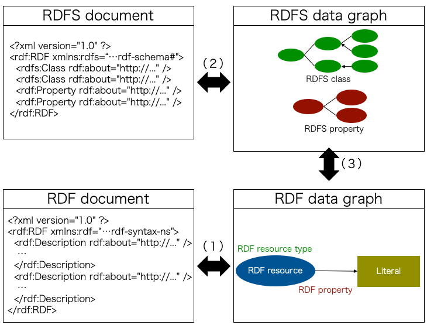
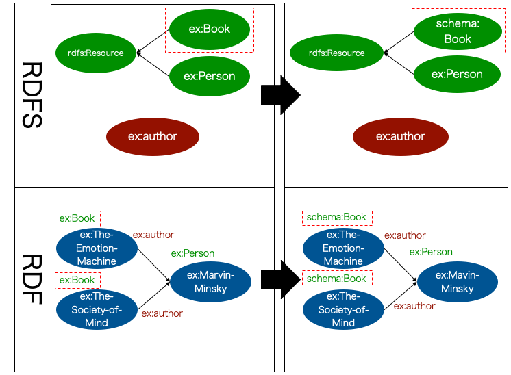
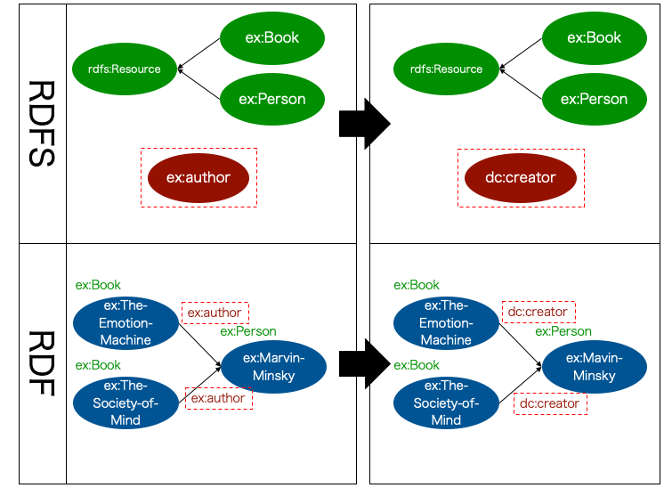
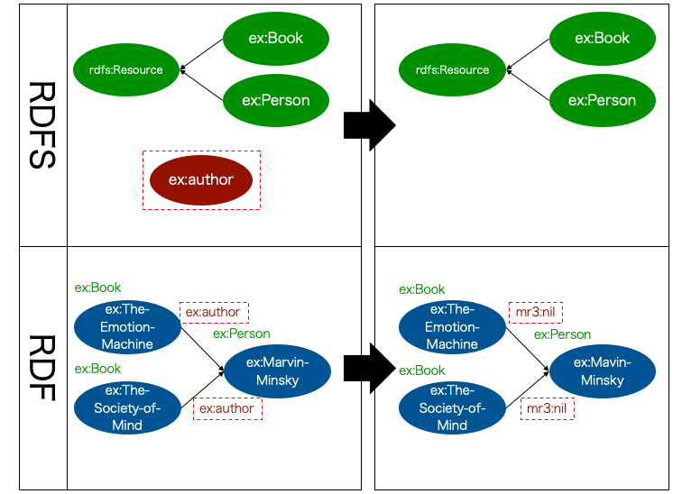
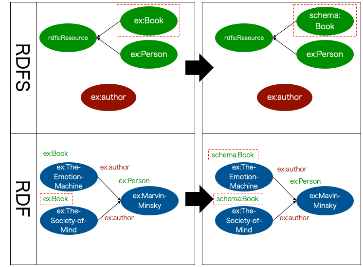
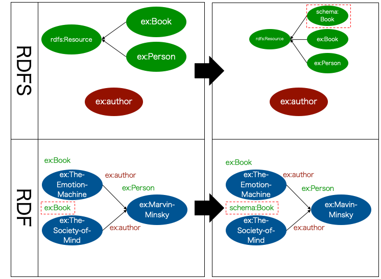

Functions
========================

.. contents:: Contents
   :depth: 4

.. |MR3| replace:: MR\ :sup:`3` \

Overview of MR\ :sup:`3` \ functions
------------------------------------
:numref:`mrcube_function_overview` shows a functional outline of MR\ :sup:`3` \. The goal of MR\ :sup:`3` \ is to represent complicated models in a form that is as easy as possible for users to understand. MR\ :sup:`3` \ provides three main functions: (1) graphical editing of RDF descriptions, (2) graphical editing of RDFS descriptions, and (3) meta-model management facilities, allowing several types of relationships in an RDF and RDFS description to be manipulated and managed. Here, the RDF elements considered are the RDF resource, RDF property and RDF literal, and the RDFS elements are the RDFS class and RDFS property. In the definition of these functions, a data graph refers to any visual expression of the data model.

The details of each function are described below.

.. _mrcube_function_overview:

   Overview of MR\ :sup:`3` \ functions

Graphical Editing of RDF Descriptions
-------------------------------------

Function (1) in :numref:`mrcube_function_overview`, which represents the graphical editing of RDF descriptions, supports the manipulation of the resource-property-value relation as defined by the semantics of the RDF data model. This function consists of the following sub-functions:

* Transformation of RDF resources into an RDF data graph
* Transformation of an RDF data graph into RDF resources

Graphical Editing of RDFS Descriptions
--------------------------------------
Function (2) in :numref:`mrcube_function_overview`, which represents the graphical editing of RDFS descriptions, supports the manipulation of the attributes of classes such as the class-subclass relation and the attributes of properties such as rdfs:domain, rdfs:range, and the property-subproperty relation, as defined by the semantics of the RDF Schema model. This function consists of the following sub-functions:

* Transformation of RDFS resources into an RDFS data graph
* Transformation of an RDFS data graph into RDFS resources

Meta-Model Management Facilities
--------------------------------
Function (3) in :numref:`mrcube_function_overview`, which represents meta-model management facilities, is defined in this context as the checking of the consistency of classes and properties. The consistency checking mechanism consists of several facilities, as detailed below.

Meta-model management facilities are categorized as O→M or M→O. O→M is the facility to reflect the change in an ontology (RDFS class and property) in a model (the type of an RDF resource and RDF property). M→O is the facility to reflect the change in a model in an ontology. Manipulation of RDFS Class and Manipulation of RDFS Property are O→M facilities. Replace the Type of an RDF Resource and Replace RDF Property are M→O facilities.

O→M: Manipulation of an RDFS Class
~~~~~~~~~~~~~~~~~~~~~~~~~~~~~~~~~~
The manipulation function of an RDFS class is operated by the meta-model management facility, and consists of replacing and removing an RDFS class.

Replace RDFS Class
    When a URI of an RDFS class is replaced, the type of the RDF resource (URI), which refers to the replaced RDFS class, is also replaced at the same time.
Removal of RDFS Class
    When an RDFS class is removed, MR\ :sup:`3` \ shows the list of RDF resources, which includes the removed RDFS class as a type. The user can choose (or empty) other RDFS classes as a type of RDF resource.

Replace URI of RDFS Class
""""""""""""""""""""""""""""""
when a URI of an RDFS class is replaced, the type of the RDF resource (URI), which refers to the replaced RDFS class, is also replaced at the same time. :numref:`rename-class` shows an example of replacing a URI of an RDFS class. The left part of :numref:`rename-class` shows the state before replacing **ex:Book** class and the right part of :numref:`rename-class` shows the state after replacing **ex:Book** to **schema:Book** class. 

In the RDFS part in the following figures, green ellipses represent RDFS classes, red ellipses represent RDFS properties, arrows represent **rdfs:subClassOf** or **rdfs:subPropertyOf** properties. In the RDF part in the following figures, ellipses represent RDF resources, arrows represent RDF properties, and labels at the upper left of ellipses represent types of RDF resources.

**ex:The-Emotion-Machine** and **ex:The-Society-of-Mind** are RDF resources that have **ex:Book** as their type. If the users replace the URI of **ex:Book** to **schema:Book**, the type of RDF resource, which refers to **ex:Book** class, is also replaced at the same time. In this case, the types of **ex:The-Emotion-Machine** and **ex:The-Society-of-Mind**  (**ex:Book** class) are replaced with **schema:Book** class.

.. _rename-class:

   An example of replacing a URI of an RDFS class

Removal of RDFS Class
"""""""""""""""""""""
When an RDFS class is removed, |MR3| shows the list of RDF resources, which includes the removed RDFS class as a type. The user can choose (or empty) other RDFS classes as a type of RDF resource.

:numref:`remove-class` shows an example of removal of an RDFS class. When the users remove ex:Book class, it can not be maintained consistency beween RDF contents and RDFS contents. Because exBook class is types of **ex:The-Emotion-Machine** and **ex:The-Society-of-Mind** resources. In :numref:`remove-class`, the users select empty as their type to maintain the consistency. 

.. note::
    If a type of an RDF resource is empty, the type of the RDF resource become implicitly rdfs:Resource. 

.. _remove-class:
.. figure:: figures/remove_rdfs_class.svg
   :scale: 80 %
   :alt: An example of removal of an RDFS class
   :align: center

   An example of removal of an RDFS class

O→M: Manipulation of an RDFS Property
~~~~~~~~~~~~~~~~~~~~~~~~~~~~~~~~~~~~~
The manipulation function of an RDFS property is operated by the meta-model management facility, and consists of replacing and removing an RDFS property.

Replace URI of RDFS Property
    When a URI of an RDFS property is replaced, the RDF property, which refers to the replaced RDFS property, is also replaced at the same time.
Removal of RDFS Property
    When an RDFS property is removed, |MR3| shows the list of the RDF properties which refer to the removed RDFS property. A user can choose other RDFS properties (or the default property – **mr3:nil** ) as a property of the RDF resources.

Replace URI of RDFS Property
""""""""""""""""""""""""""""""""
When a URI of an RDFS property is replaced, the RDF property, which refers to the replaced RDFS property, is also replaced at the same time. :numref:`rename-rdfs-property` shows an example of replacing a URI of an RDFS property. The left part of :numref:`rename-rdfs-property` shows the state before replacing **ex:author** property and the right part of :numref:`rename-rdfs-property` shows the state after replacing **ex:author** to **dc:creator** property. **ex:The-Emotion-Machine** and **ex:The-Society-of-Mind** resources have the **ex:author** property. If the users replace the **ex:author** property with the **dc:creator** property, the corresponding RDF properties are also replaced. In this case, The **ex:author** property that **ex:The-Emotion-Machine** and **ex:The-Society-of-Mind** resources have are automatically replaced with the dc:creator property|

.. _rename-rdfs-property:

   An example of replacing a URI of an RDFS property

Removal of RDFS Property
""""""""""""""""""""""""
When an RDFS property is removed, |MR3| shows the list of the RDF properties which refer to the removed RDFS property. A user can choose other RDFS properties (or the default property –  mr3:nil) as a property of the RDF resources.

:numref:`remove-property` shows an example of removal of an RDFS property. When the users remove ex:author property in the Property editor, it can not be maintained consistency between the RDF contents and the RDFS contents. Because **ex:The-Emotion-Machine** and **ex:The-Society-of-Mind** resources have the **ex:author** property. Here, in order to maintain the consistency, the users replace ex:author property with the default property ( **mr3:nil** ).

.. note::
   In |MR3|, mr3:nil is the default property. If any RDFS properties are not defined and the users create a statement, the property between resources in the statement become mr3:nil.

.. _remove-property:

   An example of removal of an RDFS property

M→O: Replacing the Type of an RDF Resource
~~~~~~~~~~~~~~~~~~~~~~~~~~~~~~~~~~~~~~~~~~
When it is not clear which RDFS class corresponds to the type of an RDF resource replaced by the user, the meta-model management facility is applied. When the type of an RDF resource replaced by the user is defined by the RDFS class, MR\ :sup:`3` \ matches the type of the RDF resource and the RDFS class corresponding to the type of RDF resource. In addition, if the class is not defined, the user can choose one of the following:

* Replacing a URI of an RDFS class with that referred to before the user replaced the type of the RDF resource.
* Creating an RDFS class that has yet to be defined.

:numref:`rename-resource-type` and :numref:`make-class` show examples of replacing a type of an RDF resource.

Replacing a URI of an RDFS class
"""""""""""""""""""""""""""""""""""
In :numref:`rename-resource-type`, although dc:BibliographicResource class is not defined in the Class editor, the users replace the type of **ex:The-Society-of-Mind** ( **ex:Book** class) with **schema:Book** class. Here, in order to maintain the consistency, the users select replacing a URI of an RDFS class. In this case, the users replace **ex:Book** class with **schema:Book** class. Therefore, the type of **ex:The-Emotion-Machine** ( **ex:Book** ) is automatically replaced with **schema:Book** class.

.. _rename-resource-type:

   Replacing a URI of an RDFS class

Creating an RDFS class
"""""""""""""""""""""""""""""""
In :numref:`make-class`, **schema:Book** class is not defined and the users replace the type of **ex:The-Society-of-Mind** ( **ex:Book** ) with **schema:Book** class. Here, the users select to create **schema:Book** class to maitain consistency.

.. _make-class:

   An example of creating an RDFS class

M→O: Replacing the RDF Property
~~~~~~~~~~~~~~~~~~~~~~~~~~~~~~~
When it is not clear which RDF property corresponds to the RDFS property replaced by a user, the meta-model management facility is applied. When the RDF property which the user replaced is defined by the RDFS property, MR\ :sup:`3` \ matches the RDF property and the RDFS property corresponding to the RDF property. If the property is not defined, the user can choose one of the following:

* Replace the RDFS property name with that referred to before the user replaced the RDF property.
* Create an RDFS property that has yet to be defined.

:numref:`rename-rdf-property` and :numref:`make-property` shows examples of replacing an RDF property.

Replacing a URI of an RDFS property
"""""""""""""""""""""""""""""""""""""""""""
In :numref:`rename-rdf-property`, although ex:author property is not defined in the Property editor, the users replace **ex:author** property that **ex:The-Society-of-Mind** resource has with **dc:creator** property. In order to maintain the consistency, the users select replacing a URI of an RDFS property. In this case, the users replace **ex:author** property with **dc:creator** property. Therefore, **ex:author** property that **ex:The-Emotion-Machine** has is automatically replaced with **dc:creator** property.

.. _rename-rdf-property:
.. figure:: figures/rename_rdf_property.svg
   :scale: 80 %
   :alt: An example of replacing a URI of an RDFS property
   :align: center

   An example of replacing a URI of an RDFS property

Creating an RDFS property
"""""""""""""""""""""""""""""""""
In :numref:`make-property`, **dc:creator** property is not defined and the users replace the **ex:author** property that **ex:The-Society-of-Mind** resource has with **dc:creator**. Here, the users select to create **dc:creator** property to maintain consistency.

.. _make-property: 
.. figure:: figures/make_rdfs_property.svg
   :scale: 80 %
   :alt: An example of creating an RDFS property
   :align: center

   An example of creating an RDFS property

Other functions
---------------

Importing an RDF Document
~~~~~~~~~~~~~~~~~~~~~~~~~
When importing an RDF document, the type of RDF resource or an RDF property may not be defined as an RDFS class or an RDFS property. In this case, in order to maintain consistency, a type of RDF resource which is not defined as an RDFS class is created as a sub class of the rdfs:Resource class. In the same way, an RDF property which is not defined as an RDFS property is created.

:numref:`import-rdf` shows an example of importing an RDF document. The left side of :numref:`import-rdf` depicts the state before importing the RDF document. The right side of :numref:`import-rdf` depicts the state after importing the RDF document. **ex:Book**, with the type of **ex:The_Emotion_Machine** and **ex:The_Society_of_Mind**, is not defined as an RDFS class. Also **ex:author** in the RDF model is not defined as an RDFS property. In order to maintain consistency, MR\ :sup:`3` \ creates a **ex:Book** class and **ex:author** property in the RDFS data graph automatically.

.. _import-rdf:
.. figure:: figures/import_rdf.svg
   :scale: 80 %
   :alt: Import RDF document
   :align: center

   Import RDF document

Keeping Element Names Unique
~~~~~~~~~~~~~~~~~~~~~~~~~~~~
This function prevents RDF and RDFS from overlapping other element names when a user renames and creates an RDF or RDFS element. If duplication of an RDFS element name is allowed, consistency cannot be maintained.

Replacing namespace with prefix or URI with label
~~~~~~~~~~~~~~~~~~~~~~~~~~~~~~~~~~~~~~~~~~~~~~~~~~~
|MR3| has a function to replace namespaces of resources with the corresponding prefixes that are defined in the Namespace Table. |MR3| also has a function to replace URIs of resources with the value of rdfs:label property that the resources have. 

Setting a Meta Class and Property
~~~~~~~~~~~~~~~~~~~~~~~~~~~~~~~~~
A user can set meta classes and properties in MR\ :sup:`3` \. This function controls whether to consider a resource of a certain type as a class or a property. For example, if a user sets **owl:Class** as a meta class and **owl:ObjectProperty** and **owl:DatatypeProperty** as meta properties, MR\ :sup:`3` \ can import the class and property hierarchy in OWL. The default meta class is **rdfs:Class** and the default meta property is **rdf:Property**.

Validation
~~~~~~~~~~
When constructing an RDF model, MR\ :sup:`3` \ doesn’t check rdfs:domain and rdfs:range in the RDFS properties. However, MR\ :sup:`3` \ can perform validation of an RDF model using vOWLidator. This function indicates the resources that don’t match the rdfs:domain and rdfs:range in the RDFS properties.

.. note ::
    In ontology based tools, the users must define domains and ranges of RDFS properties before using the RDFS properties to build RDF contents. In |MR3|, the users can use RDFS properties without defining the domains and the ranges of the property to build RDF contents.

