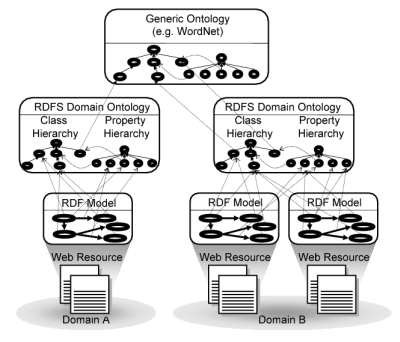
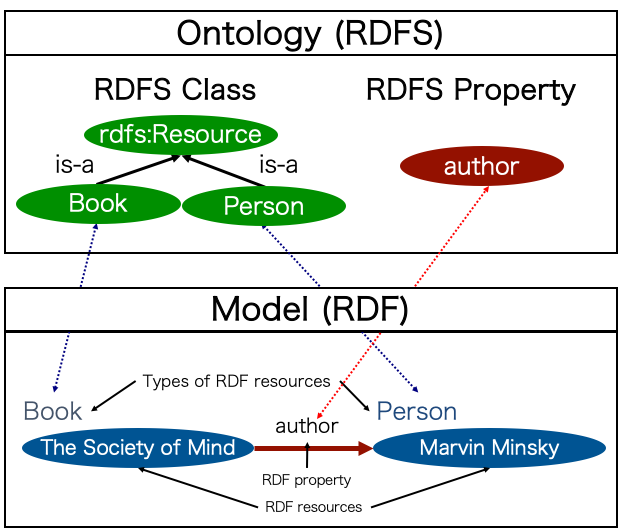
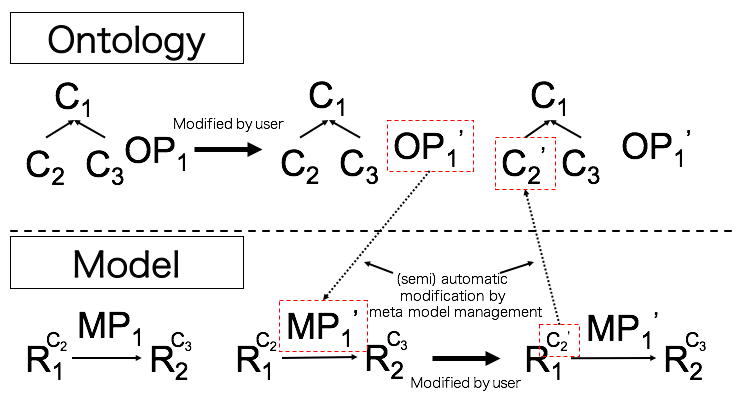

Keywords
==========================

.. contents:: Contents
   :depth: 2

Model and Ontology
---------------------------
In this section, we describe model and ontology in MR\ :sup:`3` \.

.. index:: Model

Model
~~~~~~~~~~~~~~~~~

Models are essential machine readable contents described by RDF and these are exclued trivial information from web contentns. Specifically, models include RDF triples and the subjects of the triples belong to one or more classes in RDFS. Models consist of elements provided by ontologies. The elements are types of resources and RDF properties. In the Semantic Web, the model is equivalent to RDF content (facts in OWL). 

.. index:: Ontology

Ontology
~~~~~~~~~~~~~~~~~

Ontologies are classes, properties, and relationships between classes or properties. In the Semantic Web, ontologies are equivalent to RDFS or OWL contents. Types of resources are defined by RDFS classes and RDF properties are defined by RDFS properties. Relationships among Web resources, models, and ontologies are shown in :numref:`sw_paradigm`.

RDF data models are built from Web resources. RDF data models are described by RDF/XML format as RDF contents. Domain ontologies or general ontologies (WordNet [Miller95]_, EDR [Yokoi95]_, etc) are used to build RDF data models. Same domain ontologies can be used when multiple web resources belong to same domain. For example, two RDF models that belong to Domain B use an RDFS domain ontology in :numref:`sw_paradigm` .

.. _sw_paradigm:

   Relationships among Web resources, models, and ontologies in the Semantic Web.

Meta-Model Management
--------------------------------

This section discusses our concept of a meta-model and meta-model management. In our research, meta-model is defined as a model expressing the components of models, especially the type of an RDF resource and RDF property. RDFS class is a model expressing the type of RDF resource. RDFS property is a model expressing an RDF property.

Since RDF and RDFS descriptions are described with the same RDF syntax, there is no clear distinction between RDF and RDFS parts. This forces us to observe the type of resources in order to pick up only an RDF part or only an RDFS part. Although the recent trend of Semantic Web languages, including Web Ontology Language (OWL), tries to capture the advanced concept of ontologies in a single framework, there is no clear support to manage the correspondence between RDF and RDFS.

Since RDF and RDFS can be regarded as the relationship between a model and a meta-model, in the concept of meta-model management, RDF and RDFS can be managed separately and maintain their relationship automatically. In some of the logical frameworks described above, the meta-model concept seems to capture the above RDF and RDFS relationship. Such a logical framework reminds us to distinguish RDF and RDFS clearly, and can be expected to bring (semi-)automated support of the consistency between RDF and RDFS.

As a key concept in our research, we focus on the meta-model management, which is defined as the appropriate management of the correspondence between a model and its meta-model: especially, the management of the RDFS class and RDFS property in a meta-model, and the type of an RDF resource and RDF property in a model. :numref:`concept-of-mmm` sketches the concept of meta-model management.

.. _concept-of-mmm:

   
   Concept of Meta-Model Management
  
Meta-Model Management Scenarios
-------------------------------
From our experience, we consider that the actual construction of meta-models and models in RDFS/OWL are performed from two different views. Meta-models are constructed considering a conceptualization which is separated from a real object world. On the other hand, models are constructed considering a real object world. Some modifications in models will cause the modifications of the meta-models, and vice versa. Moreover, in order to construct appropriate meta-models and models, modelers need to modify models and meta-models repeatedly. In such situation, since the modifications are made so often in both models and meta-models, these refinement costs are quite expensive. The graphical editing functions of MR3 will help modelers manage the model and the meta-model from a panoramic view. The meta-model management facilities will help modelers concentrate on editing and evaluating models or meta-models without frequently switching the editing modes between a model and a meta-model. The aim of our research is to provide such functions and facilities that will reduce the refinement cost of models and meta-models by the reflective processes.

:numref:`metamodel_management_scenario` shows an example of meta-model management process. The upper part of :numref:`metamodel_management_scenario` shows a meta-model modification process. The lower part of :numref:`metamodel_management_scenario`  shows a model modification process. C1, C2, and C3 in the meta-model depict RDFS classes. P1 in the meta-model depicts an RDFS property. R1 and R2 in the model depict RDF resources. C2 and C3 which are depicted the upper right of RDF resources in the model depict type of RDF resources. P1 in the model depicts an RDF property. In :numref:`metamodel_management_scenario`, at the beginning, P1 in the meta-model is modified to P1' by a user. Along with that, corresponding the RDF property in the model is also modified by a meta-model management facility automatically. Next, C2 which is the type of RDF resource R1 in the model is modified to C2' by a user. Along with that, corresponding the RDFS class in the meta-model is also modified by a meta-model management facility semi-automatically.

.. _metamodel_management_scenario:

   
   Meta-Model Management Scenarios

References
----------
.. [Miller95] G.A.Miller, “WordNet: A Lexical Database for English,” Commun. ACM, vol.38, no.11, pp.39.41, 1995.
.. [Yokoi95] T. Yokoi, “The EDR Electronic Dictionary,” Commun. ACM, vol.38, no.11, pp.42. 44, 1995, http://www2.nict.go.jp/r/r312/EDR/.
