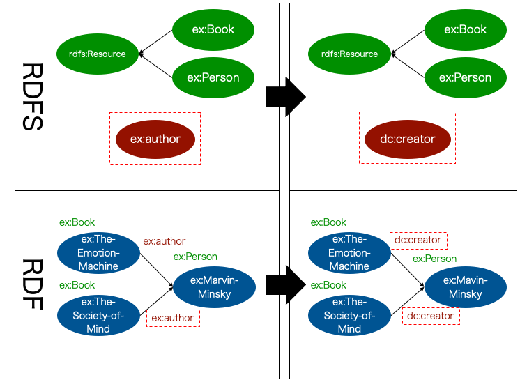
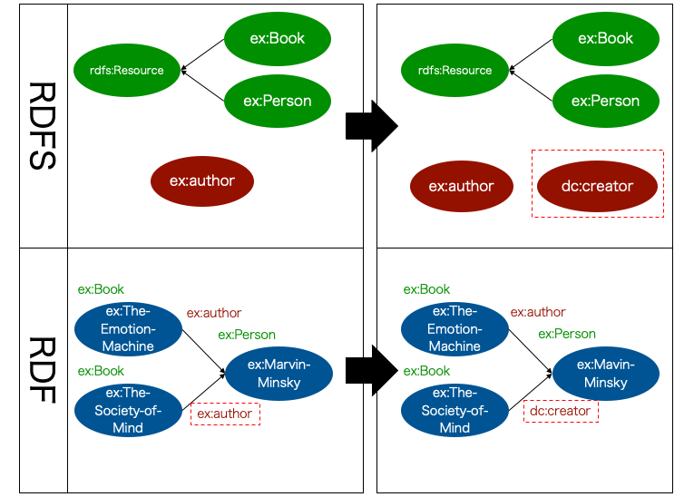
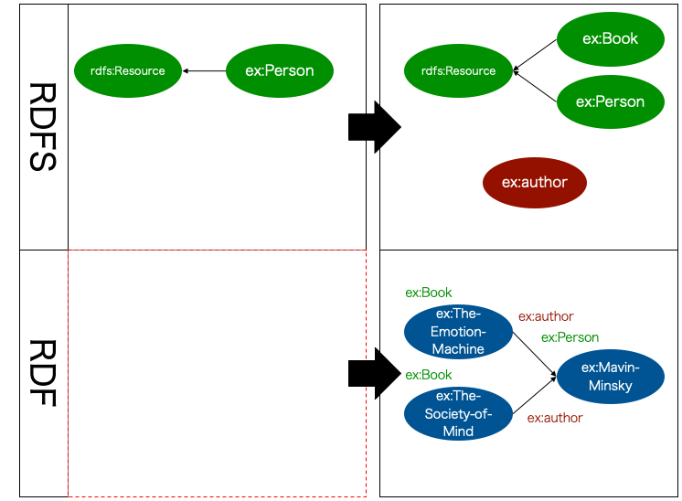

MR\ :sup:`3` \ functions
========================

.. contents:: Contents
   :depth: 4

Overview of MR\ :sup:`3` \ functions
------------------------------------
:numref:`mrcube_function_overview` shows a functional outline of MR\ :sup:`3` \. The goal of MR\ :sup:`3` \ is to represent complicated models in a form that is as easy as possible for users to understand. MR\ :sup:`3` \ provides three main functions: (1) graphical editing of RDF descriptions, (2) graphical editing of RDFS descriptions, and (3) meta-model management facilities, allowing several types of relationships in an RDF and RDFS description to be manipulated and managed. Here, the RDF elements considered are the RDF resource, RDF property and RDF literal, and the RDFS elements are the RDFS class and RDFS property. In the definition of these functions, a data graph refers to any visual expression of the data model.

The details of each function are described below.

.. _mrcube_function_overview:
.. figure:: figures/mrcube_function_overview.svg
   :scale: 80 %
   :alt: Overview of MR\ :sup:`3` \ functions
   :align: center

   Overview of MR\ :sup:`3` \ functions

Graphical Editing of RDF Descriptions
-------------------------------------

Function (1) in :numref:`mrcube_function_overview`, which represents the graphical editing of RDF descriptions, supports the manipulation of the resource-property-value relation as defined by the semantics of the RDF data model. This function consists of the following sub-functions:

* Transformation of RDF resources into an RDF data graph
* Transformation of an RDF data graph into RDF resources

Graphical Editing of RDFS Descriptions
--------------------------------------
Function (2) in :numref:`mrcube_function_overview`, which represents the graphical editing of RDFS descriptions, supports the manipulation of the attributes of classes such as the class-subclass relation and the attributes of properties such as rdfs:domain, rdfs:range, and the property-subproperty relation, as defined by the semantics of the RDF Schema model. This function consists of the following sub-functions:

* Transformation of RDFS resources into an RDFS data graph
* Transformation of an RDFS data graph into RDFS resources

Meta-Model Management Facilities
--------------------------------
Function (3) in :numref:`mrcube_function_overview`, which represents meta-model management facilities, is defined in this context as the checking of the consistency of classes and properties. The consistency checking mechanism consists of several facilities, as detailed below.

Meta-model management facilities are categorized as O→M or M→O. O→M is the facility to reflect the change in an ontology (RDFS class and property) in a model (the type of an RDF resource and RDF property). M→O is the facility to reflect the change in a model in an ontology. Manipulation of RDFS Class and Manipulation of RDFS Property are O→M facilities. Replace the Type of an RDF Resource and Replace RDF Property are M→O facilities.

O→M: Manipulation of an RDFS Class
~~~~~~~~~~~~~~~~~~~~~~~~~~~~~~~~~~
The manipulation function of an RDFS class is operated by the meta-model management facility, and consists of replacing and removing an RDFS class.

Replace RDFS Class
    When an RDFS class name is replaced, the type name of the RDF resource, which refers to the replaced RDFS class, is also replaced at the same time.
Removal of RDFS Class
    When an RDFS class is removed, MR\ :sup:`3` \ shows the list of RDF resources, which includes the removed RDFS class as a type. The user can choose (or empty) other RDFS classes as a type of RDF resource.

Replace RDFS Class
""""""""""""""""""
RDFSクラス名を変更する場合，そのRDFSクラスを参照しているRDFリソースのタイプ名(URI) も同時に変更される． :numref:`rename-class`  は，RDFSクラス名を変更する場合の具体例を表している． :numref:`rename-class`  の左側はRDFSクラスex:書籍を変更する前の状態を表しており，右側がRDFSクラスex:書籍をex:書物に変更した後の状態を表している．以下，RDF(S)コンテンツ管理機能の具体例を表す図中のRDFSにおける矩形はクラス，楕円はプロパティ，矢印はクラスの上位・下位関係を表す．矢印は，下位クラスから上位クラスに向かって伸びている．同様に，図中のRDFにおける楕円はRDFリソース，矢印はRDFプロパティ，楕円右上のラベルは，RDFリソースのタイプを表す．ex:学問のすゝめとex:民情一新は，ex:書籍をタイプとするRDFリソースである．RDFSクラスex:書籍をex:書物に変更すると，ex:書籍に対応するRDFリソースのタイプにも自動的に変更が反映される．つまり，RDFリソースex:学問のすゝめおよびex:民情一新のタイプは，ex:書物に自動的に変更される．
   
.. _rename-class:
.. figure:: figures/rename_rdfs_class.svg
   :scale: 80 %
   :alt: RDFSクラス名の変更
   :align: center

   RDFSクラス名の変更

Removal of RDFS Class
"""""""""""""""""""""
RDFSクラスを削除する場合，そのRDFSクラスをタイプとするRDFリソースの一覧を示し，ユーザはRDFリソースのタイプとして，他のRDFSクラス（または空）を選択することができる． :numref:`remove-class` は，RDFSクラスを削除する場合の具体例を表している．ユーザがRDFSクラスex:書籍を削除したとする．ex:学問のすゝめおよびex:民情一新は，ex:書籍をタイプとするRDFリソースであるため，ex:書籍が削除されるとRDFコンテンツとRDFSコンテンツ間の整合性を保つことができない． :numref:`remove-class` では整合性を保つために，RDFリソースex:学問のすゝめおよびex:民情一新のタイプを空にしている．

.. note::
    RDFリソースのタイプが空の場合，rdfs:Resource クラスをタイプとして持つことになる．

.. _remove-class:
.. figure:: figures/remove_rdfs_class.svg
   :scale: 80 %
   :alt: RDFSクラスの削除
   :align: center

   RDFSクラスの削除

O→M: Manipulation of an RDFS Property
~~~~~~~~~~~~~~~~~~~~~~~~~~~~~~~~~~~~~
The manipulation function of an RDFS property is operated by the meta-model management facility, and consists of replacing and removing an RDFS property.

Replace RDFS Property
    When an RDFS property name is replaced, the RDF property, which refers to the replaced RDFS property, is also replaced at the same time.
Removal of RDFS Property
    When an RDFS property is removed, $MR^3$ shows the list of the RDF properties which refer to the removed RDFS property. A user can choose other RDFS properties (or the default property – {\tt mr3:nil}) as a property of the RDF resources.

Replace RDFS Property
"""""""""""""""""""""
RDFSプロパティ名を変更する場合，そのRDFSプロパティを参照しているRDFプロパティ名(URI）も同時に自動的に変更される． :numref:`rename-rdfs-property` は，RDFSプロパティ名を変更する場合の具体例を表している． :numref:`rename-rdfs-property` の左側はRDFSプロパティex:著者を変更する前の状態を表しており，右側はRDFSプロパティex:著者をex:著作者に変更した後の状態を表している．ex:学問のすゝめおよびex:民情一新は，ex:著者プロパティをもつRDFリソースである．ユーザがRDFSプロパティex:著者をex:著作者に変更すると，ex:著者と対応するRDFプロパティにも変更が反映される．つまり，RDFリソースex:学問のすゝめおよびex:民情一新がもつプロパティex:著者はex:著作者に自動的に変更される．

.. _rename-rdfs-property:
.. figure:: figures/rename_rdfs_property.svg
   :scale: 80 %
   :alt: RDFSプロパティ名の変更
   :align: center

   RDFSプロパティ名の変更

Removal of RDFS Property
""""""""""""""""""""""""
RDFSプロパティを削除する場合，そのRDFSプロパティを参照しているRDFプロパティの一覧を示し，ユーザはRDFプロパティとして，他のRDFSプロパティ（あるいは初期のプロパティ）を選択することができる． :numref:`remove-property` は，RDFSプロパティを削除する場合の具体例を表している．ユーザがRDFSプロパティex:著者を削除したとする．ex:学問のすゝめとex:民情一新は，ex:著者をプロパティとしてもつRDFリソースであるため，ex:著者が削除されるとRDFコンテンツとRDFSコンテンツ間の整合性を保つことができない． :numref:`remove-property` では，整合性を保つためにユーザは，RDFリソースex:学問のすゝめおよびex:民情一新がもつex:著者プロパティを初期のプロパティ(mr3:nil) にしている．

.. note::
   MR\ :sup:`3` \ では，初期のプロパティをmr3:nil としている．RDFSプロパティが定義されていない状態でRDFリソース間の関係を定義した場合，そのRDFリソース間の関係は初期のプロパティとなる．

.. _remove-property:
.. figure:: figures/remove_rdfs_property.svg
   :scale: 80 %
   :alt: RDFSプロパティの削除
   :align: center

   RDFSプロパティの削除

M→O: Replacing the Type of an RDF Resource
~~~~~~~~~~~~~~~~~~~~~~~~~~~~~~~~~~~~~~~~~~
When it is not clear which RDFS class corresponds to the type of an RDF resource replaced by the user, the meta-model management facility is applied. When the type of an RDF resource replaced by the user is defined by the RDFS class, MR\ :sup:`3` \ matches the type of the RDF resource and the RDFS class corresponding to the type of RDF resource. In addition, if the class is not defined, the user can choose one of the following:

* Replace the RDFS class name with that referred to before the user replaced the type of the RDF resource.
* Create a new RDFS class that has yet to be defined.

:numref:`rename-resource-type` および :numref:`make-class` は，それぞれ，RDFリソースのタイプを変更した場合の具体例を表している．

参照しているRDFSクラス名の変更
""""""""""""""""""""""""""""""

:numref:`rename-resource-type` では，RDFSクラスex:書物が定義されていない状態で，ユーザがRDFリソースex:民情一新のタイプex:書籍をex:書物に変更している．ここでは，整合性を保つためにRDFSクラス名の変更をユーザが選択している．RDFSクラスex:書籍をex:書物に変更することにより，ex:学問のすゝめのタイプもex:書物に半自動的に変更される．

.. _rename-resource-type:
.. figure:: figures/rename_rdf_resource_type.svg
   :scale: 80 %
   :alt: 参照しているRDFSクラス名の変更
   :align: center

   参照しているRDFSクラス名の変更

RDFSクラスの新規作成
""""""""""""""""""""

:numref:`make-class` では，RDFSクラスex:啓蒙書が定義されていない状態で，ユーザがRDFリソースex:学問のすゝめのタイプex:書籍をex:啓蒙書に変更している．ここでは，整合性を保つためにRDFSクラスの新規作成をユーザが選択している．ex:啓蒙書クラスを新規に作成することによって，RDFコンテンツとRDFSコンテンツ間の整合性が保たれる．RDFSクラスex:啓蒙書は，rdfs:Resource のサブクラスとなる．

.. note::
    rdfs:subClassOfプロパティが定義されていないクラスは，暗黙的にrdfs:Resourceのサブクラスとなる．

.. _make-class:
.. figure:: figures/make_rdfs_class.svg
   :scale: 80 %
   :alt: RDFSクラスの新規作成
   :align: center

   RDFSクラスの新規作成

M→O: Replacing the RDF Property
~~~~~~~~~~~~~~~~~~~~~~~~~~~~~~~
When it is not clear which RDF property corresponds to the RDFS property replaced by a user, the meta-model management facility is applied. When the RDF property which the user replaced is defined by the RDFS property, MR\ :sup:`3` \ matches the RDF property and the RDFS property corresponding to the RDF property. If the property is not defined, the user can choose one of the following:

* Replace the RDFS property name with that referred to before the user replaced the RDF property.
* Create a new RDFS property that has yet to be defined.

:numref:`rename-rdf-property` および :numref:`make-property` は，それぞれ，RDFプロパティを変更した場合の具体例を表している．

参照しているRDFSプロパティ名の変更
""""""""""""""""""""""""""""""""""

:numref:`rename-rdf-property` では，RDFSプロパティex:著作者が定義されていない状態で，ユーザがRDFリソースex:民情一新が持つプロパティex:著者をex:著作者に変更している．ここでは，整合性を保つためにRDFSプロパティ名の変更をユーザが選択している．RDFSプロパティex:著者をex:著作者に変更することにより，ex:学問のすゝめが持つプロパティex:著者もex:著作者に半自動的に変更される．

.. _rename-rdf-property:

   参照しているRDFSプロパティ名の変更

RDFSプロパティの新規作成
""""""""""""""""""""""""

:numref:`make-property` では，RDFSプロパティex:著作者が定義されていない状態で，ユーザがRDFリソースex:民情一新が持つプロパティex:著者をex:著作者に変更している．ここでは，整合性を保つためにRDFSプロパティの新規作成をユーザが選択している．RDFSプロパティex:著作者を新規に作成することによって，整合性を保つことができる．

.. _make-property: 

   RDFSプロパティの新規作成

Other functions
---------------

Importing an RDF Document
~~~~~~~~~~~~~~~~~~~~~~~~~
When importing an RDF document, the type of RDF resource or an RDF property may not be defined as an RDFS class or an RDFS property. In this case, in order to maintain consistency, a type of RDF resource which is not defined as an RDFS class is created as a sub class of the rdfs:Resource class. In the same way, an RDF property which is not defined as an RDFS property is created.

:numref:`import-rdf` shows an example of importing an RDF document. The left side of :numref:`import-rdf` depicts the state before importing the RDF document. The right side of :numref:`import-rdf` depicts the state after importing the RDF document. ex:Book, with the type of ex:The_Emotion_Machine and ex:The_Society_of_Mind, is not defined as an RDFS class. Also ex:author in the RDF model is not defined as an RDFS property. In order to maintain consistency, MR\ :sup:`3` \ creates a ex:Book class and ex:author property in the RDFS data graph automatically.

.. _import-rdf:

   Import RDF document

Keeping Element Names Unique
~~~~~~~~~~~~~~~~~~~~~~~~~~~~
This function prevents RDF and RDFS from overlapping other element names when a user renames and creates an RDF or RDFS element. If duplication of an RDFS element name is allowed, consistency cannot be maintained.

URI 識別補助機能
~~~~~~~~~~~~~~~~
URI 識別補助機能とは，RDF要素およびRDFS要素の識別を補助するための機能である．ユーザはRDF要素およびRDFS要素をURI によって識別する．URI は一般的に数十文字になるため，膨大な数のリソースを扱う場合，ユーザがURI を識別および編集することが困難である．そこで，RDF(S) コンテンツ構築支援ツールではユーザが指定した名前空間URI を指定した名前空間接頭辞に置換して表示する機能をもつ．また，RDF要素およびRDFS要素にrdfs:label プロパティの値（見出し）が定義されている場合，URIの代わりに見出しを表示する機能をもつ．

Setting a Meta Class and Property
~~~~~~~~~~~~~~~~~~~~~~~~~~~~~~~~~
A user can set meta classes and properties in MR\ :sup:`3` \. This function controls whether to consider a resource of a certain type as a class or a property. For example, if a user sets owl:Class as a meta class and owl:ObjectProperty and owl:DatatypeProperty as meta properties, MR\ :sup:`3` \ can import the class and property hierarchy in OWL. The default meta class is rdfs:Class and the default meta property is rdf:Property.

Validation
~~~~~~~~~~
When constructing an RDF model, MR\ :sup:`3` \ doesn’t check rdfs:domain and rdfs:range in the RDFS properties. However, MR\ :sup:`3` \ can perform validation of an RDF model using vOWLidator. This function indicates the resources that don’t match the rdfs:domain and rdfs:range in the RDFS properties.

.. note ::
    オントロジーベースのツールでは，RDFS プロパティの定義域および値域を定義しなければ，RDF コンテンツ構築時にRDF プロパティが利用できない．RDF(S) コンテンツ構築支援ツールでは，RDFS プロパティの定義域および値域の定義を行うことなく，RDF プロパティの定義を行うことができる．

TODO
----
* 図をきれいに作りなおす
