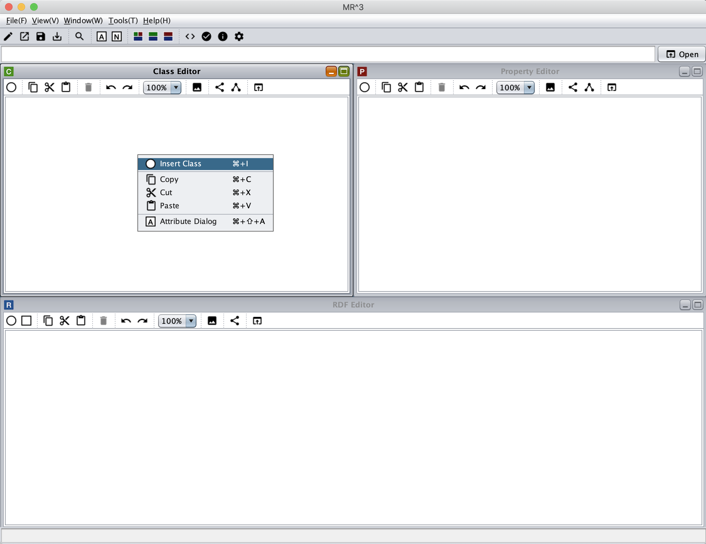
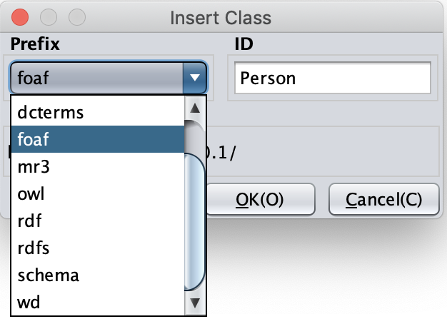
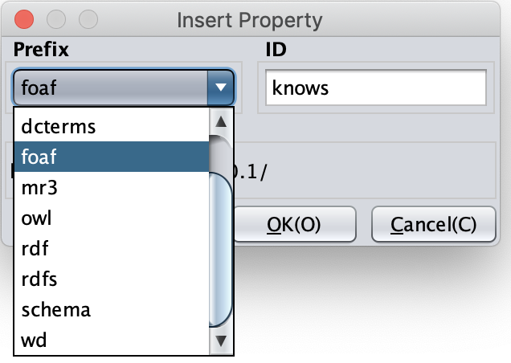

=================
Tutorial
=================

.. contents:: Contents
   :depth: 3

.. |MR3| replace:: MR\ :sup:`3` \

------------------------------   
Overview
------------------------------   
In this tutorial, we build an RDFs document that is introduced in `RDF Primer <https://www.w3.org/TR/2004/REC-rdf-primer-20040210/>`_ (Example 1: RDF/XML Describing Eric Miller as shown below) by using |MR3|. 

There are two ways to build the RDFs document by using |MR3|. One is a top down method. In the top down method, the users firstly build RDFS contents and then build RDF contents by using classes and properties defined in the RDFS contents. The users can also use an existing RDFS document by importing the document into |MR3|.

The other is a bottom up method. In the bottom up method. the users can create RDFS classes and properties when they build RDF contents by using RDF(S) contents management facilities.

In this tutorial, we introduce both of them. You can also check how to build the RDFs document from `the videos page <http://mrcube.org/videos.html>`_ in the |MR3| web site. Finally, we describe an example of replacing an RDFS document.

Example 1: RDF/XML Describing Eric Miller

.. code-block:: xml

    <?xml version="1.0"?>
    <rdf:RDF xmlns:rdf="http://www.w3.org/1999/02/22-rdf-syntax-ns#"
             xmlns:contact="http://www.w3.org/2000/10/swap/pim/contact#">

      <contact:Person rdf:about="http://www.w3.org/People/EM/contact#me">
        <contact:fullName>Eric Miller</contact:fullName>
        <contact:mailbox rdf:resource="mailto:em@w3.org"/>
        <contact:personalTitle>Dr.</contact:personalTitle>
      </contact:Person>
    </rdf:RDF>

--------------------------------------------------
Building an RDFs document by the top down method
--------------------------------------------------
^^^^^^^^^^^^^^^^^^^^^^^^^^^^^^^^^^^^^^^^^^^^^^^^^^^^^^^^^^^^^^^^^^^^^^^^^^^^^^^^^^^^^^^^^^^
1. Registering prefixes and namespaces that are used in the RDFs document
^^^^^^^^^^^^^^^^^^^^^^^^^^^^^^^^^^^^^^^^^^^^^^^^^^^^^^^^^^^^^^^^^^^^^^^^^^^^^^^^^^^^^^^^^^^
At the begininng, the users should register prefixes and the corresponding namespaces in the Namespace Table to build the RDFs document. The Namespace table can be shown by selecting |nstable| icon in the toolbar or selecting Show Namespace Table sub menu in the Window menu.

In the following figure, **contact** prefix and the corresponding namespace (**http: //www.w3.org/2000/10/swap/pim/contact#**) are registered in the Namespace Table. When the users input a prefix in the Prefix text field, input a namespace in the NameSpace textfield, and select Add button, they are registered in the Namespace Table. 

Prefixes and namespaces can be used to create resources (RDF resources, RDF properties, RDFS classes, and RDFS properties).

.. |nstable| image:: figures/toolbar/namespace_table.png

.. figure:: figures/top-down-step1.png
   :scale: 40 %
   :align: center

^^^^^^^^^^^^^^^^^^^^^^^^^^^^^^^^^^^^^^^^^^^^^^^^^^^^^^^^^^^^^^^^^^^^^^^^^^^^^^^^^^^^^^^^^^^
2. Inserting an RDFS class
^^^^^^^^^^^^^^^^^^^^^^^^^^^^^^^^^^^^^^^^^^^^^^^^^^^^^^^^^^^^^^^^^^^^^^^^^^^^^^^^^^^^^^^^^^^
In this step, we insert contact:Person class in the Class editor. 

First, when the users click a right mouse button in the Class Editor, a popup menu is shown. An RDFS class can be iserted by selecting **Insert Class menu** in the popup menu. The following figure shows the popup menu.

In the example RDFs document, contact:Person class is the type of **http: //www.w3.org/People/EM/contact#me** resource. In |MR3|, a type of an RDF resource can be selected from classes in the Class editor. Therefore, in order to select the type of the RDF resource, contact:Person class must be defined before creating the RDF resource by the top down method.

After selecting **Insert Class menu**, the following dialog is shown. The RDFS class (contact:Person) is inserted by selecting contact prefix from the Prefix combobox, inputting Person in the ID text field, and selecting the OK button.

^^^^^^^^^^^^^^^^^^^^^^^^^^^^^^^^^^^^^^^^^^^^^^^^^^^^^^^^^^^^^^^^^^^^^^^^^^^^^^^^^^^^^^^^^^^
3. Inserting RDFS properties
^^^^^^^^^^^^^^^^^^^^^^^^^^^^^^^^^^^^^^^^^^^^^^^^^^^^^^^^^^^^^^^^^^^^^^^^^^^^^^^^^^^^^^^^^^^
In this step, insert RDFS properties in the example RDFs document (contact:fullName，contact:mailbox，contact: personalTitle). 

When the users click a right mouse button in the Property Editor, a popup menu is shown. After selecting **Insert Proerty menu**, the following dialog is shown. An RDFS property is inserted by selecting a prefix from the Prefix combobox, inputting id in the ID text field, and selecting the OK button.

In |MR3|, an RDF property can be selected from the properties in the Property Editor. Therefore in order to select an RDF property, the corresponding RDFS property must be defined before using the RDF property by the top down method.

The following figure shows a dialog when the users insert contact:fullName property in the Property Editor.

The following figure shows a screenshot after inserting contact:Person class, contact:fullName，contact:mailbox，and contact:personalTitle properties.

.. figure:: figures/top-down-step3-2.png
   :scale: 60 %
   :align: center

^^^^^^^^^^^^^^^^^^^^^^^^^^^^^^^^^^^^^^^^^^^^^^^^^^^^^^^^^^^^^^^^^^^^^^^^^^^^^^^^^^^^^^^^^^^
4. Inserting RDF resources
^^^^^^^^^^^^^^^^^^^^^^^^^^^^^^^^^^^^^^^^^^^^^^^^^^^^^^^^^^^^^^^^^^^^^^^^^^^^^^^^^^^^^^^^^^^
In the following steps, we build RDF contents based on the RDFS class and the RDFS properties built by above steps.

First, insert an RDF resource in the RDF Editor. When the users click a right mouse button in the RDF Editor, a popup menu is shown. The following figure shows a screenshot showing the popup menu.

.. figure:: figures/top-down-step4-1.png
   :scale: 40 %
   :align: center

After selecting **Insert RDF Resource menu**, the following dialog is shown. A type of an RDF resource can be selected from **Resource Type combobox**. Types of RDF resources can be selected from RDFS classes in the Class Editor. Here, select contact:Person class as a type of an RDF resource. Then, input **http://www.w3.org/People/EM/contact#me** in the RDF Resource text field. The RDF resource is inserted after selecting the type of the RDF resource, inputting the URI of the RDF resource, and select the OK button.

In the same way, insert **mailto:em@w3.org** as an RDF resource in the RDF Editor.

.. note::
    Here, since **http://www.w3.org/People/EM/contact#** and the corresponding prefix are not defined in the Namespace Table, we input URI of the RDF resource directly in the RDF Resource text field. If the namespace and the prefix are registered in the Namespace Table, the namespace is automatically inserted in the RDF Resource text field by selecting the corresponding prefix in the Prefix combobox. In addition, if the users check the blank checkbox, the RDF resource become blank node.

.. figure:: figures/top-down-step4-2.png
   :scale: 100 %
   :align: center

^^^^^^^^^^^^^^^^^^^^^^^^^^^^^^^^^^^^^^^^^^^^^^^^^^^^^^^^^^^^^^^^^^^^^^^^^^^^^^^^^^^^^^^^^^^
5. Inserting RDF literals
^^^^^^^^^^^^^^^^^^^^^^^^^^^^^^^^^^^^^^^^^^^^^^^^^^^^^^^^^^^^^^^^^^^^^^^^^^^^^^^^^^^^^^^^^^^

次に，「Eric Miller」及び「Dr.」リテラルを作成する．ポップアップメニューから「リテラルの挿入」メニューを選択すると「リテラルの挿入ダイアログ」が表示される．

.. figure:: figures/top_down_step8-1.png
   :scale: 40 %
   :align: center

以下の図は，「リテラルの挿入ダイアログ」を表している．「リテラルテキストエリア」に文字列を入力し，「了解ボタン」をクリックするとリテラルがRDFエディタに挿入される．

.. figure:: figures/top_down_step8-2.png
   :scale: 90 %
   :align: center

^^^^^^^^^^^^^^^^^^^^^^^^^^^^^^^^^^^^^^^^^^^^^^^^^^^^^^^^^^^^^^^^^^^^^^^^^^^^^^^^^^^^^^^^^^^
6. Inserting RDF properties
^^^^^^^^^^^^^^^^^^^^^^^^^^^^^^^^^^^^^^^^^^^^^^^^^^^^^^^^^^^^^^^^^^^^^^^^^^^^^^^^^^^^^^^^^^^

次に，RDFプロパティの挿入を行う．RDFプロパティを挿入するためには，「接続モード」に切り替える．「接続モード」に切り替えるためには，RDFエディタ内で右クリックをして，ポップアップメニューを表示し，「接続モード」メニューを選択する．または，RDFエディタのツールバーにある， |connect| アイコンをクリックする．次に，subjectにあたるリソースの上にカーソルを合わせる．青色の枠が表示される．その状態で，objectにあたるリソースまたはリテラルに向けてカーソルをドラッグし，同様に枠が表示された状態でドロップすることで，RDFプロパティが挿入される．作成されるRDFプロパ ティはmr3#nil(MR\ :sup:`3` \が提供する）となる．RDFプロパティを挿入する際に，あらかじめプロパティエディタにおいて，挿入したいプロパティを選択してある場合には，選択されたプロパティがRDFプロパティとして挿入される．ここでは，「http: //www.w3.org/People/EM/contact#me」リソースと「Eric Miller」リテラルの間に「contact:fullName」プロパティを挿入する．同様に，「Dr.」リテラルの間に「contact: personalTitle」プロパティを，「mailto:em@w3.org」リソースの間に「contact:mailbox」プロパティを挿入する．

.. |connect| image:: figures/toolbar/connect.gif 

.. figure:: figures/top_down_step10-1.png
   :scale: 40 %
   :align: center

RDFプロパティを編集するためには，アトリビュートダイアログを表示する．アトリビュートダイアログを表示するためには，ツールバーの |attr-dialog| アイコンをクリックするか，ポップアップメニューから「アトリビュートダイアログを表示」メニューを選択する．RDFプロパティ「contact: personalTitle」に変更するためには，「接頭辞コンボボックス」から接頭辞contactを選択し，「プロパティIDリスト」からID personalTitleを選択する．「適用ボタン」をクリックすると変更が反映される．

.. |attr-dialog| image:: figures/toolbar/attr_dialog.png 

.. figure:: figures/top_down_step10-2.png
   :scale: 80 %
   :align: center

^^^^^^^^^^^^^^^^^^^^^^^^^^^^^^^^^^^^^^^^^^^^^^^^^^^^^^^^^^^^^^^^^^^^^^^^^^^^^^^^^^^^^^^^^^^
7. Exporting the RDFs contents as an RDFs document
^^^^^^^^^^^^^^^^^^^^^^^^^^^^^^^^^^^^^^^^^^^^^^^^^^^^^^^^^^^^^^^^^^^^^^^^^^^^^^^^^^^^^^^^^^^

ここまでの作業で，以下の図のようなRDFSクラス，RDFSプロパティ，RDFモデルが作成されている．

.. figure:: figures/top_down_step11-1.png
   :scale: 60 %
   :align: center

作成したRDFコンテンツが，RDF/XML形式でどのように出力されるかを確認するには，エクスポートダイアログを表示する．エクスポートダイアログは，ファイルメニューのエクスポートを選択するか，ツールバーの|export|を選択する．構文として，RDF/XML（ラジオボタン）を選択する．データタイプとして，RDFチェックボックスを選択する．エクスポートダイアログ下部にある，テキストエリアに作成したRDFコンテンツがRDF/XML形式で出力される．

.. |export| image:: figures/toolbar/export.png 

.. figure:: figures/top_down_step11-2.png
   :scale: 60 %
   :align: center

作成したRDFコンテンツをRDF/XML形式でファイルに出力したい場合には，エクスポートダイアログの「ファイルボタン」を選択する．保存ダイアログが表示されるため，適当なフォルダにRDFファイルを保存する．
   
---------------------------------------------
RDFコンテンツの作成 （ボトムアップ）
---------------------------------------------

^^^^^^^^^^^^^^^^^^^^^^^^^^^^^^^^^^^^^^^^^^^^^^^^^^^^^^^^^^^^^^^^^^^^^^^^^^^^^^^^^^^^^^^^^^^
手順１: RDFsコンテンツ作成に利用する接頭辞と名前空間の登録
^^^^^^^^^^^^^^^^^^^^^^^^^^^^^^^^^^^^^^^^^^^^^^^^^^^^^^^^^^^^^^^^^^^^^^^^^^^^^^^^^^^^^^^^^^^

トップダウンの手順１と同様

^^^^^^^^^^^^^^^^^^^^^^^^^^^^^^^^^^^^^^^^^^^^^^^^^^^^^^^^^^^^^^^^^^^^^^^^^^^^^^^^^^^^^^^^^^^
手順２: RDFリソースの挿入
^^^^^^^^^^^^^^^^^^^^^^^^^^^^^^^^^^^^^^^^^^^^^^^^^^^^^^^^^^^^^^^^^^^^^^^^^^^^^^^^^^^^^^^^^^^

トップダウンの手順６，７，９と同様にRDFリソースを挿入する．

^^^^^^^^^^^^^^^^^^^^^^^^^^^^^^^^^^^^^^^^^^^^^^^^^^^^^^^^^^^^^^^^^^^^^^^^^^^^^^^^^^^^^^^^^^^
手順３: RDFリテラルの挿入
^^^^^^^^^^^^^^^^^^^^^^^^^^^^^^^^^^^^^^^^^^^^^^^^^^^^^^^^^^^^^^^^^^^^^^^^^^^^^^^^^^^^^^^^^^^

トップダウンの手順８と同様にRDFリテラルを挿入する．

^^^^^^^^^^^^^^^^^^^^^^^^^^^^^^^^^^^^^^^^^^^^^^^^^^^^^^^^^^^^^^^^^^^^^^^^^^^^^^^^^^^^^^^^^^^
手順４: RDFプロパティの挿入
^^^^^^^^^^^^^^^^^^^^^^^^^^^^^^^^^^^^^^^^^^^^^^^^^^^^^^^^^^^^^^^^^^^^^^^^^^^^^^^^^^^^^^^^^^^

トップダウンの手順１０と同様にRDFプロパティを挿入する．

^^^^^^^^^^^^^^^^^^^^^^^^^^^^^^^^^^^^^^^^^^^^^^^^^^^^^^^^^^^^^^^^^^^^^^^^^^^^^^^^^^^^^^^^^^^
手順５: RDFリソースの編集
^^^^^^^^^^^^^^^^^^^^^^^^^^^^^^^^^^^^^^^^^^^^^^^^^^^^^^^^^^^^^^^^^^^^^^^^^^^^^^^^^^^^^^^^^^^

アトリビュートダイアログを表示し，RDFリソース「http: //www.w3.org/People/EM/contact#me」を選択する．RDFリソースの属性がアトリビュートダイアログに表示される．左側 に表示されるリストの中から「タイプ」を選択する．「接頭辞コンボボックス」からcontactを選択し，リソースタイプIDとしてPersonを入力する．RDFSクラスに指定したいクラスが定義されている場合には，「タイプ選択ボタン」をクリックすれば，クラスエディタからクラスを選択することができる．今回は，ボトムアップにRDFコンテンツ作成しているため，RDFSクラスにcontact:Personクラスが作成されておらず，選択することができない．指定したいリソースのタイプcontact:Personを入力した状態で，「適用するボタン」をクリックする．「定義されていません.クラス を作成しますか?」と尋ねるダイアログが表示されるので，「はいボタン」をクリックする．

.. figure:: figures/bottom_up_step5.png
   :scale: 30 %
   :align: center

^^^^^^^^^^^^^^^^^^^^^^^^^^^^^^^^^^^^^^^^^^^^^^^^^^^^^^^^^^^^^^^^^^^^^^^^^^^^^^^^^^^^^^^^^^^
手順６: RDFSクラスの作成
^^^^^^^^^^^^^^^^^^^^^^^^^^^^^^^^^^^^^^^^^^^^^^^^^^^^^^^^^^^^^^^^^^^^^^^^^^^^^^^^^^^^^^^^^^^

以下の図のように，クラスエディタにcontact:Personクラスが作成される．

.. figure:: figures/bottom_up_step6.png
   :scale: 60 %
   :align: center

^^^^^^^^^^^^^^^^^^^^^^^^^^^^^^^^^^^^^^^^^^^^^^^^^^^^^^^^^^^^^^^^^^^^^^^^^^^^^^^^^^^^^^^^^^^
手順７: RDFプロパティの編集１
^^^^^^^^^^^^^^^^^^^^^^^^^^^^^^^^^^^^^^^^^^^^^^^^^^^^^^^^^^^^^^^^^^^^^^^^^^^^^^^^^^^^^^^^^^^

アトリビュートダイアログを表示し，編集したいRDFプロパティを選択する．「プロパティの接頭辞のみ表示チェックボックス」にチェックがされているとRDFSプロパティで定義されているプロパティのみを表示，選択することができる．今回は，RDFSプロパティに指定したいプロパティが定義されていないので，このチェックをはずす．「接頭辞コンボボックス」から名前空間テーブルに登録したすべての接頭辞を選択できるようになるので，contactを選択する．「プロパティID」リストには，RDFSプロパティで定義されているプロパティのID一覧が表示されるが，今回は定義されていないので表示されない．「IDテキストフィールド」にfullNameと入力し，「適用ボタン」をクリックする．「定義されていません.プロパティを作成しますか?」と尋ねるダイアログが表示されるので，「はいボタン」をクリックする．

.. figure:: figures/bottom_up_step7.png
   :scale: 30 %
   :align: center
   
^^^^^^^^^^^^^^^^^^^^^^^^^^^^^^^^^^^^^^^^^^^^^^^^^^^^^^^^^^^^^^^^^^^^^^^^^^^^^^^^^^^^^^^^^^^
手順８: RDFプロパティの編集２
^^^^^^^^^^^^^^^^^^^^^^^^^^^^^^^^^^^^^^^^^^^^^^^^^^^^^^^^^^^^^^^^^^^^^^^^^^^^^^^^^^^^^^^^^^^

以下の図のように，プロパティエディタにcontact:fullNameプロパティが作成される．

.. figure:: figures/bottom_up_step8.png
   :scale: 60 %
   :align: center
   
^^^^^^^^^^^^^^^^^^^^^^^^^^^^^^^^^^^^^^^^^^^^^^^^^^^^^^^^^^^^^^^^^^^^^^^^^^^^^^^^^^^^^^^^^^^
手順９: 以上の手順を繰り返す
^^^^^^^^^^^^^^^^^^^^^^^^^^^^^^^^^^^^^^^^^^^^^^^^^^^^^^^^^^^^^^^^^^^^^^^^^^^^^^^^^^^^^^^^^^^

同様に，contact:mailBox, contact:personalTitleプロパティも編集し，RDFSプロパティとしてボトムアップに定義する．以上の手順を繰り返し行うことで，RDFコンテンツをボトムアップに作成できる．

---------------------------------------------
RDFSの置換例
---------------------------------------------

以下の図に示すように，インポートダイアログにおいて，「データタイプ」に「RDFS」，「インポート方法」に「置き換え」を選択して，実行するとRDFS の置換を行うことができる．以下の説明の中で，接頭辞animalは，http://example.com/animal#をあらわす．接頭辞mr3は， http://mr3.sourceforege.net#をあらわす．

.. figure:: figures/import_dialog_rdfs_replace.png
   :scale: 70 %
   :align: center

^^^^^^^^^^^^^^^^^^^^^^^^^^^^^^^^^^^^^^^^^^^^^^^^^^^^^^^^^^^^^^^^^^^^^^^^^^^^^^^^^^^^^^^^^^^
置換前
^^^^^^^^^^^^^^^^^^^^^^^^^^^^^^^^^^^^^^^^^^^^^^^^^^^^^^^^^^^^^^^^^^^^^^^^^^^^^^^^^^^^^^^^^^^

例として，以下のRDFs文書のRDFSの置換を行う．以下のRDFs文書には「mr3:動物」クラスのサブクラス に，「mr3:猫」クラスと「mr3:犬」クラスがある．また，RDFモデルには，「mr3:ポチ」（「mr3:犬」クラスのインスタンス）と「mr3:タマ」 （「mr3:猫」クラスのインスタンス）リソースが定義されており，「mr3:ポチ」と「mr3:タマ」には，「mr3:じゃれる」という関係がある．

変換前のRDFS

.. code-block:: xml

    <?xml version="1.0"?>
    <rdf:RDF
        xmlns:rdf="http://www.w3.org/1999/02/22-rdf-syntax-ns#"
        xmlns:owl="http://www.w3.org/2002/07/owl#"
        xmlns:mr3="http://mr3.sourceforge.net#"
        xmlns:rdfs="http://www.w3.org/2000/01/rdf-schema#"
        xmlns:animal="http://example.com/animal#"
        xml:base="http://mr3.sourceforge.net#">
        <rdfs:Class rdf:ID="犬">
            <rdfs:subClassOf>
            <rdfs:Class rdf:ID="動物"/>
            </rdfs:subClassOf>
        </rdfs:Class>
        <rdfs:Class rdf:ID="猫">
            <rdfs:subClassOf rdf:resource="#動物"/>
        </rdfs:Class>
        <rdf:Property rdf:ID="じゃれる"/>
    </rdf:RDF>

      
変換前のRDF

.. code-block:: xml

    <?xml version="1.0"?>
    <rdf:RDF
        xmlns:rdf="http://www.w3.org/1999/02/22-rdf-syntax-ns#"
        xmlns:owl="http://www.w3.org/2002/07/owl#"
        xmlns:mr3="http://mr3.sourceforge.net#"
        xmlns:rdfs="http://www.w3.org/2000/01/rdf-schema#"
        xmlns:animal="http://example.com/animal#"
        xml:base="http://mr3.sourceforge.net#">
        <mr3:犬 rdf:ID="ポチ">
            <mr3:じゃれる>
                <mr3:猫 rdf:ID="タマ"/>
            </mr3:じゃれる>
        </mr3:犬>
    </rdf:RDF>

.. figure:: figures/rdfs_replace_before.png
   :scale: 60 %
   :align: center

^^^^^^^^^^^^^^^^^^^^^^^^^^^^^^^^^^^^^^^^^^^^^^^^^^^^^^^^^^^^^^^^^^^^^^^^^^^^^^^^^^^^^^^^^^^  
置換するクラス及びプロパティ
^^^^^^^^^^^^^^^^^^^^^^^^^^^^^^^^^^^^^^^^^^^^^^^^^^^^^^^^^^^^^^^^^^^^^^^^^^^^^^^^^^^^^^^^^^^

以下のRDFSを置換前のRDFSと置き換える．

置換するRDFS

.. code-block:: xml

    <?xml version="1.0"?>
    <rdf:RDF
        xmlns:rdf="http://www.w3.org/1999/02/22-rdf-syntax-ns#"
        xmlns:owl="http://www.w3.org/2002/07/owl#"
        xmlns:mr3="http://mr3.sourceforge.net#"
        xmlns:rdfs="http://www.w3.org/2000/01/rdf-schema#"
        xmlns:animal="http://example.com/animal#"
        xml:base="http://mr3.sourceforge.net#">
      <rdfs:Class rdf:about="http://example.com/animal#動物"/>
      <rdfs:Class rdf:about="http://example.com/animal#猫">
        <rdfs:subClassOf rdf:resource="http://example.com/animal#動物"/>
      </rdfs:Class>
      <rdfs:Class rdf:about="http://example.com/animal#犬">
        <rdfs:subClassOf rdf:resource="http://example.com/animal#動物"/>
      </rdfs:Class>
      <rdf:Property rdf:about="http://example.com/animal#じゃれる"/>
    </rdf:RDF>

^^^^^^^^^^^^^^^^^^^^^^^^^^^^^^^^^^^^^^^^^^^^^^^^^^^^^^^^^^^^^^^^^^^^^^^^^^^^^^^^^^^^^^^^^^^  
RDFS置換ダイアログ
^^^^^^^^^^^^^^^^^^^^^^^^^^^^^^^^^^^^^^^^^^^^^^^^^^^^^^^^^^^^^^^^^^^^^^^^^^^^^^^^^^^^^^^^^^^

RDFSの置換を実行するとRDFS置換ダイアログが表示される．RDFS置換ダイアログには，置換前と置換後のクラスとプロパティのリストが表示される．上，下のボタンを押して，置換前と置換後のクラス及びプロパティを同じ行に合わせることで，置換するクラス及びプロパティを指定することができる．ここでは，「mr3:動物」クラスを「animal:動物」クラスに，「mr3:犬」クラスを「animal:犬」クラスに，「mr3:猫」クラスを「animal:猫」クラスに置換する．また，「mr3:じゃれる」プロパティを「animal:じゃれる」プロパティに置換する．以下の図のようにして， 適用するボタンを押すと置換が行われる．置換前と置換後のリストの項目の初期位置は，以下の優先順で決められる．

1. URIが同一の場合
2. IDが同一の場合

1と2に該当するクラス及びプロパティがない場合には，NULLとなる．NULLまたは，置換前よりも置換後のクラス及びプロパティの数が少ない場合には，クラスは空に，プロパティは「mr3:nil」となる．

.. figure:: figures/rdfs_replace_dialog.png
   :scale: 80 %
   :align: center
   

^^^^^^^^^^^^^^^^^^^^^^^^^^^^^^^^^^^^^^^^^^^^^^^^^^^^^^^^^^^^^^^^^^^^^^^^^^^^^^^^^^^^^^^^^^^
置換後
^^^^^^^^^^^^^^^^^^^^^^^^^^^^^^^^^^^^^^^^^^^^^^^^^^^^^^^^^^^^^^^^^^^^^^^^^^^^^^^^^^^^^^^^^^^

置換後は，以下のようになる．RDFSを置換したことで，RDFモデルのリソースのタイプやプロパティの置換も同時に行われる．今回の例では，リソース「ポチ」のタイプが「mr3:犬」から「animal:犬」に，リソース「タマ」のタイプが「mr3:猫」から「animal:猫」に変更されている．また，ポチとタマの関係が「mr3:じゃれる」プロパティから「animal:じゃれる」プロパティに変更されている．

置換後のRDF

.. code-block:: xml

    <?xml version="1.0"?>
    <rdf:RDF
        xmlns:rdf="http://www.w3.org/1999/02/22-rdf-syntax-ns#"
        xmlns:owl="http://www.w3.org/2002/07/owl#"
        xmlns:mr3="http://mr3.sourceforge.net#"
        xmlns:rdfs="http://www.w3.org/2000/01/rdf-schema#"
        xmlns:animal="http://example.com/animal#"
        xml:base="http://mr3.sourceforge.net#">
      <animal:犬 rdf:ID="ポチ">
        <animal:じゃれる>
          <animal:猫 rdf:ID="タマ"/>
        </animal:じゃれる>
      </animal:犬>
    </rdf:RDF>

     
.. figure:: figures/rdfs_replace_after.png
   :scale: 60 %
   :align: center     
   
   

