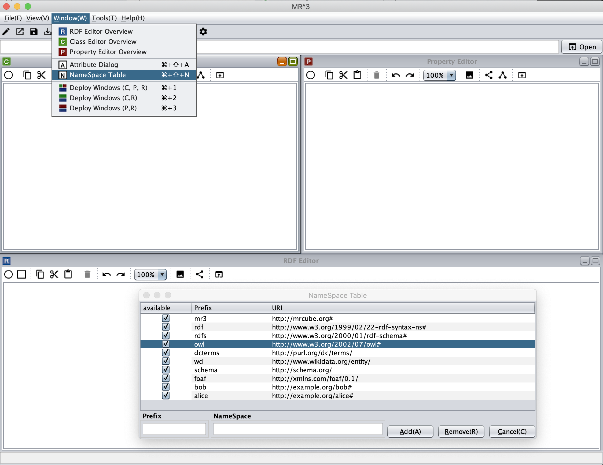
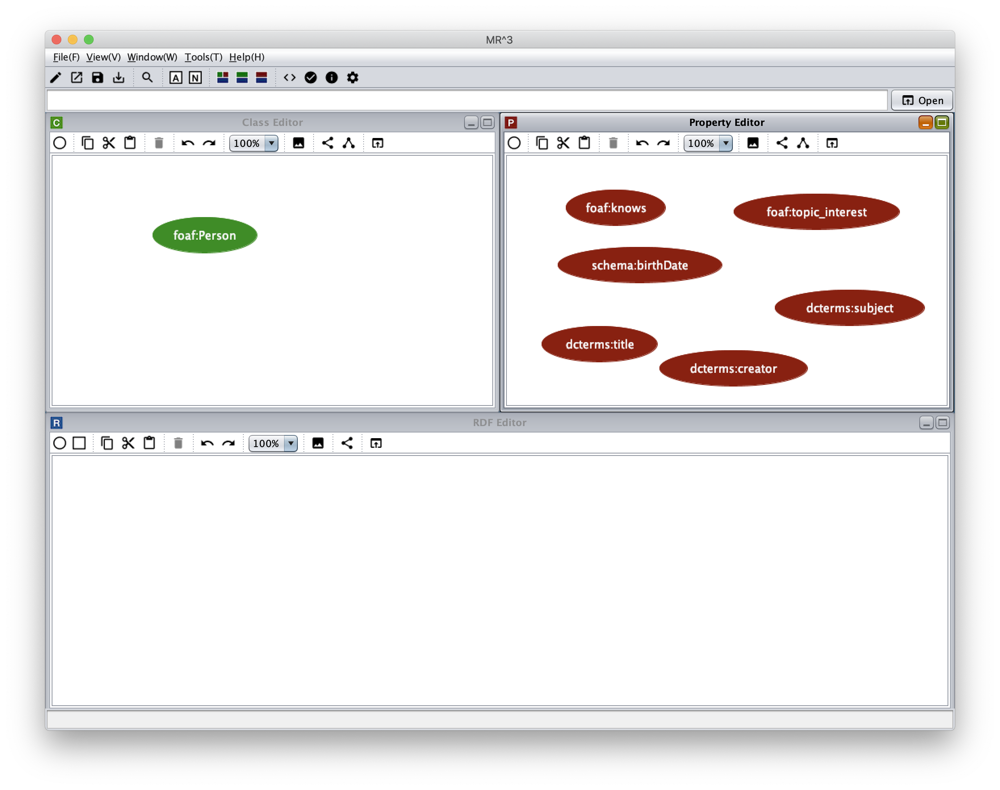
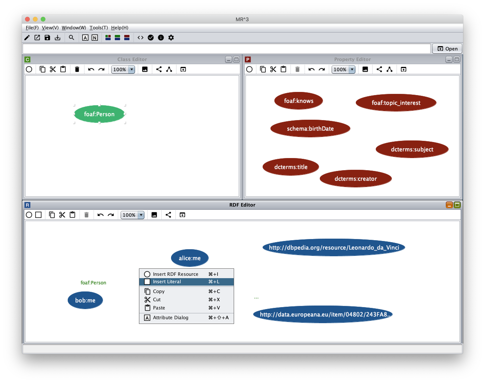
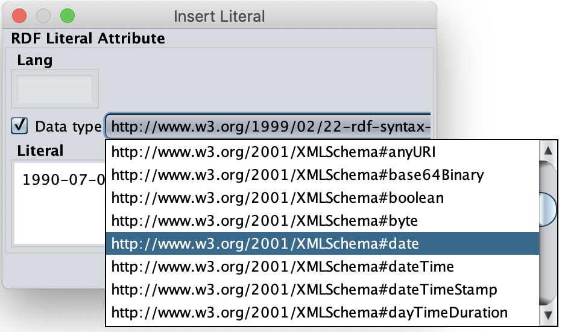
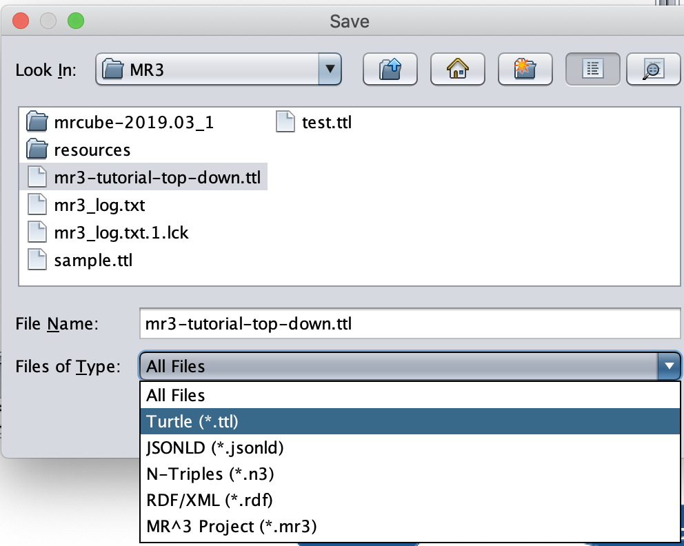
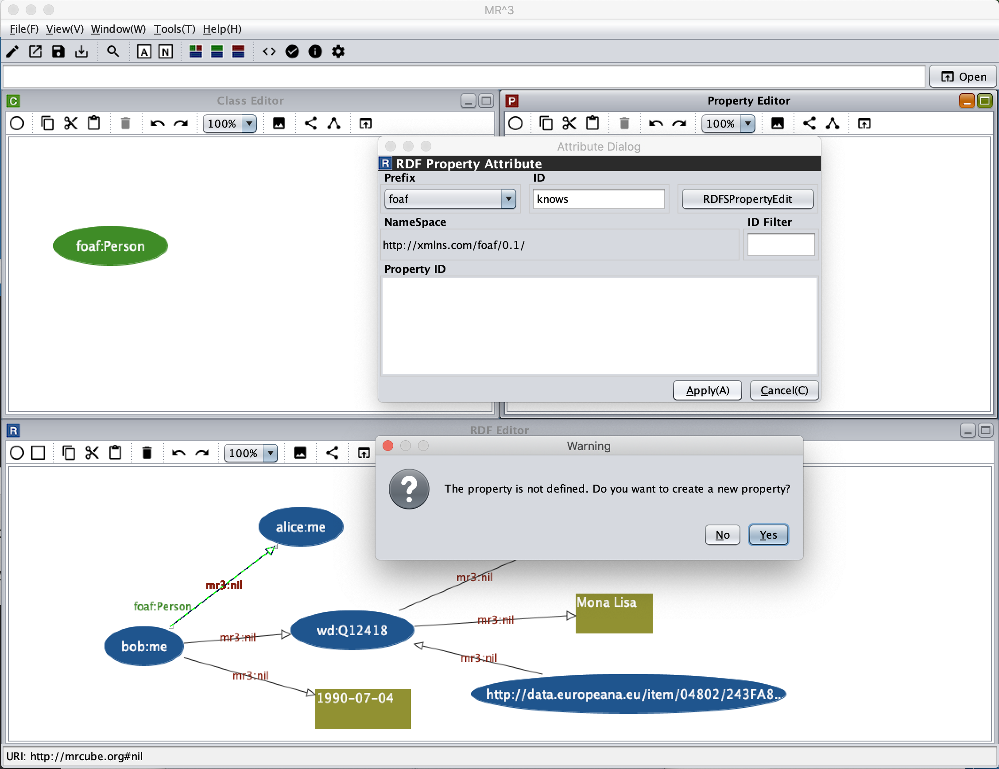

=================
Tutorial
=================

.. contents:: Contents
   :depth: 3

.. |MR3| replace:: MR\ :sup:`3` \

------------------------------   
Overview
------------------------------   
In this tutorial, we build an RDF(S) document that is introduced in `RDF Primer <https://www.w3.org/TR/rdf11-primer/>`_ by using |MR3|. 

There are two ways to build RDF(S) documents by using |MR3|. One is a top down method. In the top down method, the users firstly build RDFS contents and then build RDF contents by using classes and properties defined in the RDFS contents. The users can also use an existing RDFS document by importing the document into |MR3|.

The other is a bottom up method. In the bottom up method. the users can create RDFS classes and properties when they build RDF contents by using RDF(S) contents management facilities.

In this tutorial, we introduce how to build up the RDF(S) document shown below using top down and bottom up methods. You can also check how to build the RDF(S) document from `the videos page <http://mrcube.org/videos.html>`_ in the |MR3| web site. 

.. code-block:: turtle

    BASE   <http://example.org/>
    PREFIX bob: <http://example.org/bob#>
    PREFIX alice: <http://example.org/alice#>
    PREFIX foaf: <http://xmlns.com/foaf/0.1/>
    PREFIX xsd: <http://www.w3.org/2001/XMLSchema#>
    PREFIX schema: <http://schema.org/>
    PREFIX dcterms: <http://purl.org/dc/terms/>
    PREFIX wd: <http://www.wikidata.org/entity/>
 
    bob:me
        a foaf:Person ;
        foaf:knows alice:me ;
        schema:birthDate "1990-07-04"^^xsd:date ;
        foaf:topic_interest wd:Q12418 .
   
    wd:Q12418
        dcterms:title "Mona Lisa" ;
        dcterms:creator <http://dbpedia.org/resource/Leonardo_da_Vinci> .
  
    <http://data.europeana.eu/item/04802/243FA8618938F4117025F17A8B813C5F9AA4D619>
        dcterms:subject wd:Q12418 .

--------------------------------------------------
Building an RDF(S) document by the top down method
--------------------------------------------------
^^^^^^^^^^^^^^^^^^^^^^^^^^^^^^^^^^^^^^^^^^^^^^^^^^^^^^^^^^^^^^^^^^^^^^^^^^^^^^^^^^^^^^^^^^^
1. Registering prefixes and namespaces that are used in the RDF(S) document
^^^^^^^^^^^^^^^^^^^^^^^^^^^^^^^^^^^^^^^^^^^^^^^^^^^^^^^^^^^^^^^^^^^^^^^^^^^^^^^^^^^^^^^^^^^
At the begininng, the users should register prefixes and the corresponding namespaces in the **[Namespace Table]** to build the RDF(S) document. The **[Namespace Table]** can be shown by selecting |nstable| icon in the toolbar or selecting **[Namespace Table]** sub menu in the **[Window]** menu. :numref:`top-down-step1` shows the correspondence between the namespace prefixes and the namespaces shown below registered in the **[Namespace Table]**. The namespace prefixes **mr3**, **rdf**, **rdfs** and **owl** are registered in the initial state.

When the users input a prefix in the **[Prefix]** text field, input a namespace in the **[NameSpace]** textfield, and select **[Add]** button, they are registered in the **[Namespace Table]**. Prefixes and namespaces can be used to create resources (RDF resources, RDF properties, RDFS classes, and RDFS properties).

.. csv-table::
   :header: Prefix, Namespace
   :widths: 5, 30 

   mr3, http://mrcube.org#
   rdf, http://www.w3.org/1999/02/22-rdf-syntax-ns#
   rdfs, http://www.w3.org/2000/01/rdf-schema#
   owl, http://www.w3.org/2002/07/owl#
   foaf, http://xmlns.com/foaf/0.1/
   schema, http://schema.org/
   dcterms, http://purl.org/dc/terms/
   wd, http://www.wikidata.org/entity/
   bob,  http://example.org/bob#
   alice,  http://example.org/alice#

.. |nstable| image:: figures/toolbar/namespace_table.png

.. _top-down-step1:

   Top down step 1

^^^^^^^^^^^^^^^^^^^^^^^^^^^^^^^^^^^^^^^^^^^^^^^^^^^^^^^^^^^^^^^^^^^^^^^^^^^^^^^^^^^^^^^^^^^
2. Inserting an RDFS class
^^^^^^^^^^^^^^^^^^^^^^^^^^^^^^^^^^^^^^^^^^^^^^^^^^^^^^^^^^^^^^^^^^^^^^^^^^^^^^^^^^^^^^^^^^^
In this step, we insert **foaf:Person** class in the Class editor. 

First, when the users click a right mouse button in the **Class Editor**, a popup menu is shown (:numref:`top-down-step2-1`). An RDFS class can be iserted by selecting **[Insert Class]** menu in the popup menu. 

In the example RDF(S) document, **foaf:Person** class is the type of **bob:me** resource. In |MR3|, a type of an RDF resource can be selected from classes in the Class editor. Therefore, in order to select the type of the RDF resource, **foaf:Person** class must be defined before creating the RDF resource by the top down method.

.. _top-down-step2-1:
.. figure:: figures/top-down-step2-1.png
   :scale: 25 %
   :align: center

   Top down step 2-1

After selecting **[Insert Class]** menu, **[Insert Class]** dialog is shown (:numref:`top-down-step2-2`). The RDFS class (foaf:Person) is inserted by selecting **foaf** prefix from the **[Prefix]** combobox, inputting Person in the **[ID]** text field, and selecting the **[OK]** button.

.. _top-down-step2-2:
.. figure:: figures/top-down-step2-2.png
   :scale: 50 %
   :align: center

   Top down step 2-2

^^^^^^^^^^^^^^^^^^^^^^^^^^^^^^^^^^^^^^^^^^^^^^^^^^^^^^^^^^^^^^^^^^^^^^^^^^^^^^^^^^^^^^^^^^^
3. Inserting RDFS properties
^^^^^^^^^^^^^^^^^^^^^^^^^^^^^^^^^^^^^^^^^^^^^^^^^^^^^^^^^^^^^^^^^^^^^^^^^^^^^^^^^^^^^^^^^^^
In this step, insert RDFS properties in the example RDF(S) document (**foaf:knows**, **schema:birthDate**, **foaf:topic_interest**, **dcterms:title**, **dcterms:creator**, **dcterms:subject**). 

When the users click a right mouse button in the **Property Editor**, a popup menu is shown. After selecting **[Insert Proerty]** menu, the **[Insert Property]** dialog is shown (:numref:`top-down-step3-1`). An RDFS property is inserted by selecting a prefix from the **[Prefix]** combobox, inputting id in the **[ID]** text field, and selecting the **[OK]** button.

In |MR3|, an RDF property can be selected from the properties in the **Property Editor**. Therefore in order to select an RDF property, the corresponding RDFS property must be defined before using the RDF property by the top down method.

:numref:`top-down-step3-1` shows a dialog when the users insert **foaf:knows** property in the **Property Editor**.

.. _top-down-step3-1:
.. figure:: figures/top-down-step3-1.png
   :scale: 50 %
   :align: center

   Top down step 3-1

:numref:`top-down-step3-2` shows a screenshot after inserting **foaf:Person** class in the **Class Editor**, and **foaf:knows**, **schema:birthDate**, **foaf:topic_interest**, **dcterms:title**, **dcterms:creator**, **dcterms:subject** properties in the **Property Editor**.

.. _top-down-step3-2:

   Top down step 3-2

^^^^^^^^^^^^^^^^^^^^^^^^^^^^^^^^^^^^^^^^^^^^^^^^^^^^^^^^^^^^^^^^^^^^^^^^^^^^^^^^^^^^^^^^^^^
4. Inserting RDF resources
^^^^^^^^^^^^^^^^^^^^^^^^^^^^^^^^^^^^^^^^^^^^^^^^^^^^^^^^^^^^^^^^^^^^^^^^^^^^^^^^^^^^^^^^^^^
In the following steps, we build RDF contents based on the RDFS class and the RDFS properties built by above steps.

First, insert an RDF resource in the **RDF Editor**. When the users click a right mouse button in the **RDF Editor**, a popup menu is shown. :numref:`top-down-step4-1` shows a screenshot showing the popup menu.

.. _top-down-step4-1:
.. figure:: figures/top-down-step4-1.png
   :scale: 25 %
   :align: center

   Top down step 4-1

After selecting **[Insert RDF Resource]** menu, the **[Insert RDF Resource]** dialog is shown (:numref:`top-down-step4-2`). A type of an RDF resource can be selected from **[Resource Type]** combobox. Types of RDF resources can be selected from RDFS classes in the **Class Editor**. Here, select **foaf:Person** class as a type of an RDF resource. Then, input **http://example.org/bob#me** in the **[RDF Resource]** text field. The RDF resource is inserted after selecting the type of the RDF resource, inputting the URI of the RDF resource, and select the **[OK]** button.

.. _top-down-step4-2:
.. figure:: figures/top-down-step4-2.png
   :scale: 50 %
   :align: center

   Top down step 4-2

In the same way, insert **alice:me**, **wd:Q12418**, **http://dbpedia.org/resource/Leonardo_da_Vinci**, **http://data.europeana.eu/item/04802/243FA8618938F4117025F17A8B813C5F9AA4D619** as RDF resources in the **RDF Editor**. Select empty as the type of resources.

^^^^^^^^^^^^^^^^^^^^^^^^^^^^^^^^^^^^^^^^^^^^^^^^^^^^^^^^^^^^^^^^^^^^^^^^^^^^^^^^^^^^^^^^^^^
5. Inserting RDF literals
^^^^^^^^^^^^^^^^^^^^^^^^^^^^^^^^^^^^^^^^^^^^^^^^^^^^^^^^^^^^^^^^^^^^^^^^^^^^^^^^^^^^^^^^^^^
In this step, insert "1990-07-04"^^xsd:date と "Mona Lisa" RDF literals in the **RDF Editor**. 

When the users click a right mouse button in the **RDF Editor** and select **[Insert Literal]** menu in the popup menu (:numref:`top-down-step5-1`), the **[Insert Literal]** dialog is shown. 

.. _top-down-step5-1:

   Top down step 5-1

:numref:`top-down-step5-2` shows the **[Insert Literal]** dialog. An RDF literal is inserted after inputting strings in the **[Literal]** text area and selecting **[OK]** button. When the users check the **[Data type]** checkbox, a data type of a literal can be selected from the **[Data type[** combobox. Here, select **http://www.w3.org/2001/XMLSchema#date** (xsd:date) as the data type of "1990-07-04" literal.

.. _top-down-step5-2:

   Top down step 5-2

^^^^^^^^^^^^^^^^^^^^^^^^^^^^^^^^^^^^^^^^^^^^^^^^^^^^^^^^^^^^^^^^^^^^^^^^^^^^^^^^^^^^^^^^^^^
6. Inserting RDF properties
^^^^^^^^^^^^^^^^^^^^^^^^^^^^^^^^^^^^^^^^^^^^^^^^^^^^^^^^^^^^^^^^^^^^^^^^^^^^^^^^^^^^^^^^^^^
In this step, insert RDF properties in the **RDF Editor**. First, move the mouse cursor to the center of a source (subject) RDF resource. At that time, the shape of mouse cursor changes from arrow to cross. After that, drag the mouse cursor to the center of a target (object) RDF resource or RDF literal. When the shape of mouse cursor changes from arrow to cross, drop the mouse cursor. Then, two nodes are connected with an RDF property. If the users do not select one of the RDFS properties in the **Property Editor**, the RDF property becomes **mr3:nil** which is the default RDF property in |MR3|. If the users select one of the RDFS properties, the selected RDFS property is used for the RDF property.

Here, connect **bob:me** RDF resource and **alice:me** RDF resource with **foaf:knows** RDF property. :numref:`top-down-step6-1` shows the screenshot of connecting these nodes.

In the same way，connect **bob:me** RDF resourcre and **"1990-07-04"** literal with **schema:birthDate** property. Connect **bob:me** RDF resource and **wd:Q12418** RDF resource with **foaf:topic_interest** property. Connect **wd:Q12418** RDF resource and **http://dbpedia.org/resource/Leonardo_da_Vinci** RDF resource with **dcterms:creator** property. Connect **wd:Q12418** RDF resource and **"Mona Lisa"** literal with **dcterms:title** property. **http://data.europeana.eu/item/04802/243FA8618938F4117025F17A8B813C5F9AA4D619** RDF resource and **wd:Q12418** RDF resource with **dcterms:subject** property.

.. _top-down-step6-1:
.. figure:: figures/top-down-step6-1.png
   :scale: 25 %
   :align: center

   Top down step 6-1

In order to edit an RDF property, the **[Attribute Dialog]** is used. The **[Attribute Dialog]** is shown by clicking |attr-dialog| icon in the toolbar or selecting **[Attribute Dialog]** menu in the popup menu in the **RDF Editor**.

:numref:`top-down-step6-2` shows a screenshot of the **[Attribute Dialog]** when the users select **foaf:knows** RDF property. An RDF property can be edited by selecting a prefix from the **[Prefix]** combobox, selecting an id from **[Property ID]** list, and selecting **[Apply]** button.

.. _top-down-step6-2:
.. figure:: figures/top-down-step6-2.png
   :scale: 50 %
   :align: center

   Top down step 6-2

^^^^^^^^^^^^^^^^^^^^^^^^^^^^^^^^^^^^^^^^^^^^^^^^^^^^^^^^^^^^^^^^^^^^^^^^^^^^^^^^^^^^^^^^^^^
7. Exporting the RDF contents as an RDF(S) document
^^^^^^^^^^^^^^^^^^^^^^^^^^^^^^^^^^^^^^^^^^^^^^^^^^^^^^^^^^^^^^^^^^^^^^^^^^^^^^^^^^^^^^^^^^^
Finally, export the RDF contents as an RDF(S) document.

As a result, the following RDFS classes, RDFS properties, and an RDF model are created in each editor (:numref:`top-down-step7-1`). 

.. _top-down-step7-1:
.. figure:: figures/top-down-step7-1.png
   :scale: 25 %
   :align: center

   Top down step 7-1

To see how the RDF(S) contents you created is output, show the **RDF Source Code Viewer**. :numref:`top-down-step7-2` shows a screenshot of the **RDF Source Code Viewer**. The **[RDF Source Code Viewer]** is shown by clicking |code_viewer| icon in the toolbar or selecting **[RDF Source Code Viewer]** sub menu on the **Tools** menu. The users can select **Turtle**, **JSONLD**, **XML**, and **N-Triples** formats as the syntax from the radio button. Selecting the radio button will display the RDF source code with the specified syntax.

.. |export| image:: figures/toolbar/saveas.png 

.. _top-down-step7-2:
.. figure:: figures/top-down-step7-2.png
   :scale: 50 %
   :align: center

   Top down step 7-2

If the users want to output the created RDF(S) content to a file, select the **[Save As]** button on the **[File]** menu. Then, **[Save]** dialog is shown (:numref:`top-down-step7-3`). Select the folder the users want to save, select an RDF format from **[Files of Type]** combobox, and press the **[Save]** button, the RDF(S) content will be saved to the file in the specified format. Here, select **[Turtle（\*.ttl)]** to save the RDF(S) content as Turtle format.

.. _top-down-step7-3:

   Top down step 7-3

--------------------------------------------------------
Building an RDF(S) document by the bottom up method
--------------------------------------------------------

^^^^^^^^^^^^^^^^^^^^^^^^^^^^^^^^^^^^^^^^^^^^^^^^^^^^^^^^^^^^^^^^^^^^^^^^^^^^^^^^^^^^^^^^^^^
1. Registering prefixes and namespaces that are used in the RDF(S) document
^^^^^^^^^^^^^^^^^^^^^^^^^^^^^^^^^^^^^^^^^^^^^^^^^^^^^^^^^^^^^^^^^^^^^^^^^^^^^^^^^^^^^^^^^^^
This step is same as the step1 in the top down method.

^^^^^^^^^^^^^^^^^^^^^^^^^^^^^^^^^^^^^^^^^^^^^^^^^^^^^^^^^^^^^^^^^^^^^^^^^^^^^^^^^^^^^^^^^^^
2. Inserting RDF resources and creating an RDFS class
^^^^^^^^^^^^^^^^^^^^^^^^^^^^^^^^^^^^^^^^^^^^^^^^^^^^^^^^^^^^^^^^^^^^^^^^^^^^^^^^^^^^^^^^^^^
This step is almost same as the step4 in the top down method.

The difference is the type of **http: //www.w3.org/People/EM/contact#me** resource is not defined in the Class Editor at this time. In the bottom up method, the users can create an RDFS class while editing an RDF resource.

The attributes of **http: //www.w3.org/People/EM/contact#me** resource are shown in the Attribute Dialog by selecting the resource and showing the Attribute Dialog. Then, select Type item in the left side list. After that, Check isType checkbox, select contact from the Prefix combobox, and input Person in the Resource Type ID. If the selected class is defined in the Class Editor, the selected class can be set as a type of an RDF resource. In this case, since the selected class (contact:Person) is not defined in the Class Editor, the selected class can not be set as the type of the RDF resource in this state. In this situation, |MR3| performs an RDF(S) management facility to maintain consistency. When the users click Apply button in the Attribute Dialog, RDF(S) management dialog is shown as follows. 

.. figure:: figures/bottom-up-step2-1.png
   :scale: 25 %
   :align: center

If the users click the Yes button in the RDF(S) management dialog, contact:Person class is created in the Class Editor as follows.

.. figure:: figures/bottom-up-step2-2.png
   :scale: 25 %
   :align: center

^^^^^^^^^^^^^^^^^^^^^^^^^^^^^^^^^^^^^^^^^^^^^^^^^^^^^^^^^^^^^^^^^^^^^^^^^^^^^^^^^^^^^^^^^^^
3. Inserting RDF literals
^^^^^^^^^^^^^^^^^^^^^^^^^^^^^^^^^^^^^^^^^^^^^^^^^^^^^^^^^^^^^^^^^^^^^^^^^^^^^^^^^^^^^^^^^^^
This step is same as the step5 in the top down method.

^^^^^^^^^^^^^^^^^^^^^^^^^^^^^^^^^^^^^^^^^^^^^^^^^^^^^^^^^^^^^^^^^^^^^^^^^^^^^^^^^^^^^^^^^^^
4. Inserting RDF properties
^^^^^^^^^^^^^^^^^^^^^^^^^^^^^^^^^^^^^^^^^^^^^^^^^^^^^^^^^^^^^^^^^^^^^^^^^^^^^^^^^^^^^^^^^^^
This step is almost same as the step6 in the top down method.

The difference is RDFS properties are not defined in the Property Editor at this time. In the bottom up method, the users can create an RDFS property while editing an RDF property.

First, select an RDF property and show the Attribute Dialog. At this time, RDF resources and literals are connected with mr3:nil property. 

Second, uncheck the Show Property Prefix Only checkbox. If this checkbox is checked, the users only select prefixes that RDFS properties defined in the Property Editor have. In this case, since any RDFS properties are not defined in the Property Editor, uncheck the checkbox to select contact prefix.

Third, select contact prefix in the Prefix combobox. since there are no Ids in the Property ID list, input an id in the ID text field and click Apply button. Then, the RDF(S) management dialog is shown to maintain the consistency. The following figure shows a screenshot when the users input fullName in the ID text field and click the Apply button.

   
If the users click the Yes button in the RDF(S) management dialog, contact:fullName property is created in the Property Editor as follows.

.. figure:: figures/bottom-up-step4-2.png
   :scale: 25 %
   :align: center

Create contact:mailbox and contact:personalTitle properties in the same way.

^^^^^^^^^^^^^^^^^^^^^^^^^^^^^^^^^^^^^^^^^^^^^^^^^^^^^^^^^^^^^^^^^^^^^^^^^^^^^^^^^^^^^^^^^^^
5. Exporting the RDF(S) contents as an RDF(S) document
^^^^^^^^^^^^^^^^^^^^^^^^^^^^^^^^^^^^^^^^^^^^^^^^^^^^^^^^^^^^^^^^^^^^^^^^^^^^^^^^^^^^^^^^^^^
This step is same as the step7 in the top down method.
   