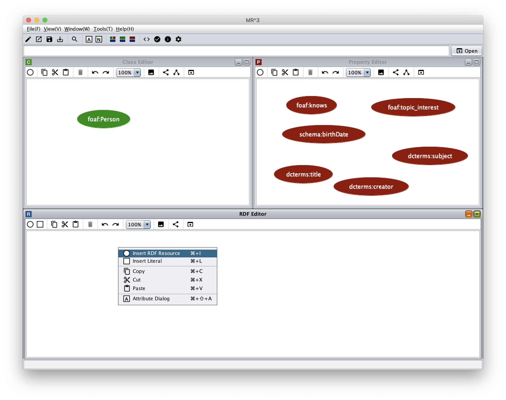
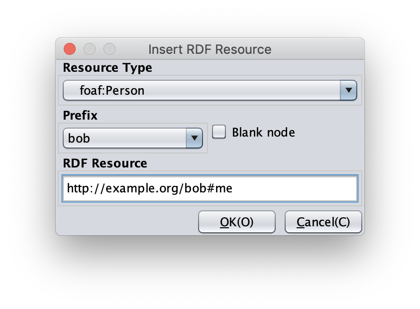
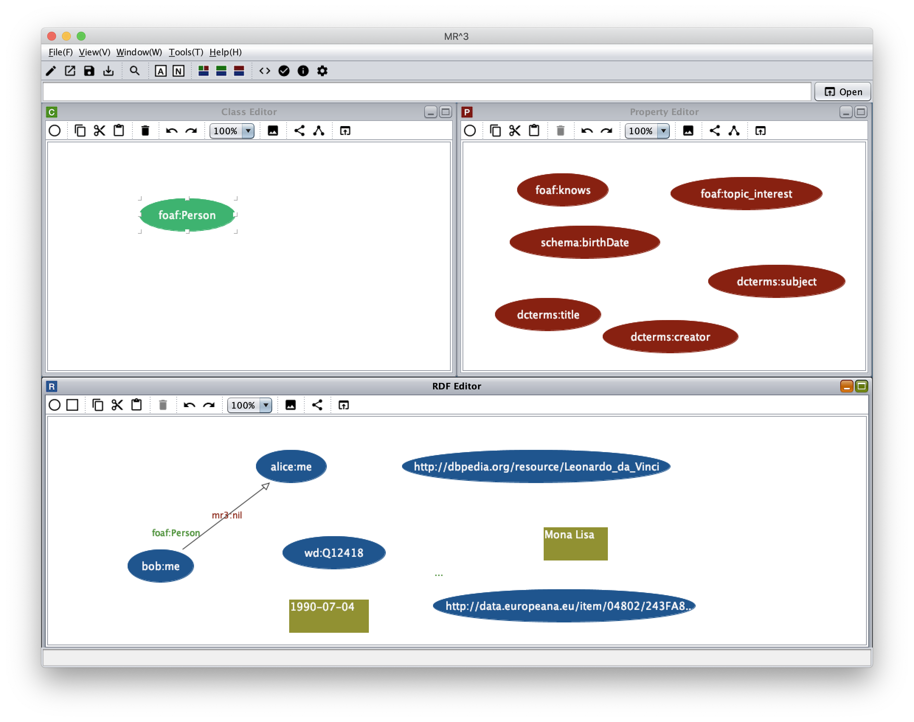
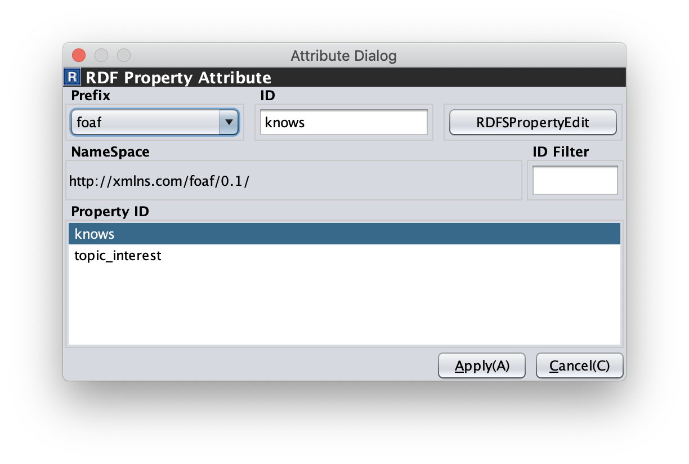
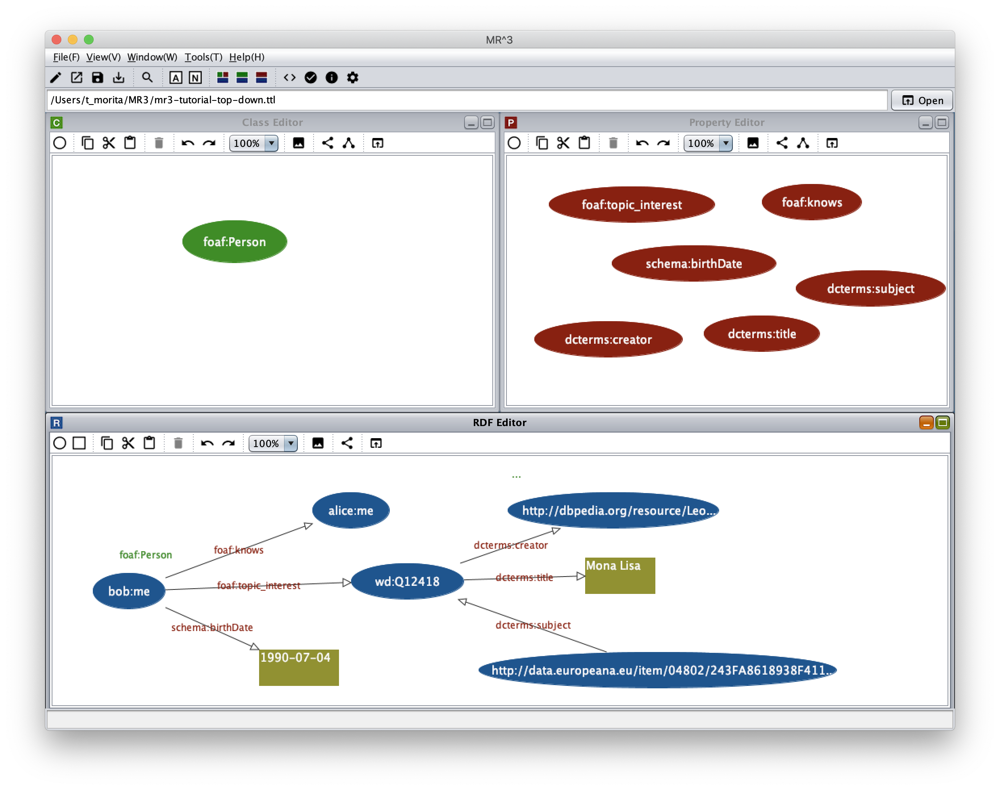
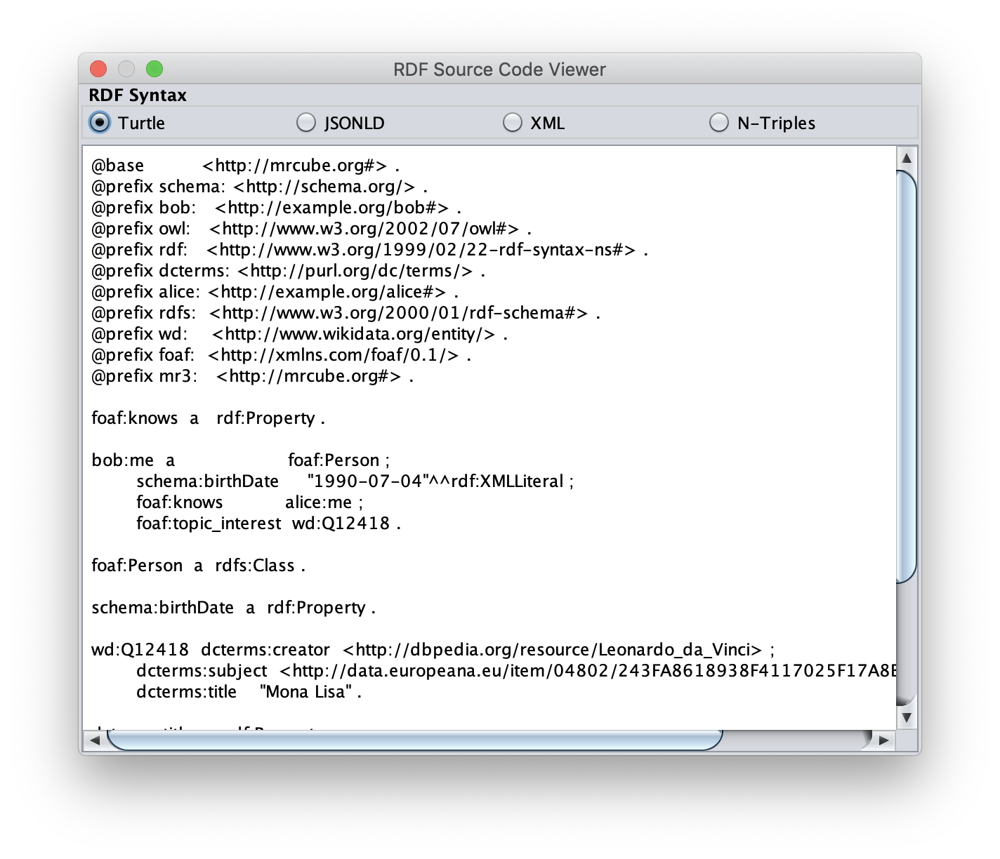
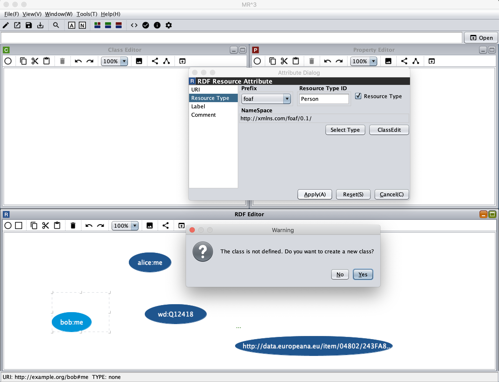
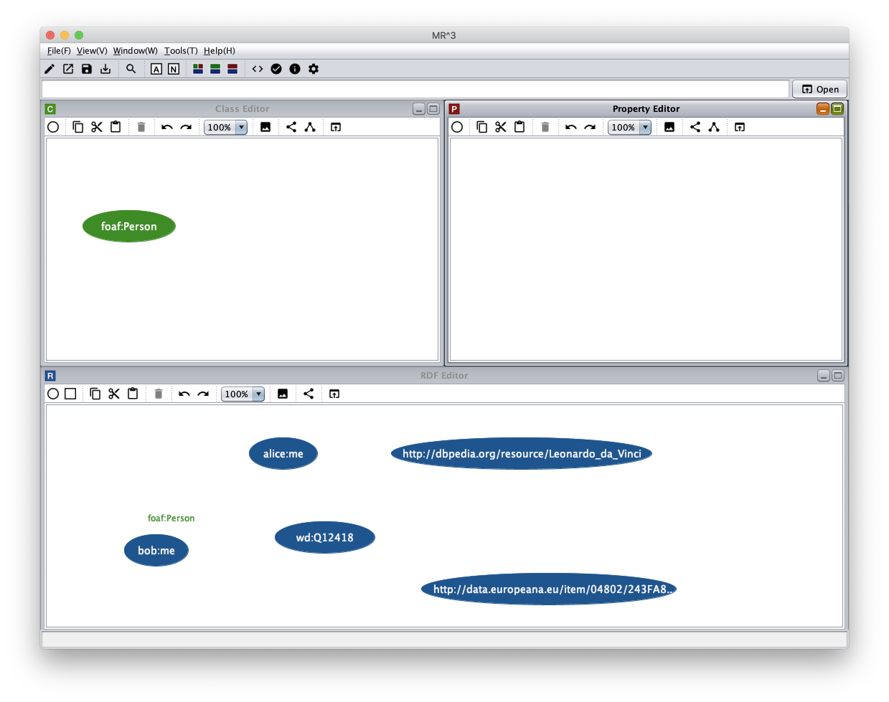
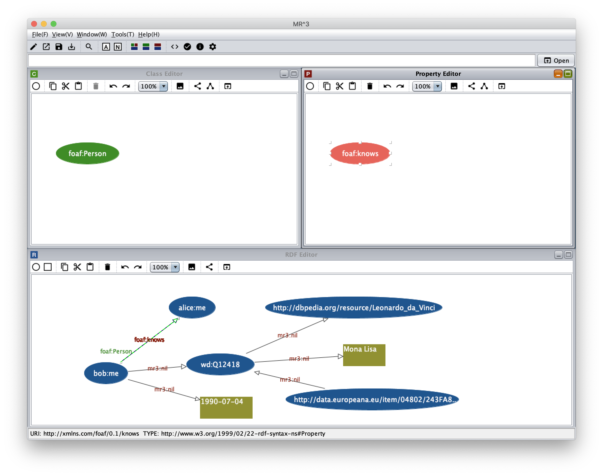

=================
Tutorial
=================

.. contents:: Contents
   :depth: 3

.. |MR3| replace:: MR\ :sup:`3` \

------------------------------   
Overview
------------------------------   
In this tutorial, we build an RDF document that is introduced in `RDF Primer <https://www.w3.org/TR/2004/REC-rdf-primer-20040210/>`_ (Example 1: RDF/XML Describing Eric Miller as shown below) by using |MR3|. 

There are two ways to build the RDF document by using |MR3|. One is a top down method. In the top down method, the users firstly build RDFS contents and then build RDF contents by using classes and properties defined in the RDFS contents. The users can also use an existing RDFS document by importing the document into |MR3|.

The other is a bottom up method. In the bottom up method. the users can create RDFS classes and properties when they build RDF contents by using RDF(S) contents management facilities.

In this tutorial, we introduce both of them. You can also check how to build the RDF document from `the videos page <http://mrcube.org/videos.html>`_ in the |MR3| web site. Finally, we describe an example of replacing an RDFS document.

Example 1: RDF/XML Describing Eric Miller

.. code-block:: xml

    <?xml version="1.0"?>
    <rdf:RDF xmlns:rdf="http://www.w3.org/1999/02/22-rdf-syntax-ns#"
             xmlns:contact="http://www.w3.org/2000/10/swap/pim/contact#">

      <contact:Person rdf:about="http://www.w3.org/People/EM/contact#me">
        <contact:fullName>Eric Miller</contact:fullName>
        <contact:mailbox rdf:resource="mailto:em@w3.org"/>
        <contact:personalTitle>Dr.</contact:personalTitle>
      </contact:Person>
    </rdf:RDF>

--------------------------------------------------
Building an RDF document by the top down method
--------------------------------------------------
^^^^^^^^^^^^^^^^^^^^^^^^^^^^^^^^^^^^^^^^^^^^^^^^^^^^^^^^^^^^^^^^^^^^^^^^^^^^^^^^^^^^^^^^^^^
1. Registering prefixes and namespaces that are used in the RDF document
^^^^^^^^^^^^^^^^^^^^^^^^^^^^^^^^^^^^^^^^^^^^^^^^^^^^^^^^^^^^^^^^^^^^^^^^^^^^^^^^^^^^^^^^^^^
At the begininng, the users should register prefixes and the corresponding namespaces in the Namespace Table to build the RDF document. The Namespace table can be shown by selecting |nstable| icon in the toolbar or selecting Show Namespace Table sub menu in the Window menu.

In the following figure, **contact** prefix and the corresponding namespace (**http: //www.w3.org/2000/10/swap/pim/contact#**) are registered in the Namespace Table. When the users input a prefix in the Prefix text field, input a namespace in the NameSpace textfield, and select Add button, they are registered in the Namespace Table. 

Prefixes and namespaces can be used to create resources (RDF resources, RDF properties, RDFS classes, and RDFS properties).

.. figure:: figures/top-down-step1.png
   :scale: 40 %
   :align: center

^^^^^^^^^^^^^^^^^^^^^^^^^^^^^^^^^^^^^^^^^^^^^^^^^^^^^^^^^^^^^^^^^^^^^^^^^^^^^^^^^^^^^^^^^^^
2. Inserting an RDFS class
^^^^^^^^^^^^^^^^^^^^^^^^^^^^^^^^^^^^^^^^^^^^^^^^^^^^^^^^^^^^^^^^^^^^^^^^^^^^^^^^^^^^^^^^^^^
In this step, we insert contact:Person class in the Class editor. 

First, when the users click a right mouse button in the Class Editor, a popup menu is shown. An RDFS class can be iserted by selecting **Insert Class menu** in the popup menu. The following figure shows the popup menu.

In the example RDF document, contact:Person class is the type of **http: //www.w3.org/People/EM/contact#me** resource. In |MR3|, a type of an RDF resource can be selected from classes in the Class editor. Therefore, in order to select the type of the RDF resource, contact:Person class must be defined before creating the RDF resource by the top down method.

.. figure:: figures/top-down-step2-1.png
   :scale: 40 %
   :align: center

After selecting **Insert Class menu**, the following dialog is shown. The RDFS class (contact:Person) is inserted by selecting contact prefix from the Prefix combobox, inputting Person in the ID text field, and selecting the OK button.

.. figure:: figures/top-down-step2-2.png
   :scale: 50 %
   :align: center

^^^^^^^^^^^^^^^^^^^^^^^^^^^^^^^^^^^^^^^^^^^^^^^^^^^^^^^^^^^^^^^^^^^^^^^^^^^^^^^^^^^^^^^^^^^
3. Inserting RDFS properties
^^^^^^^^^^^^^^^^^^^^^^^^^^^^^^^^^^^^^^^^^^^^^^^^^^^^^^^^^^^^^^^^^^^^^^^^^^^^^^^^^^^^^^^^^^^
In this step, insert RDFS properties in the example RDF document (contact:fullName，contact:mailbox，contact: personalTitle). 

When the users click a right mouse button in the Property Editor, a popup menu is shown. After selecting **Insert Proerty menu**, the following dialog is shown. An RDFS property is inserted by selecting a prefix from the Prefix combobox, inputting id in the ID text field, and selecting the OK button.

In |MR3|, an RDF property can be selected from the properties in the Property Editor. Therefore in order to select an RDF property, the corresponding RDFS property must be defined before using the RDF property by the top down method.

The following figure shows a dialog when the users insert contact:fullName property in the Property Editor.

.. figure:: figures/top-down-step3-1.png
   :scale: 100 %
   :align: center

The following figure shows a screenshot after inserting contact:Person class, contact:fullName，contact:mailbox，and contact:personalTitle properties.

.. figure:: figures/top-down-step3-2.png
   :scale: 60 %
   :align: center

^^^^^^^^^^^^^^^^^^^^^^^^^^^^^^^^^^^^^^^^^^^^^^^^^^^^^^^^^^^^^^^^^^^^^^^^^^^^^^^^^^^^^^^^^^^
4. Inserting RDF resources
^^^^^^^^^^^^^^^^^^^^^^^^^^^^^^^^^^^^^^^^^^^^^^^^^^^^^^^^^^^^^^^^^^^^^^^^^^^^^^^^^^^^^^^^^^^
In the following steps, we build RDF contents based on the RDFS class and the RDFS properties built by above steps.

First, insert an RDF resource in the RDF Editor. When the users click a right mouse button in the RDF Editor, a popup menu is shown. The following figure shows a screenshot showing the popup menu.

After selecting **Insert RDF Resource menu**, the following dialog is shown. A type of an RDF resource can be selected from **Resource Type combobox**. Types of RDF resources can be selected from RDFS classes in the Class Editor. Here, select contact:Person class as a type of an RDF resource. Then, input **http://www.w3.org/People/EM/contact#me** in the RDF Resource text field. The RDF resource is inserted after selecting the type of the RDF resource, inputting the URI of the RDF resource, and select the OK button.

In the same way, insert **mailto:em@w3.org** as an RDF resource in the RDF Editor. Select empty as the type of **mailto:em@w3.org**.

.. note::
    Here, since **http://www.w3.org/People/EM/contact#** and the corresponding prefix are not defined in the Namespace Table, we input URI of the RDF resource directly in the RDF Resource text field. If the namespace and the prefix are registered in the Namespace Table, the namespace is automatically inserted in the RDF Resource text field by selecting the corresponding prefix in the Prefix combobox. In addition, if the users check the blank checkbox, the RDF resource become blank node.

^^^^^^^^^^^^^^^^^^^^^^^^^^^^^^^^^^^^^^^^^^^^^^^^^^^^^^^^^^^^^^^^^^^^^^^^^^^^^^^^^^^^^^^^^^^
5. Inserting RDF literals
^^^^^^^^^^^^^^^^^^^^^^^^^^^^^^^^^^^^^^^^^^^^^^^^^^^^^^^^^^^^^^^^^^^^^^^^^^^^^^^^^^^^^^^^^^^
In this step, insert **Eric Miller** and **Dr.** RDF literals in the RDF Editor. 

When the users click a right mouse button in the RDF Editor and select **Insert Literal menu** in the popup menu, the following dialog is shown. An RDF literal is inserted after inputting strings in the Literal text area and selecting OK button.

.. figure:: figures/top-down-step5.png
   :scale: 100 %
   :align: center

^^^^^^^^^^^^^^^^^^^^^^^^^^^^^^^^^^^^^^^^^^^^^^^^^^^^^^^^^^^^^^^^^^^^^^^^^^^^^^^^^^^^^^^^^^^
6. Inserting RDF properties
^^^^^^^^^^^^^^^^^^^^^^^^^^^^^^^^^^^^^^^^^^^^^^^^^^^^^^^^^^^^^^^^^^^^^^^^^^^^^^^^^^^^^^^^^^^
In this step, insert RDF properties in the RDF Editor. 

First, change connect mode by clicking a right mouse button and selecting **Connect Mode menu** as shown below. The users also can change the connect mode by clicking |connect| icon in the toolbar.

.. |connect| image:: figures/toolbar/connect.gif 

Second, move the mouse cursor to the center of an RDF resource, drag the mouse cursor to the center of an RDF resource or an RDF literal, and drop the mouse cursor. Then, two nodes are connected with an RDF property. If the users do not select one of the RDFS properties in the Property Editor, the RDF property become mr3:nil which is the default RDF property in |MR3|. If the users select one of the RDFS properties, the selected RDFS property is used for the RDF property.

Here, connect **http: //www.w3.org/People/EM/contact#me** RDF resource and **Eric Miller** literal with **contact:fullName** RDF property. In the same way，connect the RDF resourcre and **Dr.** literal with **contact:personalTitle** property. Connect the RDF resource and **mailto:em@w3.org** resource with **contact:mailbox** property.

In order to edit an RDF property, the Attribute Dialog is used. The Attribute Dialog is shown by clicking |attr-dialog| icon in the toolbar or selecting **Show Attribute Dialog menu** in the popup menu in the RDF Editor.

The following figure shows a screenshot of the Attribute Dialog when the users select an RDF property. An RDF property can be edited by selecting a prefix from the Prefix combobox, selecting an id from Property ID list, and selecting Apply button.

.. |attr-dialog| image:: figures/toolbar/attr_dialog.png 

^^^^^^^^^^^^^^^^^^^^^^^^^^^^^^^^^^^^^^^^^^^^^^^^^^^^^^^^^^^^^^^^^^^^^^^^^^^^^^^^^^^^^^^^^^^
7. Exporting the RDF contents as an RDF document
^^^^^^^^^^^^^^^^^^^^^^^^^^^^^^^^^^^^^^^^^^^^^^^^^^^^^^^^^^^^^^^^^^^^^^^^^^^^^^^^^^^^^^^^^^^
Finally, export the RDF contents as an RDF document.

As a result, the following RDFS classes, RDFS properties, and an RDF model are created in each editor.

First, show the Export Dialog by selecting **Export sub menu** in the File menu or selecting |export| icon in the toolbar. 

Second, select Syntax, Data Type, and Option. Here, select RDF/XML as the syntax and select RDF checkbox to export only RDF model as RDF/XML format. The source of the RDF document is shown at bottom part of the Export Dialog.

.. |export| image:: figures/toolbar/export.png 

When the users select File button, a Save dialog is shown. Then, you can select or create a file to export the RDF document.
   
--------------------------------------------------------
Building an RDF document by the bottom up method
--------------------------------------------------------

^^^^^^^^^^^^^^^^^^^^^^^^^^^^^^^^^^^^^^^^^^^^^^^^^^^^^^^^^^^^^^^^^^^^^^^^^^^^^^^^^^^^^^^^^^^
1. Registering prefixes and namespaces that are used in the RDF document
^^^^^^^^^^^^^^^^^^^^^^^^^^^^^^^^^^^^^^^^^^^^^^^^^^^^^^^^^^^^^^^^^^^^^^^^^^^^^^^^^^^^^^^^^^^
This step is same as the step1 in the top down method.

^^^^^^^^^^^^^^^^^^^^^^^^^^^^^^^^^^^^^^^^^^^^^^^^^^^^^^^^^^^^^^^^^^^^^^^^^^^^^^^^^^^^^^^^^^^
2. Inserting RDF resources and creating an RDFS class
^^^^^^^^^^^^^^^^^^^^^^^^^^^^^^^^^^^^^^^^^^^^^^^^^^^^^^^^^^^^^^^^^^^^^^^^^^^^^^^^^^^^^^^^^^^
This step is almost same as the step4 in the top down method.

The difference is the type of **http: //www.w3.org/People/EM/contact#me** resource is not defined in the Class Editor at this time. In the bottom up method, the users can create an RDFS class while editing an RDF resource.

The attributes of **http: //www.w3.org/People/EM/contact#me** resource are shown in the Attribute Dialog by selecting the resource and showing the Attribute Dialog. Then, select Type item in the left side list. After that, Check isType checkbox, select contact from the Prefix combobox, and input Person in the Resource Type ID. If the selected class is defined in the Class Editor, the selected class can be set as a type of an RDF resource. In this case, since the selected class (contact:Person) is not defined in the Class Editor, the selected class can not be set as the type of the RDF resource in this state. In this situation, |MR3| performs an RDF(S) management facility to maintain consistency. When the users click Apply button in the Attribute Dialog, RDF(S) management dialog is shown as follows. 

If the users click the Yes button in the RDF(S) management dialog, contact:Person class is created in the Class Editor as follows.

^^^^^^^^^^^^^^^^^^^^^^^^^^^^^^^^^^^^^^^^^^^^^^^^^^^^^^^^^^^^^^^^^^^^^^^^^^^^^^^^^^^^^^^^^^^
3. Inserting RDF literals
^^^^^^^^^^^^^^^^^^^^^^^^^^^^^^^^^^^^^^^^^^^^^^^^^^^^^^^^^^^^^^^^^^^^^^^^^^^^^^^^^^^^^^^^^^^
This step is same as the step5 in the top down method.

^^^^^^^^^^^^^^^^^^^^^^^^^^^^^^^^^^^^^^^^^^^^^^^^^^^^^^^^^^^^^^^^^^^^^^^^^^^^^^^^^^^^^^^^^^^
4. Inserting RDF properties
^^^^^^^^^^^^^^^^^^^^^^^^^^^^^^^^^^^^^^^^^^^^^^^^^^^^^^^^^^^^^^^^^^^^^^^^^^^^^^^^^^^^^^^^^^^
This step is almost same as the step6 in the top down method.

The difference is RDFS properties are not defined in the Property Editor at this time. In the bottom up method, the users can create an RDFS property while editing an RDF property.

First, select an RDF property and show the Attribute Dialog. At this time, RDF resources and literals are connected with mr3:nil property. 

Second, uncheck the Show Property Prefix Only checkbox. If this checkbox is checked, the users only select prefixes that RDFS properties defined in the Property Editor have. In this case, since any RDFS properties are not defined in the Property Editor, uncheck the checkbox to select contact prefix.

Third, select contact prefix in the Prefix combobox. since there are no Ids in the Property ID list, input an id in the ID text field and click Apply button. Then, the RDF(S) management dialog is shown to maintain the consistency. The following figure shows a screenshot when the users input fullName in the ID text field and click the Apply button.

.. figure:: figures/bottom-up-step4-1.png
   :scale: 30 %
   :align: center
   
If the users click the Yes button in the RDF(S) management dialog, contact:fullName property is created in the Property Editor as follows.

Create contact:mailbox and contact:personalTitle properties in the same way.

^^^^^^^^^^^^^^^^^^^^^^^^^^^^^^^^^^^^^^^^^^^^^^^^^^^^^^^^^^^^^^^^^^^^^^^^^^^^^^^^^^^^^^^^^^^
5. Exporting the RDF contents as an RDF document
^^^^^^^^^^^^^^^^^^^^^^^^^^^^^^^^^^^^^^^^^^^^^^^^^^^^^^^^^^^^^^^^^^^^^^^^^^^^^^^^^^^^^^^^^^^
This step is same as the step7 in the top down method.
   
---------------------------------------------
An example of replacing RDFS contents
---------------------------------------------
The users can replace an RDFS contents by selecting RDFS as Data Type, selecting Replace as Import Method, and selecting Import button in the Import Dialog as shown below.

In the following descriptions, prefix animal represents **http://example.com/animal#** and prefix mr3 represents **http://mr3.sourceforege.net#**.

.. figure:: figures/import_dialog_rdfs_replace.png
   :scale: 70 %
   :align: center

^^^^^^^^^^^^^^^^^^^^^^^^^^^^^^^^^^^^^^^^^^^^^^^^^^^^^^^^^^^^^^^^^^^^^^^^^^^^^^^^^^^^^^^^^^^
Before replacing an RDFS contents
^^^^^^^^^^^^^^^^^^^^^^^^^^^^^^^^^^^^^^^^^^^^^^^^^^^^^^^^^^^^^^^^^^^^^^^^^^^^^^^^^^^^^^^^^^^
In the following, example RDFS and RDF documents are shown.

An RDFS document before replacing
""""""""""""""""""""""""""""""""""""""""
In the RDFS document, three classes are defined. They are mr3:Animal, mr3:Dog, and mr3:Cat classes. mr3:Dog and mr3:Cat classes are sub class of mr3:Animal class.

.. code-block:: xml

    <?xml version="1.0"?>
    <rdf:RDF
        xmlns:rdf="http://www.w3.org/1999/02/22-rdf-syntax-ns#"
        xmlns:owl="http://www.w3.org/2002/07/owl#"
        xmlns:mr3="http://mr3.sourceforge.net#"
        xmlns:rdfs="http://www.w3.org/2000/01/rdf-schema#"
        xmlns:animal="http://example.com/animal#"
        xml:base="http://mr3.sourceforge.net#">
        <rdfs:Class rdf:ID="Dog">
            <rdfs:subClassOf>
            <rdfs:Class rdf:ID="Animal"/>
            </rdfs:subClassOf>
        </rdfs:Class>
        <rdfs:Class rdf:ID="Cat">
            <rdfs:subClassOf rdf:resource="#Animal"/>
        </rdfs:Class>
        <rdf:Property rdf:ID="play"/>
    </rdf:RDF>

      
An RDF document before replacing
"""""""""""""""""""""""""""""""""""""""""""
In the RDF document, mr3:Pochi is an RDF resource and it's instance of mr3:Dog. mr3:Tama is an RDF resource and it's instance of mr3:Cat class. mr3:Pochi is connected to mr3:Tama with mr3:play property.

.. code-block:: xml

    <?xml version="1.0"?>
    <rdf:RDF
        xmlns:rdf="http://www.w3.org/1999/02/22-rdf-syntax-ns#"
        xmlns:owl="http://www.w3.org/2002/07/owl#"
        xmlns:mr3="http://mr3.sourceforge.net#"
        xmlns:rdfs="http://www.w3.org/2000/01/rdf-schema#"
        xmlns:animal="http://example.com/animal#"
        xml:base="http://mr3.sourceforge.net#">
        <mr3:Dog rdf:ID="Pochi">
            <mr3:play>
                <mr3:Cat rdf:ID="Tama"/>
            </mr3:play>
        </mr3:Dog>
    </rdf:RDF>

The following figure shows a screenshot of the RDF and RDFS model before replacing.

^^^^^^^^^^^^^^^^^^^^^^^^^^^^^^^^^^^^^^^^^^^^^^^^^^^^^^^^^^^^^^^^^^^^^^^^^^^^^^^^^^^^^^^^^^^  
An RDFS document to be replaced
^^^^^^^^^^^^^^^^^^^^^^^^^^^^^^^^^^^^^^^^^^^^^^^^^^^^^^^^^^^^^^^^^^^^^^^^^^^^^^^^^^^^^^^^^^^
In the example, the following RDFS document is replaed with the previous RDFS document. The difference is the namespace of classes and properties. The base namespace of the RDFS document before replacing is **http://mr3.sourceforge.net#**. On the other hand, the base namespace of the RDFS document to be replaced is **http://example.com/animal#**.

.. code-block:: xml

    <?xml version="1.0"?>
    <rdf:RDF
        xmlns:rdf="http://www.w3.org/1999/02/22-rdf-syntax-ns#"
        xmlns:owl="http://www.w3.org/2002/07/owl#"
        xmlns:mr3="http://mr3.sourceforge.net#"
        xmlns:rdfs="http://www.w3.org/2000/01/rdf-schema#"
        xmlns:animal="http://example.com/animal#"
        xml:base="http://mr3.sourceforge.net#">
      <rdfs:Class rdf:about="http://example.com/animal#Animal"/>
      <rdfs:Class rdf:about="http://example.com/animal#Cat">
        <rdfs:subClassOf rdf:resource="http://example.com/animal#Animal"/>
      </rdfs:Class>
      <rdfs:Class rdf:about="http://example.com/animal#Dog">
        <rdfs:subClassOf rdf:resource="http://example.com/animal#Animal"/>
      </rdfs:Class>
      <rdf:Property rdf:about="http://example.com/animal#play"/>
    </rdf:RDF>

^^^^^^^^^^^^^^^^^^^^^^^^^^^^^^^^^^^^^^^^^^^^^^^^^^^^^^^^^^^^^^^^^^^^^^^^^^^^^^^^^^^^^^^^^^^  
Replace RDFS Dialog
^^^^^^^^^^^^^^^^^^^^^^^^^^^^^^^^^^^^^^^^^^^^^^^^^^^^^^^^^^^^^^^^^^^^^^^^^^^^^^^^^^^^^^^^^^^
When the users import an RDFS document with replace option, the Replace RDFS Dialog is shown. In the dialog, current class list and current property list are shown. If the users select up arrow or down arrow button to match a class in the current class list to a class in the replace class list, the selected class is replaced. A property in the current property list can be replaed in the same way.

Here, mr3:Animal class is replaced with animal:Animal class, mr3:Dog class is replaced with animal:Dog class, and mr3:Cat class is replaed with animal:Cat class respectively. In addition, mr3:play property is replaed with animal:play property. When the users select Apply button, current RDFS document is replaced with new one. The following figure shows the Replace RDFS Dialog.

|MR3| automatically matches classes and properties before replacing and classes and properties after replacing according to the following priority.

1. URIs are same
2. IDs are same

If there are no classes or properties that match above, classes and properties after replacing become NULL. In this case, classes aftere replacing become empty and properties after replacing become mr3:nil.

^^^^^^^^^^^^^^^^^^^^^^^^^^^^^^^^^^^^^^^^^^^^^^^^^^^^^^^^^^^^^^^^^^^^^^^^^^^^^^^^^^^^^^^^^^^
After replacing an RDFS contents
^^^^^^^^^^^^^^^^^^^^^^^^^^^^^^^^^^^^^^^^^^^^^^^^^^^^^^^^^^^^^^^^^^^^^^^^^^^^^^^^^^^^^^^^^^^
The RDF document after replacing an RDFS document is shown below. Types of RDF resources and RDF properties in an RDF model are also replaced. In this case, the type of mr3:Pochi (mr3:Dog) is replaced with animal:Dog and the type of mr3:Tama (mr3:Cat) is replaced with animal:Cat. In addition, the relationship between mr3:Pochi and mr3:Tama (mr3:play property) is replaced with animal:play property.

The RDF document after replacing an RDFS document
""""""""""""""""""""""""""""""""""""""""""""""""""""""
.. code-block:: xml

    <?xml version="1.0"?>
    <rdf:RDF
        xmlns:rdf="http://www.w3.org/1999/02/22-rdf-syntax-ns#"
        xmlns:owl="http://www.w3.org/2002/07/owl#"
        xmlns:mr3="http://mr3.sourceforge.net#"
        xmlns:rdfs="http://www.w3.org/2000/01/rdf-schema#"
        xmlns:animal="http://example.com/animal#"
        xml:base="http://mr3.sourceforge.net#">
      <animal:Dog rdf:ID="Pochi">
        <animal:play>
          <animal:猫 rdf:ID="Tama"/>
        </animal:play>
      </animal:Dog>
    </rdf:RDF>

The following figure shows a screenshot of the RDF and RDFS model after replacing.
     

   
