User manual
========================

.. contents:: Contents
   :depth: 4

.. |MR3| replace:: MR\ :sup:`3` \

Implementation architecture
------------------------------------------

:numref:`mr3-architecture` shows the system architecture of |MR3| from the aspect of system implementation. |MR3| is implemented in Java language, using the Java Swing user interface. |MR3| uses JGraph for RDF(S) graph visualization, and Apache Jena for enabling the use of Semantic Web standards such as RDF, RDFS, and OWL. The Parser and Generator in |MR3| are implemented using Jena APIs. By using these libraries, |MR3| is implemented as an environment for graphical representation of Semantic Web descriptions. Additionally, |MR3| also has a plug-in facility to extend its functionality. At present, |MR3| offers two kinds of APIs for plug-in development: one for changing the |MR3| data graph into a model object of Jena, and one for changing the model object of Jena into a |MR3| data graph. 

.. _mr3-architecture:

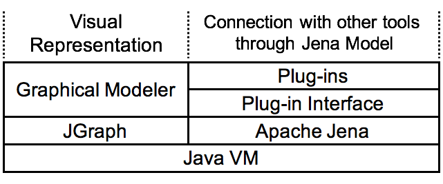

   Implementation architecture of |MR3|

System overview
----------------------------------------

:numref:`system-overview` shows the system overview of |MR3| . |MR3| consists of the Parser module, Generator module, Meta-Model Management module, Plug-ins, and User Interface. The user edits the RDFs description visually via the User Interface, which also includes the Graphical Modeler and Plug-in interfaces. The Graphical Modeler provides access to the basic functions of |MR3| , while the Plug-in Interface provides access to the functions of the plug-ins. The input and output of |MR3| are RDFs documents. The Parser analyzes input RDFs documents and makes further operations possible by transforming the RDFs document into a Jena model. Then, the Parser changes the Jena model into an internal data expression, and meta-model management is performed. Plug-ins are built using APIs provided by |MR3| . The Generator changes the internal data expression into a Jena model. Finally, the Jena model is changed into an RDFs document.

.. _system-overview:

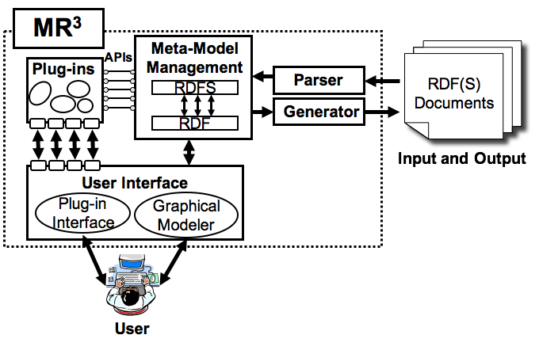

   System overview of |MR3| 

Overview of the Graphical modeler
---------------------------------------

:numref:`mr3-screenshot` shows a typical screen showing the Graphical Modeler interface of |MR3| . The Graphical Modeler consists of five main windows; RDF Editor, Class Editor, Property Editor, Attribute Dialog, and Namespace Table. 

The details of the graphical modeler are shown in the following sections.

 .. _mr3-screenshot:
 .. figure:: figures/screenshot_of_mr3.png
   :scale: 50 %
   :alt: Typical screen with Graphical Modeler interface of |MR3|
   :align: center

   Typical screen with Graphical Modeler interface of |MR3|
   
.. index:: RDF Editor

RDF Editor
--------------

The RDF Editor allows the user to express the relationship between an RDF resource, RDF property, and RDF literal using a directed graph, and also allows the attributes of each element to be edited. The attributes of an RDF resource consist of a URI, the URI type, and the RDF resource type. The RDF resource type can be chosen using the Class Editor. The URI type can be chosen from either a URI or can be set as anonymous. 

As shown in :numref:`rdf-editor`, RDF resources are represented as ellipses, RDF properties are represented as arrows, and RDF literals are represented as rectangles in the RDF editor . Types of RDF resources are shown at the upper right part of the RDF resources.

.. _rdf-editor:
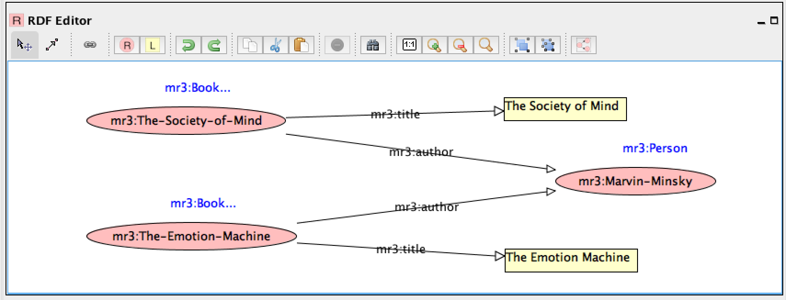

   RDF Editor

Toolbar in the RDF Editor
~~~~~~~~~~~~~~~~~~~~~~~~~~~~~

Icons in the toolbar in the RDF editor and the corresponding functions are shown in the following table.

================================================== ===================================================================
        Icon                                          Function                                                             
================================================== ===================================================================
 .. figure:: figures/toolbar/move.gif               Move nodes
 .. figure:: figures/toolbar/connect.gif            Connect nodes
 .. figure:: figures/toolbar/link.png               Select a corresponding RDFS class or property
 .. figure:: figures/toolbar/link_break.png         Don't select a corresponding RDFS class or property
 .. figure:: figures/toolbar/insert_resource.png    Insert an RDF resource
 .. figure:: figures/toolbar/insert_literal.png     Insert an RDF literal
 .. figure:: figures/toolbar/arrow_undo.png         Undo
 .. figure:: figures/toolbar/arrow_redo.png         Redo
 .. figure:: figures/toolbar/copy.png               Copy nodes
 .. figure:: figures/toolbar/cut.png                Cut nodes
 .. figure:: figures/toolbar/paste.png              Paste nodes
 .. figure:: figures/toolbar/delete.png             Remov nodes
 .. figure:: figures/toolbar/find.png               Show resource find dialog
 .. figure:: figures/toolbar/zoom100.gif            Set default magnification
 .. figure:: figures/toolbar/zoom_in.png            Expand the RDF editor
 .. figure:: figures/toolbar/zoom_out.png           Reduce the RDF editor
 .. figure:: figures/toolbar/zoom.png               Set appropriate magnification
 .. figure:: figures/toolbar/shape_group.png        Group nodes
 .. figure:: figures/toolbar/shape_ungroup.png      Ungroup nodes
 .. figure:: figures/toolbar/layout_rdf_graph.png   Automatically layout the RDF graph
================================================== ===================================================================

Popup menu in the RDF editor
~~~~~~~~~~~~~~~~~~~~~~~~~~~~~~~~~
When users right click in the RDF editor, a popup menu is shown. The contents of the popu menu is different when nodes are selected or not. Popup menus are shown as follows.

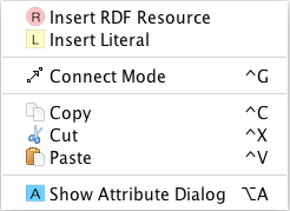

   Popup menu when nodes in the RDF Editor are not selected.

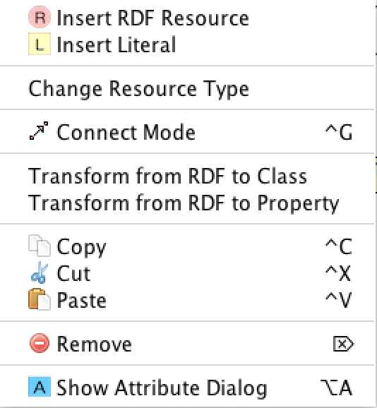

   Popup menu when nodes in the RDF Editor are selected.

Insert RDF Resource
    Insert an RDF resource to the position that mouse is right clicked.
Insert RDF Literal
    Insert an RDF literal to the position that mouse is right clicked.
Connect Mode
    Change the mode to connect mode from move mode. When the mode is connect mode, users can connect an RDF resource and another RDF resource or a literal by dragging and dropping. 
Move Mode
    Change the mode to move mode from connect mode. When the mode is move mode, users can move nodes in the RDF editor.
Transform from RDF to Class
    Transform the selected RDF resource to an RDFS class.
Transform from RDF to Property
    Transform the selected RDF resource to an RDFS property.
Copy
    Copy selected RDF resources, properties, or literals
Cut
    Cut selected RDF resources, properties, or literals
Paste
    Paste selected RDF resources, properties, or literals
Remove
    Remove selected RDF resources, properties or literals
Show Attribute Dialog
    Show the Attribute Dialog

Editing attributes of RDF resources
~~~~~~~~~~~~~~~~~~~~~~~~~~~~~~~~~~~~~~~~~~~~~~~~~~~~~~~~
When users select an RDF resource in the RDF editor, the attributes of the RDF resource are shown in the Attribute Dialog ( :numref:`attr-rdf-res-uri` to :numref:`attr-rdf-literal` ). The attributes of RDF resources are URI, rdf:type, blank node or note, rdfs:label, and rdfs:comment. Here the blank nodes are RDF resources that are not named by URIs. Blank nodes can not be acceced from external documents.  However, the blank nodes can be subjects or objects of statements. They are used to represent RDF resources that are difficult to name or structure RDF contents.

If users would like to set a URI of an RDF resource, they should select URI from the left side menus in the Attribute Dialog as shown in :numref:`attr-rdf-res-uri`. Prefixes that are registered in the Namespace Table are shown in The prefix combo box. When users select one of the prefixes in the combo box, the corresponding namespace is shown in the RDF Resource text field. The users can input any URI in the text field. If the users would like to set an RDF resource as a blank node, the users should check the blank checkbox. 

.. _attr-rdf-res-uri:
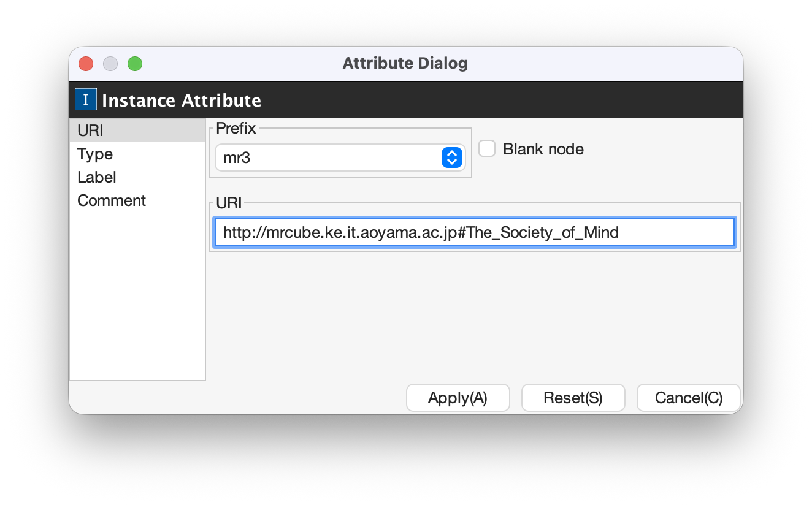

   Attribute Dialog (URI of an RDF resource)

If the users would like to set a type to an RDF resource, the users should select the Type from the left side menu in the Attribute Dialog as shown in :numref:`attr-rdf-res-type`. The isType checkbox should be checked when the users input the type of an RDF resource. If the users would like to empty the type of an RDF resource, they should uncheck the isType checkbox. 

When the users click the Select Type button, Select Resource Type Dialog are shown as shown in :numref:`rdf-res-type-selection-dialog`. The class hierarchy that is build in the Class editor is shown in the Select Resource Type Dialog. When the users select an RDFS class in the dialog, the namespace and ID of the selected class are set in the Attribute Dialog.

When the users input a URI that is not defined in the Class editor, RDF(S) contents management dialog is shown as shown in :numref:`rdf-and-rdfs-management-dialog`. In the RDF(S) contents management dialog, the users can select Rename or Create. 

When the users click the JumpClass button, the type of an RDF resource is selected and the attributes of the type of the RDF resource are shown in the Attribute Dialog. 

.. _attr-rdf-res-type:
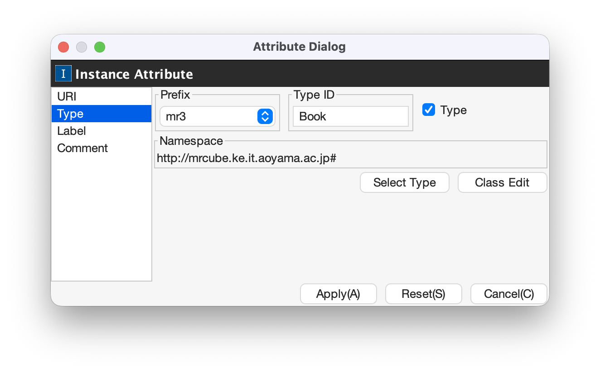

   Attribute Dialog (type of RDF resource)

.. _rdf-res-type-selection-dialog:
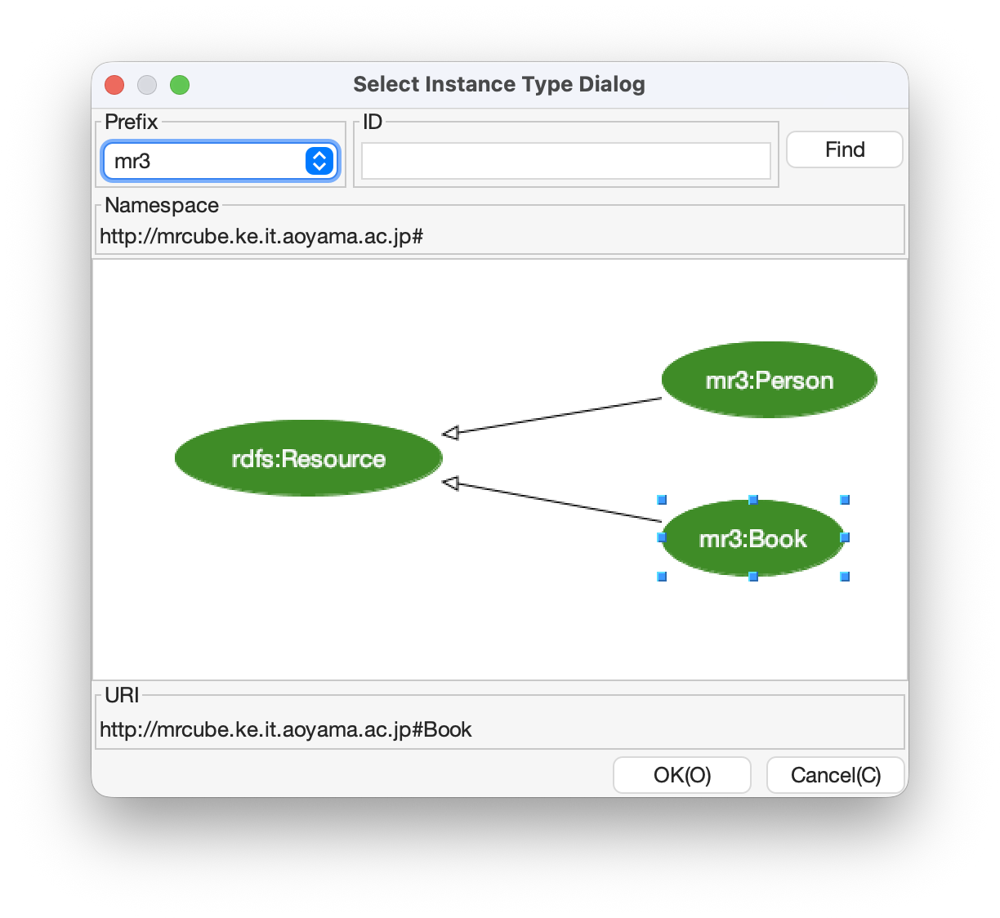

   RDF Resource Type Selection Dialog

.. _rdf-and-rdfs-management-dialog:
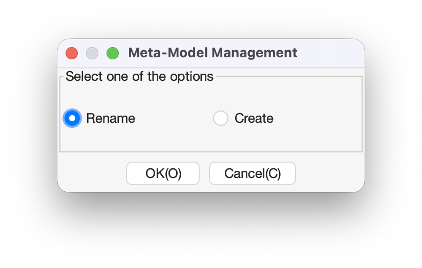

   RDF(S) contents management dialog

If the users would like to define the rdfs:label of an RDF resource, the users should select Label in the left side menu in the Attribute Dialog as shown in :numref:`attr-rdf-res-label`. After inputting language in the Lang text field and label in the Label text field, the language and the label are added in the table in the Attribute Dialog. If the users select a line in the table and click remove button, the selected label is removed.

.. _attr-rdf-res-label:
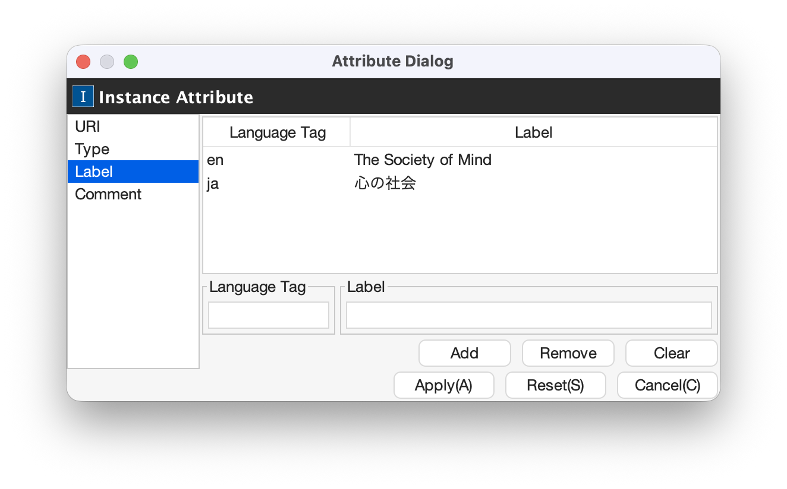

   Attribute Dialog (Label of an RDF resource)

If the users would like to define the rdfs:comment of an RDF resource, the users should select Comment in the left side menu in the Attribute Dialog as shown in :numref:`attr-rdf-res-comment`. After clicking the Add button, the Edit Comment Dialog is shown. 

First input language in the Lang text field and comment in the Comment text area. Then, click OK button. After that, the language and the label are added in the table in the Attribute Dialog. If the users select a line in the table and click Edit button, the users can edit the selected comment and the language. In the same way, if the user select a line in the table and click Remove button, the selected label is removed.

.. _attr-rdf-res-comment:
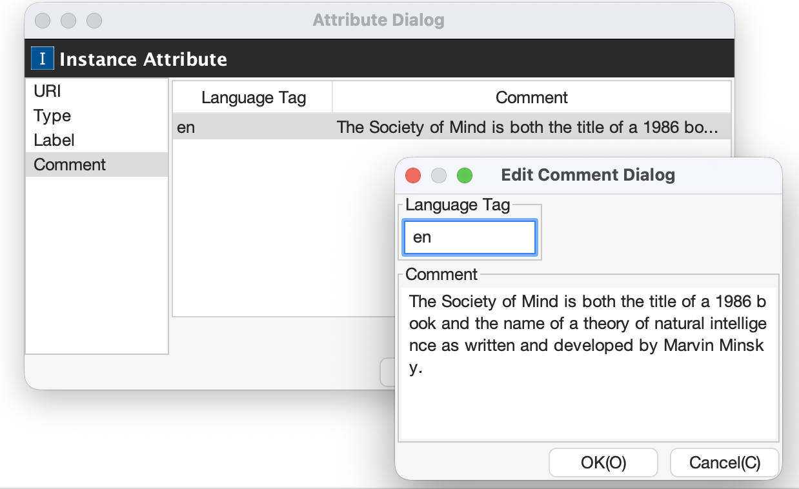

   Attribute Dialog (Comment of an RDF resource)

Editing attributes of RDF properties
~~~~~~~~~~~~~~~~~~~~~~~~~~~~~~~~~~~~~~~~~~~~~~
If the users select an RDF property in the RDF Editor, the attributes of the RDF property are shown in the Attribute Dialog (:numref:`attr-rdf-property`). The users can edit the URI of the selected RDF property. 

If the users check the isContainer checkbox and input a number, the users can set rdf:_1 to n property that is corresponding to the inputted number.

If the user check the Show Property Prefix Only checkbox, the users can only select prefixes that are only used in the defined RDFS properties. If the user uncheck the checkbox, the users can select all of the prefixes that are defined in the Namespace Table.

.. _attr-rdf-property:
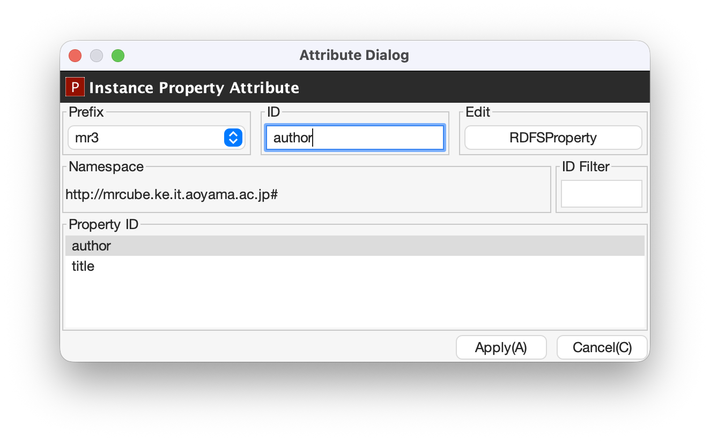

   Attribute Dialog (RDF Property)

When the users input a URI which is not defined in the Property Editor, RDF(S) contents management dialog is shown as shown in :numref:`rdf-and-rdfs-management-dialog`. In the RDF(S) contents management dialog, the users can select rename the RDFS property or create an RDFS property. 

When the users select one of the prefixes in the dialog, IDs of RDFS properties that are defined in the Property Editor and the namespace is correspond to the selected prefix are shown in the Property ID list. 

When the users select one of the Property IDs and click (Jump) Property button, the RDFS property is selected and the attributes of the RDFS property are shown in the Attribute Dialog.

Editing attributes of RDF literals
~~~~~~~~~~~~~~~~~~~~~~~~~~~~~~~~~~~~~~~~~~~~
When the users select an RDF literal in the RDF Editor, the attributes of the RDF literal are shown in the Attribute Dialog. (:numref:`attr-rdf-literal`) The users can edit the contents of the literal, the attribute of language (xml:lang), and the data type of the literal. In the Literal text are, the users can input the contents of the literal. The users can also input language in the Lang text field. If the users set the data type of the literal, the users should check isType checkbox and select one of the types in the Type combobox. Language attribute and data type attribute are exclusive and the users only select one of them. 

.. _attr-rdf-literal:
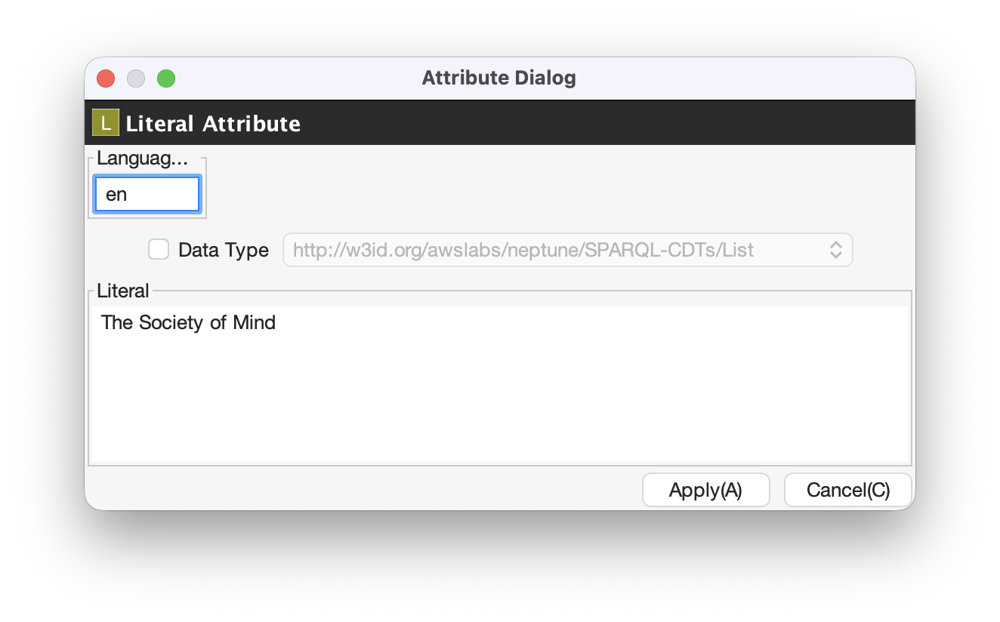

   Attribute Dialog (RDF Literal)

.. index:: Class Editor

Class Editor
--------------
The Class Editor allows the users to edit the attributes of RDFS classes and the relationships between the classes.

:numref:`class-editor` shows an screenshot of the Class Editor

.. _class-editor:
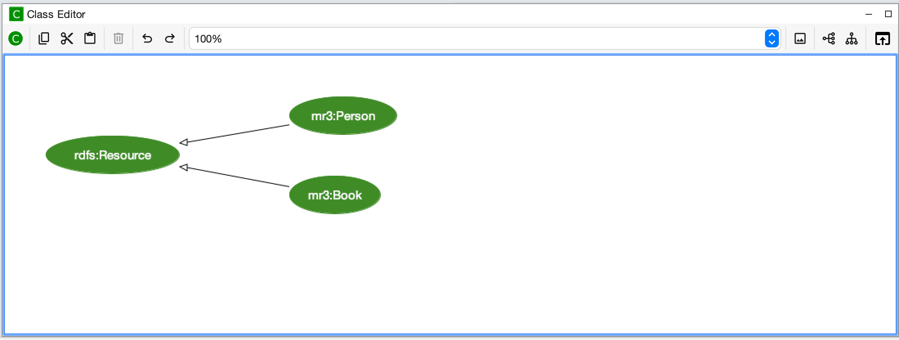
   
   An screenshot of the Class Editor

Toolbar in the Class Editor
~~~~~~~~~~~~~~~~~~~~~~~~~~~~~~~~
Icons in the toolbar in the Class editor and the corresponding functions are shown in the following table.

======================================================= ===================================================================
        Icon                                             Function                                                             
======================================================= ===================================================================
 .. figure:: figures/toolbar/move.gif                    Move nodes
 .. figure:: figures/toolbar/connect.gif                 Connect nodes
 .. figure:: figures/toolbar/insert_class.png            Insert an RDFS class
 .. figure:: figures/toolbar/arrow_undo.png              Undo
 .. figure:: figures/toolbar/arrow_redo.png              Redo
 .. figure:: figures/toolbar/copy.png                    Copy nodes
 .. figure:: figures/toolbar/cut.png                     Cut nodes
 .. figure:: figures/toolbar/paste.png                   Paste nodes
 .. figure:: figures/toolbar/delete.png                  Remove nodes
 .. figure:: figures/toolbar/find.png                    Show resource search dialog
 .. figure:: figures/toolbar/zoom100.gif                 Set default magnification
 .. figure:: figures/toolbar/zoom_in.png                 Expand the Class Editor
 .. figure:: figures/toolbar/zoom_out.png                Reduct the Class Editor
 .. figure:: figures/toolbar/zoom.png                    Set appropriate magnification
 .. figure:: figures/toolbar/shape_group.png             Group nodes
 .. figure:: figures/toolbar/shape_ungroup.png           Ungroup nodes
 .. figure:: figures/toolbar/layout_class_graph.png      Automatically layout the RDFS class graph
======================================================= ===================================================================

Popup menu in the Class Editor
~~~~~~~~~~~~~~~~~~~~~~~~~~~~~~~~~~~~
When users right click in the Class editor, a popup menu is shown. The contents of the popu menu is different when nodes are selected or not. The popup menus are shown as follows.

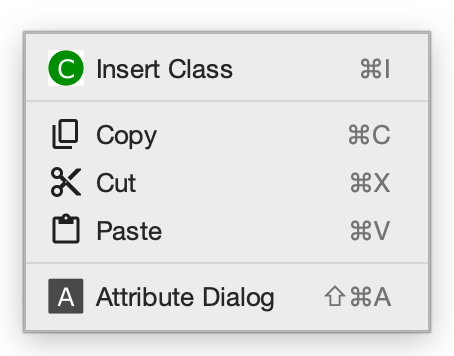
   
   Popup menu when nodes in the Class Editor are not selected.
   
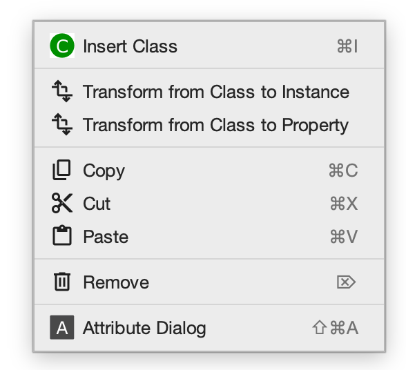
   
   Popup menu when nodes in the Class Editor are selected.

Insert Class
    Insert an RDFS class to the position that the mouse is right clicked. If one or more RDFS classes are selected, an RDFS class is inserted as the sub classes of the selected classes.
Connect Mode
   Change the mode to connect mode from move mode. When the mode is connect mode, users can connect classes by dragging and dropping.
Move Mode
    Change the mode to move mode from connect mode. When the mode is move mode, users can move nodes in the Class editor.
Transform from Class to RDF
    Transform the selected RDFS classes to RDF resources. 
Transform from Class to Property
    Transform the selected RDFS classes to RDFS properties.
Copy
    Copy selected RDFS classes and the relationships between the classes.
Cut
    Cut selected RDFS classes and the relationships between the classes.
Paste
    Paste copied RDFS classes and the relationships between the classes.
Remove
    Remove selected RDFS classes and the relationships between the classes.
Show Attribute Dialog
    Show the Attribute Dialog

Editing attributes of the Class editor
~~~~~~~~~~~~~~~~~~~~~~~~~~~~~~~~~~~~~~~~~~~~~~~~~
When the users select an RDFS class in the Class Editor, the attributes of the RDFS class are shown in the Attribute Dialog (:numref:`attr-class-basic` to :numref:`attr-class-upper-class`). The users can edit the attributes of an RDFS class by selecting Base, Label, Comment, Instances, or UpperClasses items from the left side menu in the Attribute Dialog.

When the users select the Base item, the type of an RDFS class and the URI can be edited (:numref:`attr-class-basic`).  The types can be defined class class list in the Config Dialog. When the users select the Label item, the value of rdfs:label property can be edited. When the users select the Comment item, the value of rdfs:comment property can be edited. The methods for editing rdfs:label and rdfs:comment are same as RDF resource. When the users select the Instances item, the instances of the selected RDFS class are shown in the list (:numref:`attr-class-instance`). When the users select the one of the items in the list, corresponding RDF resource is selected and the attributes of the RDF resource are shown in the Attribute Dialog. When the users select the UpperClasses item, the uppser classes of the selected RDFS class are shown in the list (:numref:`attr-class-upper-class`).

.. _attr-class-basic:
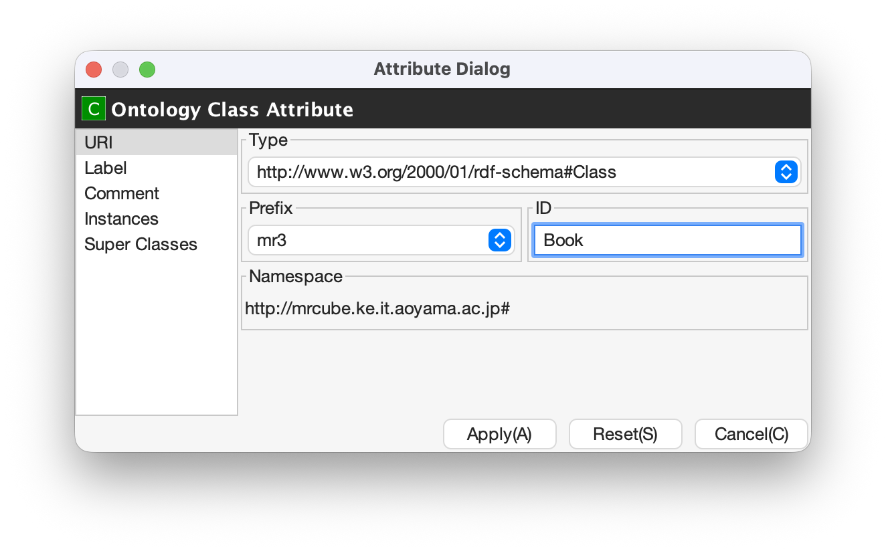
   
   Attribute Dialog (Base of RDFS class)
 
.. _attr-class-instance:
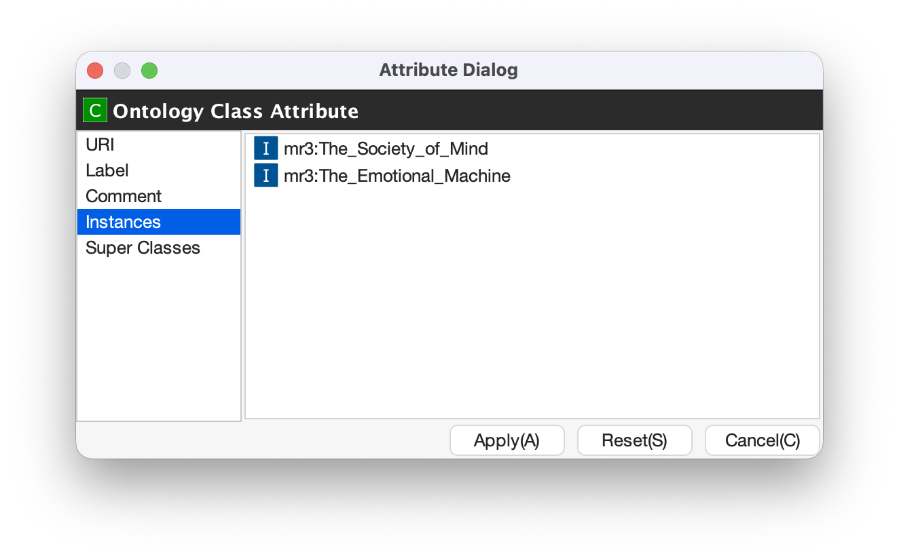

   Attribute Dialog (Instances of the RDFS class)
  
.. _attr-class-upper-class:
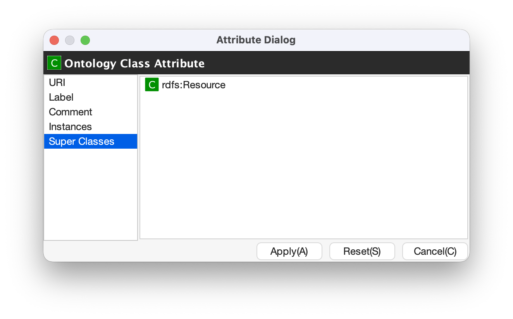

   Attribute Dialog (Upper classes of the RDFS class)

.. index:: Property Editor

Property Editor
------------------
The Property Editor allows the users to edit the attributes of RDFS properties and the relationships between the properties.

:numref:`property-editor` shows an screenshot of the Property Editor

.. _property-editor:
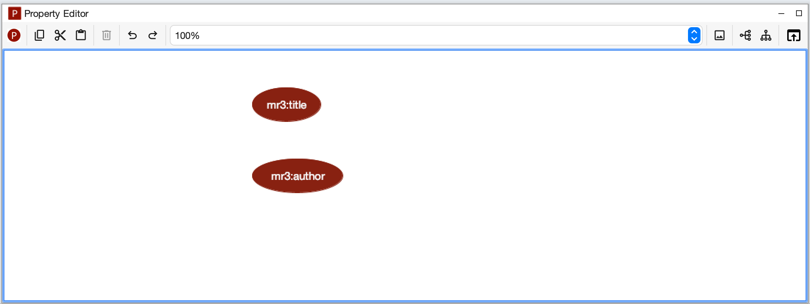
   
   An screenshot of the Property Editor

Toolbar in the Property Editor
~~~~~~~~~~~~~~~~~~~~~~~~~~~~~~~~~~~~~~~~~~~~~~
Icons in the toolbar in the Property editor and the corresponding functions are shown in the following table.

======================================================= ===================================================================
        Icon                                             Function                                                             
======================================================= ===================================================================
 .. figure:: figures/toolbar/move.gif                    Move nodes
 .. figure:: figures/toolbar/connect.gif                 Connect nodes
 .. figure:: figures/toolbar/insert_property.png         Insert an RDFS property
 .. figure:: figures/toolbar/arrow_undo.png              Undo
 .. figure:: figures/toolbar/arrow_redo.png              Redo
 .. figure:: figures/toolbar/copy.png                    Copy nodes
 .. figure:: figures/toolbar/cut.png                     Cut nodes
 .. figure:: figures/toolbar/paste.png                   Paste nodes
 .. figure:: figures/toolbar/delete.png                  Remove nodes
 .. figure:: figures/toolbar/find.png                    Show Resource Search Dialog
 .. figure:: figures/toolbar/zoom100.gif                 Set default magnification
 .. figure:: figures/toolbar/zoom_in.png                 Expand the Property Editor
 .. figure:: figures/toolbar/zoom_out.png                Reduce the Property Editor
 .. figure:: figures/toolbar/zoom.png                    Set appropriate magnification
 .. figure:: figures/toolbar/shape_group.png             Group nodes
 .. figure:: figures/toolbar/shape_ungroup.png           Ungroup nodes
 .. figure:: figures/toolbar/layout_property_graph.png   Automatically layout the RDFS property graph
======================================================= ===================================================================

Popup menu in the Property Editor
~~~~~~~~~~~~~~~~~~~~~~~~~~~~~~~~~~~~~~~~
When users right click in the Property editor, a popup menu is shown. The contents of the popu menu is different when nodes are selected or not. The popup menus are shown as follows.

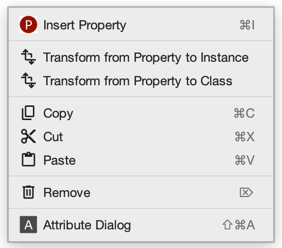
   
   Popup menu when nodes in the Property Editor are not selected.
   

   
   Popup menu when nodes in the Property Editor are selected.

Insert Property
    Insert an RDFS property to the position that the mouse is right clicked. If one or more RDFS properties are selected, an RDFS property is inserted as the sub properties of the selected properties.
Connect Mode
   Change the mode to connect mode from move mode. When the mode is connect mode, users can connect propertie by dragging and dropping.
Move Mode
    Change the mode to move mode from connect mode. When the mode is move mode, users can move nodes in the Property editor.
Transform from Property to RDF
    Transform the selected RDFS properties to RDF resources
Transform from Property to Class
    Transform the seledcted RDFS properties to RDFS classes
Copy
    Copy the selected RDFS properties and the relationships between the properties
Cut
    Cut the selected RDFS properties and the relationships between the properties
Paste
    Paste the copied RDFS properties and the relationships between the properties
Remove
    Remove the selected RDFS properties and the relationships between the properties
Show Attribute Dialog
    Show the Attribute Dialog

Editing attributes of the Property editor
~~~~~~~~~~~~~~~~~~~~~~~~~~~~~~~~~~~~~~~~~~~~~
When the users select an RDFS property in the Property Editor, the attributes of the RDFS property are shown in the Attribute Dialog (:numref:`attr-property-region`  to :numref:`attr-property-upper-property`).  The users can edit the attributes of an RDFS property by selecting Base, Label, Comment, Region, Instance, or SuperProperties items in the left side menu of the Attribute Dialog. Base, Label, and Comment items are same as RDFS Class. The type list in the Base item can be defined in the property class list in the Config Dialog. When the users select Region item, domains and ranges of the selected RDFS property can be edited (:numref:`attr-property-region`). When the users select Instances item, RDF resource list that have the selected RDFS property is shown in the Attribute Dialog (:numref:`attr-property-instance`). When the users select the one of the items in the list, the RDF resource is selected and the attributes of the RDF resource are shown in the Attribute Dialog. When the users select SuperProperties item, super properties of the selected RDFS property are shown in the list (:numref:`attr-property-upper-property`).

.. _attr-property-region:
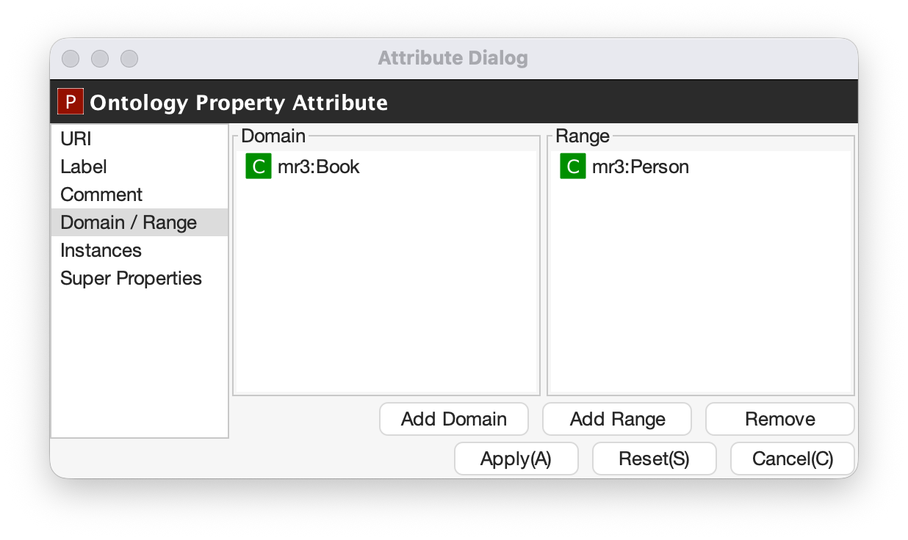
   
   Attribute Dialog (Range of RDFS property)
  
.. _attr-property-instance:
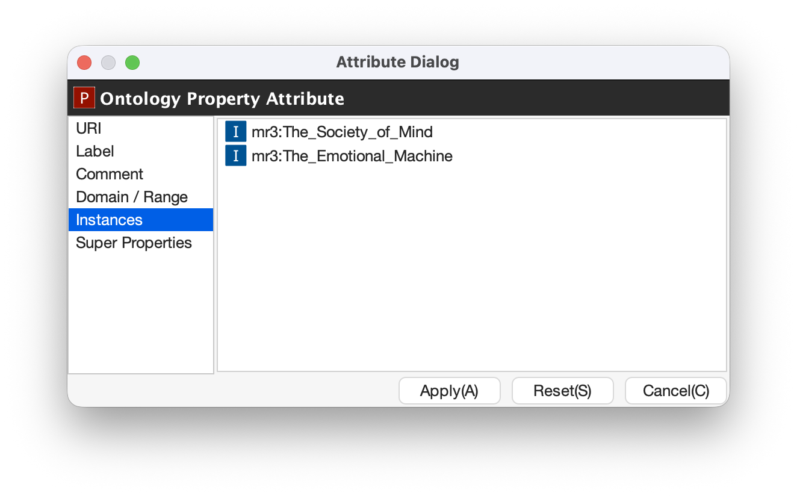
   
   Attribute Dialog (Instances of RDFS property)
  
.. _attr-property-upper-property:
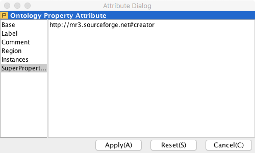
   
   Attribute Dialog (Super properties of RDFS property)

.. index:: Resource Search Dialog

Resource Search Dialog
--------------------------
The users can find resources (RDF resources, RDF properties, RDFS classes, and RDFS properties) by using Resource Search Dialog. :numref:`resource-search-dialog` shows a screenshot of the Resource Search Dialog. The users can set search scope by checking the Graph Type (RDF, Class, or Property). When the users set a URI in the URI text field, resources that partially match the URI are shown in the Find Result list in the Resource Search Dialog. When the users select the one of the items in the list, corresponding resource is selected and the attributes of the resource are shown in the Attribute Dialog. The users can set the value of rdfs:label and rdfs:comment in the Label or Comment text field. 

 .. _resource-search-dialog:
 .. figure:: figures/resource_search_dialog.png
   :scale: 100 %
   :alt: A screenshot of the Resource search dialog
   :align: center

   A screenshot of the Resource search dialog
 
.. index:: Namespace Table

Namespace Table
-------------------
The users can register perfixes and the corresponding namespaces in the Namespace Table. :numref:`namespace-table` shows a screenshot of the Namespace Table. When the users set a prefix in the Prefix text field, set a namespace in the NameSpace text field, and click Add button, the prefix and the namespace are added in the table in the Namespace Table. If the users would like to remove the prefix and the corresponding namespace, select the line in the table and click Remove button. If the users check the available checkbox, namespaces of resources in each editor are replaced with the corresponding prefix (This function is only available when the Display->URI menu is selected.). When the users set a URI of an resource, the Namespace Table is referred and the users can select the registered prefixes in the Attribute Dialog. When the users select one of the prefixes, the corresponding namespace is shown in the Namespace label or RDF Resource text field.

.. _namespace-table:
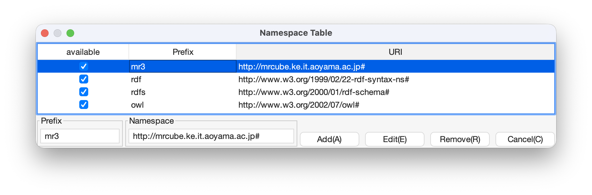

   A screenshot of the Namespace Table
 

.. index:: Remove Dialog

Remove Dialog
-----------------
If an RDFS class is referred by a type of a resource or a domain or a range of a property, it is inconsistency when the RDFS class is removed. If an RDFS property is reffered in the RDF editor, it is inconsistency when the RDFS property is removed. In these cases, when the users remove those RDFS classes or properties, the Remove Dialog as shown in :numref:`remove-dialog` is shown before removing them actually.

Removed RDFS classes or properties are shown in the upper part of :numref:`remove-dialog`. RDF resources that referred the removed RDFS classes as their type are shown in the RDF tab in the lower part of :numref:`remove-dialog`. RDF properties that referred the removed RDFS properties are also shown in the RDF tab. RDFS properties that refer removed RDFS classes as their domains or ranges are shown in the Property tab in the lower part of :numref:`remove-dialog`.

If the users check the Delete Checkboxes and click Apply button, RDF resources, RDF properties, and RDFS properties that listed in the lower part of the Remove Dialog stop referring to the removed RDFS classes or RDFS properties. Then, the RDFS classes and RDFS properties are actually removed. 

If the users select one of the RDF resources, RDF properties, or RDFS properties, attributes of the selected resource are shown in the Attribute Dialog. Then, the users can edit the attributes to maintain consistency.

.. _remove-dialog:
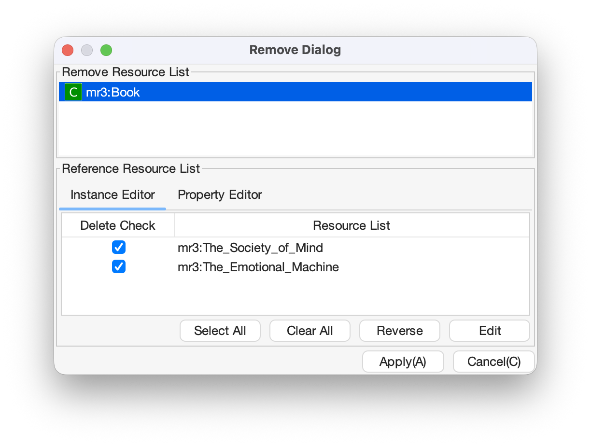

   Remove Dialog
 

.. index:: Import Dialog

Import Dialog
--------------------
The users can import RDF(S) documents described as RDF/XML, N3, N-Triple, or Turtle format to |MR3| by using Import Dialog. :numref:`import-dialog` shows a screenshot of the Import Dialog. The parts of the Import Dialog (1 to 13 in :numref:`import-dialog`) are shown below.

 .. _import-dialog:
 .. figure:: figures/import_dialog.svg
   :scale: 100 %
   :alt: A screenshot of the Import Dialog
   :align: center

   A screenshot of the Import Dialog
 
#. Directory or URI
     Directories that RDF(S) documents are saved or URIs that are RDF(S) documents are shown in the list.
#. Add Dir
     Add a directory in the Directory or URI list.
#. Add URI
     Add a URI in the Directory or URI list.
#. Remove
     Remove the selected directory or URI in the Directory or URI list.
#. Syntax
     Select a syntax (RDF/XML, N3, N-Triple, or Turtle) of an RDF(S) document that the users would like to import
#. Data Type
     Select a data type (RDF, RDFS, or OWL) of an RDF(S) document that the users would like to import
#. Import Method
     If the users select Merge, an RDF(S) document is merged to the current project. If the users select Replace, an RDF(S) document is replaced with the current project. 
#. Find Resource
     The files in the Import File List are filtered by inputted keyword in the Find Resource text field.
#. Import File List
     Files in the selected directory in the Directory or URI list are shown in the Import File List.
#. Extension
    The files in the Import File List are filtered by selected extensions. 
#. Reload
    Reload the directories in the directory or URI list and the lates files are shown in the Import File List.
#. Import
    Import an RDF(S) document to |MR3| based on the set condition (syntax, data type, import method, and import file).
#. Cancel
    Close the Import Dialog.

.. index:: Export Dialog

Export Dialog
----------------------
The users can export RDF(S) data graphs in |MR3| to an RDF(S) document as RDF/XML, N3, N-Triple, or Turtle syntax. :numref:`export-dialog` shows a screenshot of the Export Dialog. The parts of the Export Dialog (1 to 8 in :numref:`export-dialog`) are described below.

.. _export-dialog:

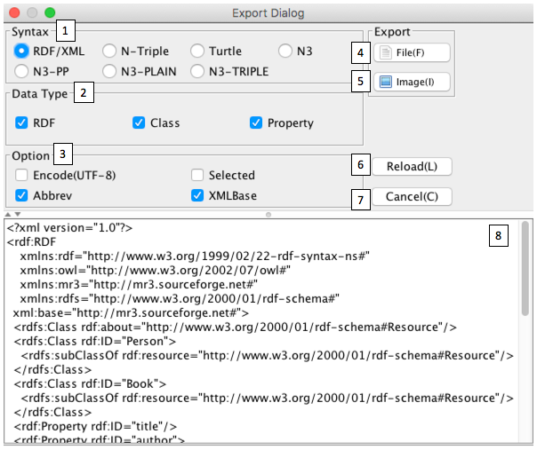

   A screenshot of the Export Dialog

#. Syntax
    Select a syntax (RDF/XML，N-Triple，Turtle，N3, etc) of an RDF(S) document that the users would like to export.
#. Data Type
    If the users check the RDF, Class, or Property checkbox, data graphs in the selected editor are exported to an RDF(S) document. (For example, if the users checks Class and Property, classes and properties are exported as an RDF(S) document.)
#. Option
    If the users check Encode(UTF-8) checkbox, URIs of resources are encoded based on RFC3986.  If the users check Selected checkbox, only selected nodes are exported. If the users check Abbrev checkbox, data graphs are exported as RDF/XML Abbreviation syntax. If the users check XMLbase checkbox, XMLBase declaration is added in the RDF(S) document.
#. File
    Export an RDF(S) document based on the set condition (syntax, data type, and options).
#. Image
    If the users select one of the data types (RDF, Class, or Property) and click Image button, the selected data graph is saved as an image file. 
#. Reload
    The latest data graph are exported based on the set condition and the source is shown in the 8 part.
#. Cancel
    Close the Export Dialog.
#. Show the source of RDFs models
    The users can confirm the source of an RDF(S) document that will be exported.
    
.. index:: Config Dialog

Config Dialog
----------------
The users can set configurations about basic, directory, proxy, meta class, layout, and rendering in the Config Dialog.

Basic
~~~~~~~~~
When the users select the Basic item as shown in :numref:`config-basic`, language, UI language, output encoding, font, base URI, and log file can be set. If a resource has many multilingual labels, the users should select the prior language. The prior language of labels can be set in the Lang text field. Labels with prior language are shown in each resource when the user select display->label menu. Language of UI such as menu can be set in the UI Lang list. The users can select ja (Japanese), en (English), or zh (Chinsese) from the UI Lang list. Output encoding can be used to export an RDF(S) document. The font of resources can be set by clicking Font Setting button and selecting a font from the font selecting dialog. Default namespace is set based on the Base URI. The directory that a log file is saved can be set by clicking Browse button and selecting the directory from the directory selection dialog.

.. _config-basic:

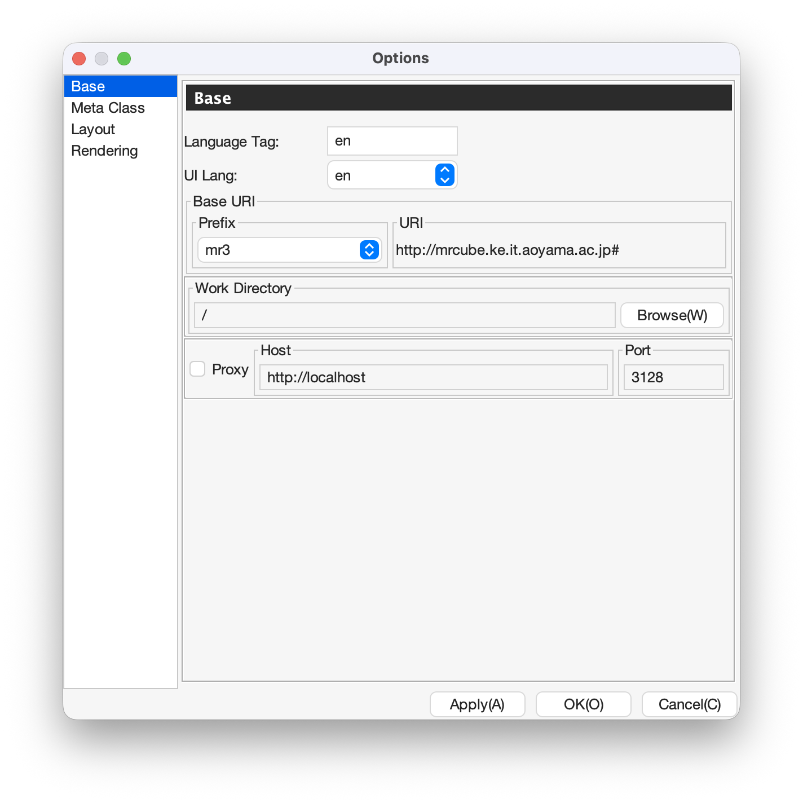

   Config Dialog: Basic

Directory
~~~~~~~~~~~~
When the users select the Directory item as shown in :numref:`config-directory`, work directory, plugins directory, and resources directory can be set. The work directory is a directory that is opened firstly when the users import an RDF(S) document. The plugins directory is a directory that plug-ins of |MR3| are saved. The resources directory is a directory that property files are saved. The property files are defined labels that displayed in |MR3| for each language.

.. _config-directory:
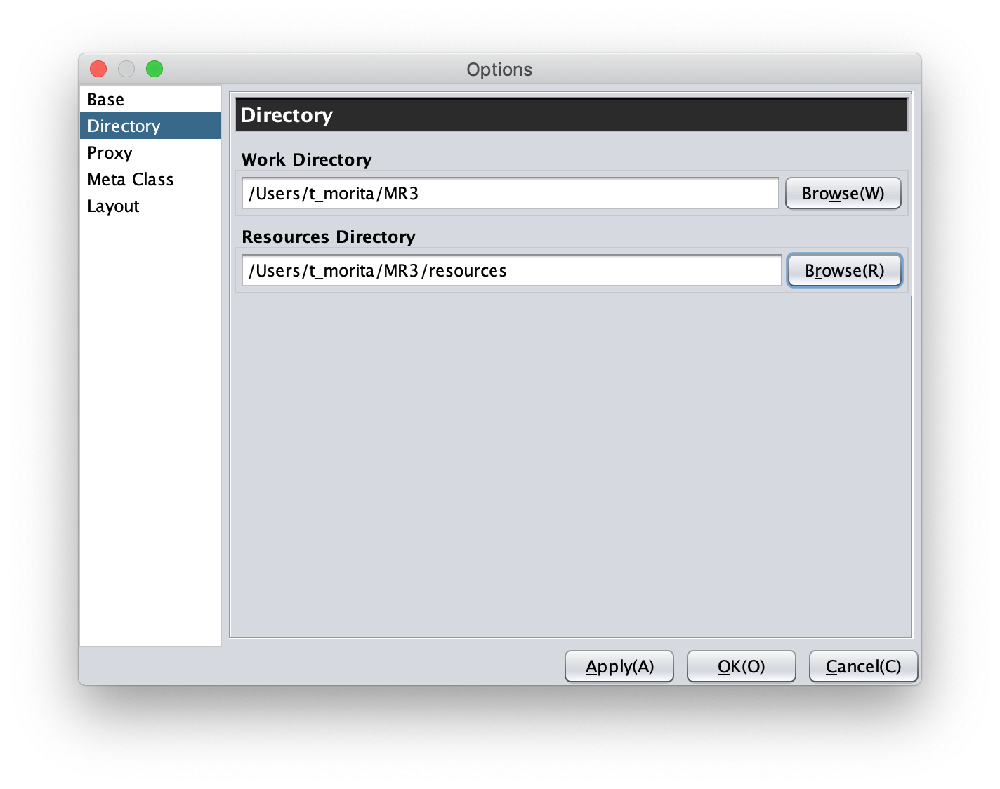

   Config Dialog: Directory
   
Proxy
~~~~~~~~
When the users select the Proxy item as shown in :numref:`config-proxy`, a host name and a port number of a proxy server can be set. This configuration is necessary to import an RDF(S) document from a URI when the user's environment is under a proxy server.

.. _config-proxy:
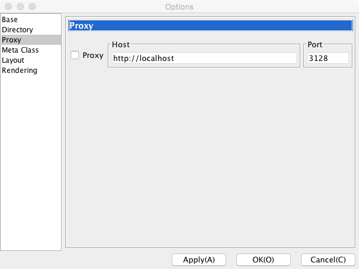

   Config Dialog: Proxy

Meta Class
~~~~~~~~~~~~~~
When the users select the Meta Class item as shown in :numref:`config-metaclass`, Class Class and Property Class can be set. If the users set a Class Class, |MR3| regards resources that have the Class Class as their type as classes. If the users set a Property Class, |MR3| regards resources that have the Property Class as their type as properties. These classes and properties are imported in the RDFS class editor or RDFS property editor. 

In the initial setting, rdfs:Class is defined in Class Class and rdf:Property is defined in Property Class. If the users would like to import OWL classes and properties, owl:Class must be set as Class Class, owl:ObjectProperty and owl:DatatypeProperty must be set as Property Class.

.. _config-metaclass:
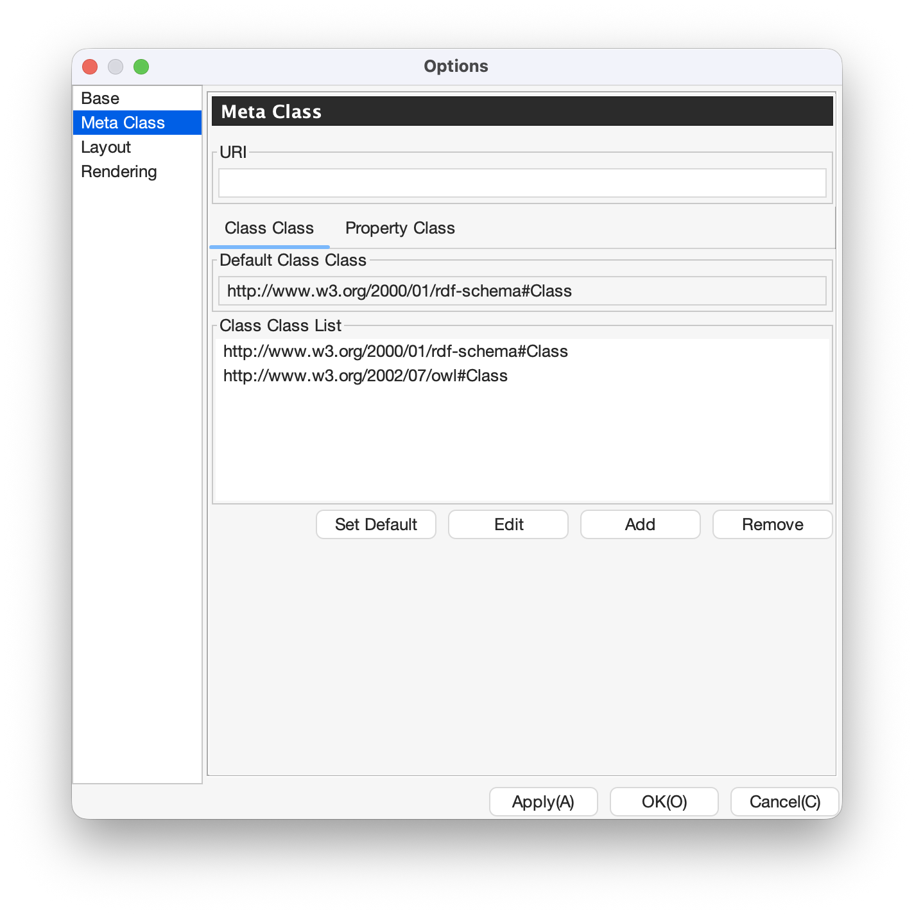

   Config Dialog: Meta Class

Layout
~~~~~~~~~~
When the users select the Layout item as shown in :numref:`config-layout`, methods for layout for each editor can be set.

.. _config-layout:
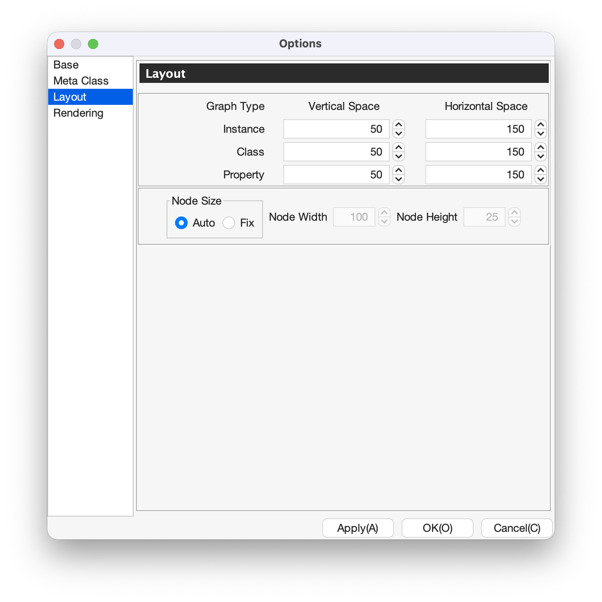

   Config Dialog: Layout

Rendering
~~~~~~~~~~~~
When the users select Rendering item as shown in :numref:`config-rendering`, colors of each node (RDF resources, RDF literals, RDFS classes, and RDFS properties), colors of each selected node, and background color of each editor can be set. If the users uncheck the Color checkbox, all of the nodes become colorless. If the users check the Antialias checkbox, an edge of each node become smooth.

.. _config-rendering:
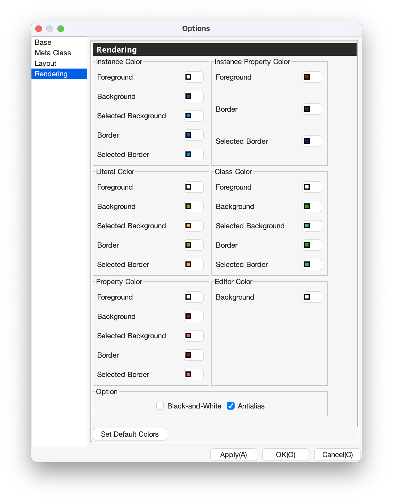

   Config Dialog: Rendering

Plugins
---------
When the users select Plugins sub menu in the Tool menu, the dialog as shown in :numref:`plugin-dialog` is shown. |MR3| loads jar files in the plug-ins directory that is set in the Config Dialog. The plugins are shown in the list. If the users select one of the plugins, the description of the plugin is shown at the bottom of the dialog. If the users click Exec button, the selected plugin is executed. Please refer to :doc:`plugin_development` to build |MR3| plugins.

.. _plugin-dialog:
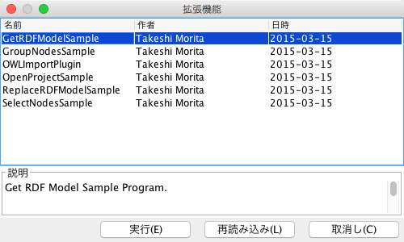

   Plugins

Validator
-----------
When the users select Validator sub menu in the Tool menu, the dialog as shown in :numref:`validator-dialog` is shown. |MR3| uses Apache Jena's validation API (`org.apache.jena.reasoner.ValidityReport <https://jena.apache.org/documentation/javadoc/jena/org/apache/jena/reasoner/ValidityReport.html>`_ ) and it is enabled to check if the data type of literals are defined based on a range of property.

.. _validator-dialog:
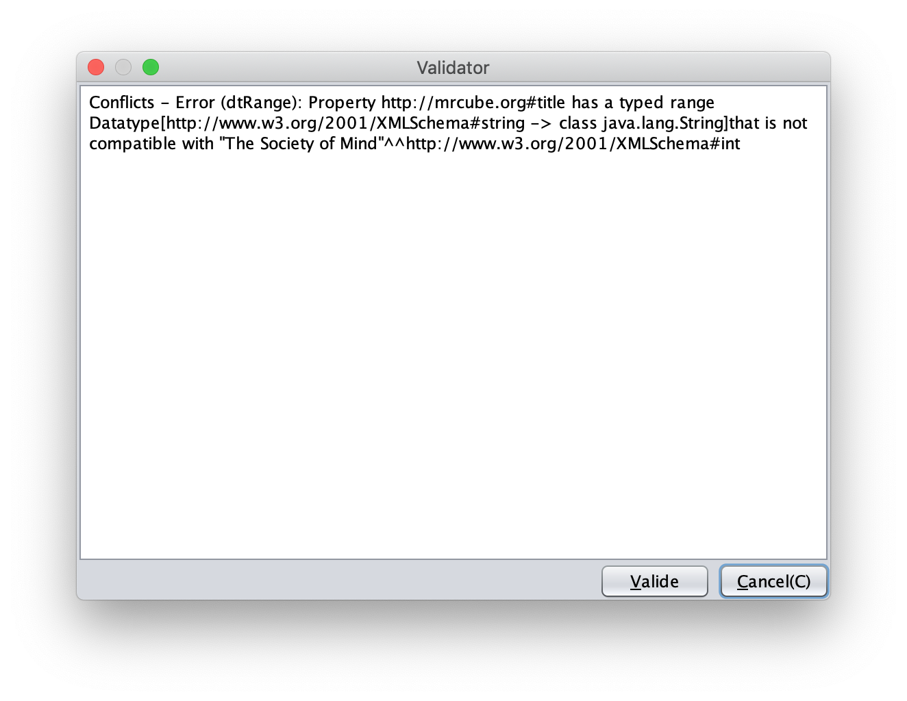

   Validator

Project Info
------------------
When the users select Project Info sub menu in the Tool menu, the dialog as shown in :numref:`project-info-dialog` is shown. The current project name, the number of RDF resources, the number of RDF literals, the number of RDF statements, the number of classes, the number of properties, the number of all resources, the number of all literals, the number of all statements are shown in the dialog.

.. _project-info-dialog:
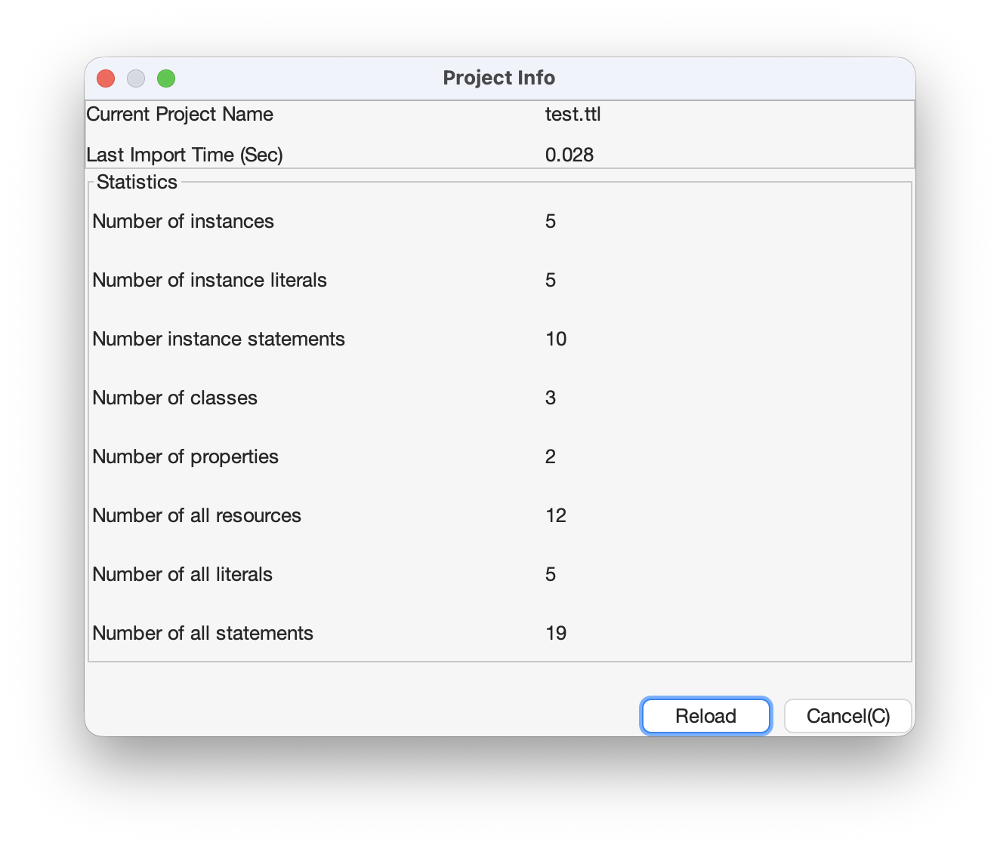

   Project Info

Log Console
-----------------
When the users select Show Log Console sub menu in the Tool menu, the dialog as shown in :numref:`log-console` is shown. The users can confirm the standard output and the standard error in the dialog. 

.. _log-console:
.. figure:: figures/log_console.png
   :scale: 100 %
   :alt: Log Console
   :align: center

   Log Console

About MR3
-----------
When the users select About MR3 sub menu in the Help menu, the dialog as shown in :numref:`about-mr3` is shown. The developer, version, license, project web site, contact, and libraries used in |MR3| are shown in the dialog.

.. _about-mr3:
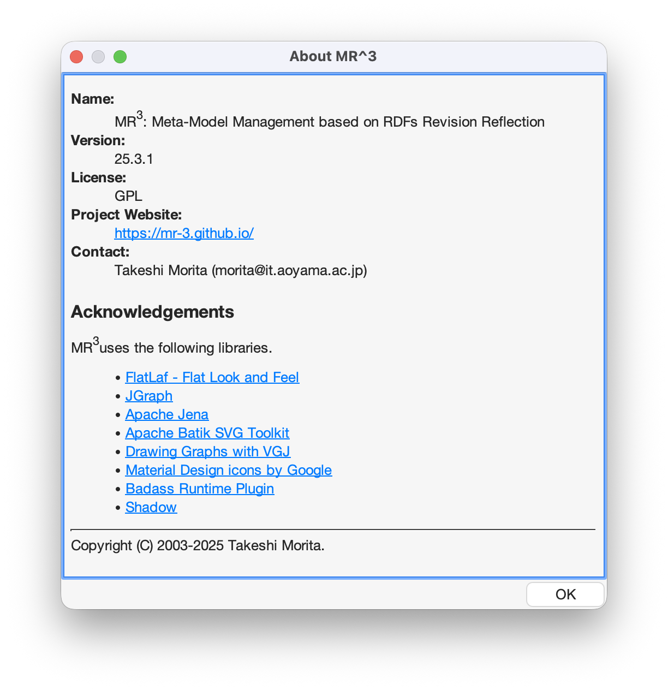

   About MR3

Menu
---------------

File
~~~~~~~~~~
File->New Project
    Create new |MR3| project. The users should select save the current project or delete it.
File->Open Project
    Open |MR3| project file
File->Save Project
    Save |MR3| project file
File->Save As Project
    Save As |MR3| project file
File->Import
    Show Import Dialog
File->Export
    Show Export Dialog
File->Exit
    Exit |MR3|

Edit
~~~~~~~~~
Edit->Find Resource
    Show Find Resource Dialog

**Edit->Select->Select All RDF Nodes**
    　
**Edit->Select->Select All Class Nodes**

**Edit->Select->Select All Property Nodes**
      　  

View
~~~~~~~~
View->URI View
    URIs of resources are shown in each editor. If namespaces are defined in the Namespace Table, the corresponding prefixes are replaced with the namespaces.
View->ID View
    IDs of resources are shown in each editor.
View->Label View
    Values of rdfs:label properties are shown in each editor. If a resource does not have rdfs:label property, the URI of the resource is shown instead of the value of rdfs:label property.
View->Show Resource Type
    If the users check the Show Resource Type, the type of RDF resources are shown at the top right of each resource.
View->Show RDF Property Label
    If the users check the Show RDF Property Label, the label of properties are shown. If it is not checked, the label properties are not shown in the RDF editor.
View->Show ToolTips
    If the users check the Show ToolTips, tooltips are shown when the users mouse over the resources.
View->Apply Layout->RDF
    Automatically layout the RDF graph
View->Apply Layout->Class
    Automatically layout the Class graph
View->Apply Layout->Property
    Automatically layout the Property graph

Window
~~~~~~~~~~
Window->Show RDF Editor Overview
    The overview of the RDF editor is shown in the dialog. When the users drag a red rectangle, part of the RDF graph in the red rectangle are shown in the RDF editor. The users can change the size of the red rectangle by dragging the right down part. It is enabled to expand and reduce the editor.
Window->Show Class Editor Overview
    The overview of the Class editor is shown in the dialog. The functions of the dialog is as same as RDF Editor Overview.
Window->Show Property Editor Overview
    The overview of the Property editor is shown in the dialog. The functions of the dialog is as same as RDF Editor Overview.
    
**Window->To Front RDF Editor**
        
**Window->To Front Class Editor**
    
**Window->To Front Property Editor**
    
**Window->Show Attribute Dialog**
    
**Window->Show Namespace Table**
    
Window->Layout->Deploy Windows (C,P,R)
    The RDF editor, the Property editor, and the Class editor are shown.
Window->Layout->Deploy Windows (C,R)
    The Class editor and the RDF editor are shown.
Window->Layout->Deploy Windows (P,R)
    The Property editor and the RDF editor are shown.

Help
~~~~~~~~~
Help->About MR\ :sup:`3` \
    The developer, version, license, project web site, contact, and libraries used in |MR3| are shown in the dialog.
 
Toolbar
------------------

================================================== ===================================================================
        Icon                                         Function                                                             
================================================== ===================================================================
 .. figure:: figures/toolbar/new.png                New |MR3| project
 .. figure:: figures/toolbar/open.png               Open |MR3| project file
 .. figure:: figures/toolbar/save.png               Save |MR3| project file
 .. figure:: figures/toolbar/saveas.png             Save as |MR3| project file
 .. figure:: figures/toolbar/import.png             Show Import Dialog
 .. figure:: figures/toolbar/export.png             Show Export Dialog
 .. figure:: figures/toolbar/find.png               Show Resource Search Dialog
 .. figure:: figures/toolbar/rdf_editor.png         Show RDF Editor to the front
 .. figure:: figures/toolbar/class_editor.png       Show Class Editor to the front
 .. figure:: figures/toolbar/property_editor.png    Show Property Editor to the front
 .. figure:: figures/toolbar/attr_dialog.png        Show Attribute Dialog to the front
 .. figure:: figures/toolbar/namespace_table.png    Show Namespace Table to the front
 .. figure:: figures/toolbar/cpr.png                Show Class, Property, and RDF Editors
 .. figure:: figures/toolbar/cr.png                 Show Class and RDF Editors
 .. figure:: figures/toolbar/pr.png                 Show Property and RDF Editors
 .. figure:: figures/toolbar/arrow_left.png         Find previous
 .. figure:: figures/toolbar/arrow_right.png        Find next
 .. figure:: figures/toolbar/accept.png             Validate RDFs contents
 .. figure:: figures/toolbar/plugin.png             Show Plugin Management Dialog
 .. figure:: figures/toolbar/information.png        Show Project Information
 .. figure:: figures/toolbar/log_console.png        Show Log Console
 .. figure:: figures/toolbar/cog.png                Show Config Dialog
 .. figure:: figures/toolbar/help.png               Show about |MR3|
================================================== ===================================================================

Shortcut keys
-------------------

Shortcut keys that can be used in |MR3|
~~~~~~~~~~~~~~~~~~~~~~~~~~~~~~~~~~~~~~~~~~
Ctrl-N
    Create new |MR3| project. The users should select save the current project or delete it.
Ctrl-O
    Open |MR3| project file
Ctrl-S
    Save |MR3| project file
Ctrl+Shift+S
    Save as |MR3| project file
Ctrl+Q
    Exit |MR3|
Alt+R
    Show the RDF Editor to the front
Alt+C
    Show the Class Editor to the front
Alt+P
    Show the Property Editor to the front
Alt+A
    Show the Attribute Dialog
Alt+N
    Show the Namespace Table
Alt+F
    Show the Find Resource Dialog

Shortcut keys that can be used in editors
~~~~~~~~~~~~~~~~~~~~~~~~~~~~~~~~~~~~~~~~~~~~~~~~~~~~~
Ctrl-A
    Select all of the nodes in a editor
Delete
    Delete selected nodes in a editor
Ctrl-C
    Copy selected nodes in a editor
Ctrl-X
    Cut selected nodes in a editor
Ctrl-V
    Paste nodes that are copied or cut.

