User manual
========================

.. contents:: Contents
   :depth: 4

.. |MR3| replace:: MR\ :sup:`3` \

Implementation architecture
------------------------------------------
:numref:`mr3-architecture` shows the system architecture of |MR3| from the aspect of system implementation. |MR3| is implemented in Java language, using the Java Swing user interface. |MR3| uses JGraph for RDF(S) graph visualization, and Apache Jena for enabling the use of Semantic Web standards such as RDF, RDFS, and OWL. The Parser and Generator in |MR3| are implemented using Jena APIs. By using these libraries, |MR3| is implemented as an environment for graphical representation of Semantic Web descriptions. 

.. _mr3-architecture:

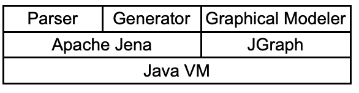

   Implementation architecture of |MR3|

System overview
----------------------------------------
:numref:`system-overview` shows the system overview of |MR3| . |MR3| consists of the **Parser**, **Generator**, **RDF(S) Management**, and **Graphical Modeler**. The **Graphical Modeler** mainly consists of the **RDF Editor**, **Class Editor**, and **Property Editor**. The user edits the RDFs description visually via the **Graphical Modeler**. The input and output of |MR3| are RDFs documents. The **Parser** analyzes input RDFs documents and makes further operations possible by transforming the RDFs document into a Jena model. Then, the **Parser** changes the Jena model into an internal data expression, and RDF(S) management is performed. The **Generator** changes the internal data expression into a Jena model. Finally, the Jena model is changed into an RDFs document.

.. _system-overview:

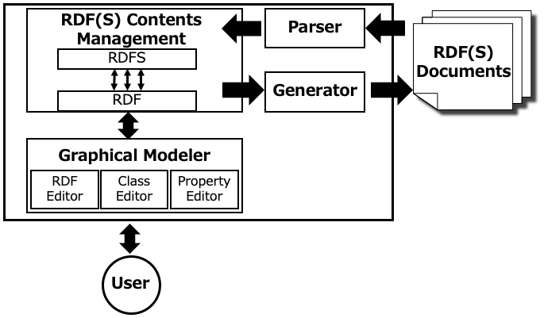

   System overview of |MR3| 

Overview of the Graphical Modeler
---------------------------------------
:numref:`mr3-screenshot` shows a typical screen showing the **Graphical Modeler** of |MR3| . The **Graphical Modeler** consists of **RDF Editor**, **Class Editor**, **Property Editor**, **Attribute Dialog**, **Namespace Table**, **Remove Dialog**, **Find Resource Dialog**, **Import Dialog**, and **Export Dialog**. 

The details of the **Graphical Modeler** are shown in the following sections.

 .. _mr3-screenshot:
 .. figure:: figures/screenshot_of_mr3.png
   :scale: 25 %
   :alt: Typical screen with Graphical Modeler interface of |MR3|
   :align: center

   Typical screen with Graphical Modeler interface of |MR3|
   
.. index:: RDF Editor

RDF Editor
--------------
The **RDF Editor** allows the user to express the relationship between an RDF resource, RDF property, and RDF literal using a directed graph, and also allows the attributes of each element to be edited. The attributes of an RDF resource consist of a URI, the URI type, and the RDF resource type. The RDF resource type can be chosen using the **Class Editor**. The URI type can be chosen from either a URI or can be set as anonymous. 

As shown in :numref:`rdf-editor`, RDF resources are represented as ellipses, RDF properties are represented as arrows, and RDF literals are represented as rectangles in the **RDF editor**. Types of RDF resources are shown at the upper left part of the RDF resources.

.. _rdf-editor:
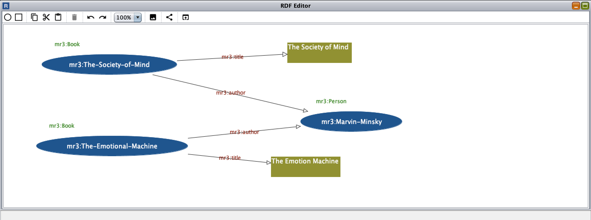

   RDF Editor

Toolbar in the RDF Editor
~~~~~~~~~~~~~~~~~~~~~~~~~~~~~
Icons in the toolbar in the **RDF Editor** and the corresponding functions are shown in the following table.

.. csv-table::
   :header: Icon, Function
   :align: center
   :widths: 3, 10 

   .. figure:: figures/toolbar/resource.png, Insert an RDF resource
   .. figure:: figures/toolbar/literal.png, Insert an RDF literal
   .. figure:: figures/toolbar/copy.png, Copy nodes
   .. figure:: figures/toolbar/cut.png, Cut nodes
   .. figure:: figures/toolbar/paste.png, Paste nodes
   .. figure:: figures/toolbar/delete.png, Remove nodes
   .. figure:: figures/toolbar/undo.png, Undo
   .. figure:: figures/toolbar/redo.png, Redo
   .. figure:: figures/toolbar/export_graph_img.png, Save the RDF graph as image file
   .. figure:: figures/toolbar/l_to_r_layout.png, Automatically layout the RDF graph
   .. figure:: figures/toolbar/open_resource.png, Open a selected RDF resource

Popup menu in the RDF editor
~~~~~~~~~~~~~~~~~~~~~~~~~~~~~~~~~
When users right click in the **RDF Editor**, a popup menu is shown. The contents of the popu menu is different when nodes are selected or not. Popup menus are shown as follows.

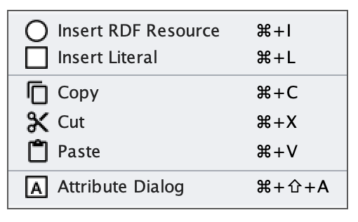

   Popup menu when nodes in the RDF Editor are not selected.

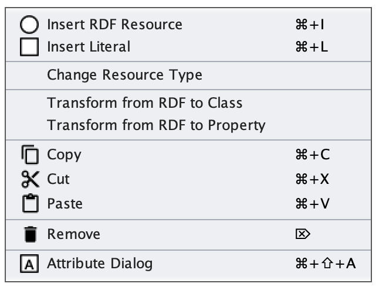

   Popup menu when nodes in the RDF Editor are selected.

Insert RDF Resource
    Insert an RDF resource to the position that mouse is right clicked.
Insert RDF Literal
    Insert an RDF literal to the position that mouse is right clicked.
Change Resource Type
    Convert an RDF resource type to a class selected in the **Class Editor**.
Transform from RDF to Class
    Transform the selected RDF resource to an RDFS class.
Transform from RDF to Property
    Transform the selected RDF resource to an RDFS property.
Copy
    Copy selected RDF resources, properties, or literals
Cut
    Cut selected RDF resources, properties, or literals
Paste
    Paste selected RDF resources, properties, or literals
Remove
    Remove selected RDF resources, properties or literals
Attribute Dialog
    Show the Attribute Dialog

Editing attributes of RDF resources
~~~~~~~~~~~~~~~~~~~~~~~~~~~~~~~~~~~~~~~~~~~~~~~~~~~~~~~~
When users select an RDF resource in the **RDF Editor*, the attributes of the RDF resource are shown in the **Attribute Dialog** ( :numref:`attr-rdf-res-uri` to :numref:`attr-rdf-res-comment` ). The attributes of RDF resources are URI, rdf:type, blank node or not, rdfs:label, and rdfs:comment. Here the blank nodes are RDF resources that are not named by URIs. Blank nodes can not be acceced from external documents.  However, the blank nodes can be subjects or objects of statements. They are used to represent RDF resources that are difficult to name or structure RDF contents.

If users would like to set a URI of an RDF resource, they should select URI from the left side menus in the **Attribute Dialog** as shown in :numref:`attr-rdf-res-uri`. Prefixes that are registered in the **Namespace Table** are shown in the **[Prefix]** combo box. When users select one of the prefixes in the combo box, the corresponding namespace is shown in the **[RDF Resource]** text field. The users can input any URI in the text field. If the users would like to set an RDF resource as a blank node, the users should check the **[blank node]** checkbox. 

.. _attr-rdf-res-uri:
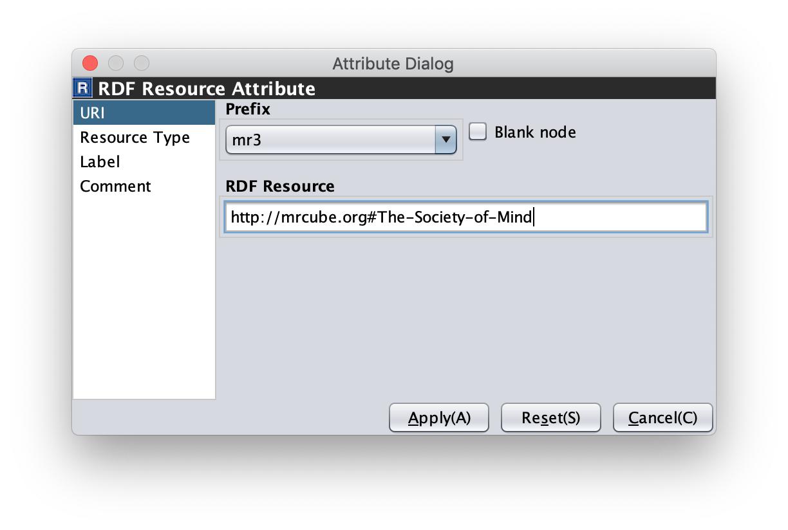

   Attribute Dialog (URI of an RDF resource)

If the users would like to set a type to an RDF resource, the users should select the **[Resource Type]** from the left side menu in the **Attribute Dialog** as shown in :numref:`attr-rdf-res-type`. The **[Resource Type]** checkbox should be checked when the users input the type of an RDF resource. If the users would like to empty the type of an RDF resource, they should uncheck the **[Resouce Type]** checkbox. 

When the users click the **[Select Type]** button, **[Select Resource Type Dialog]** are shown as shown in :numref:`rdf-res-type-selection-dialog`. The class hierarchy that is build in the **Class Editor** is shown in the **[Select Resource Type Dialog]**. When the users select an RDFS class in the dialog, the namespace and ID of the selected class are set in the **Attribute Dialog**.

When the users input a URI that is not defined in the **[Class Editor]**, **[RDF(S) contents management]** dialog is shown as shown in :numref:`rdf-and-rdfs-management-dialog`. In the RDF(S) contents management dialog, the users can select Rename or Create. 

When the users click the **[ClassEdit]** button, the type of an RDF resource is selected and the attributes of the type of the RDF resource are shown in the **Attribute Dialog**. 

.. _attr-rdf-res-type:
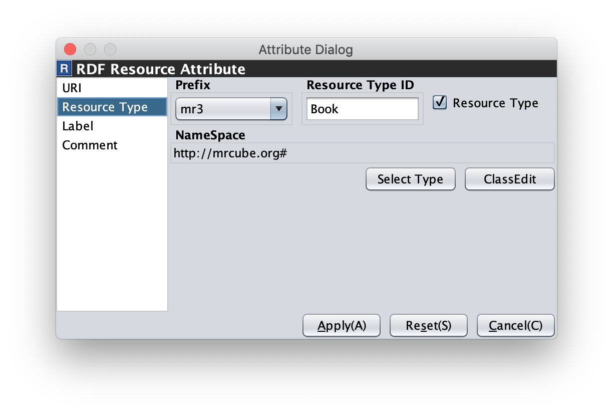

   Attribute Dialog (type of RDF resource)

.. _rdf-res-type-selection-dialog:
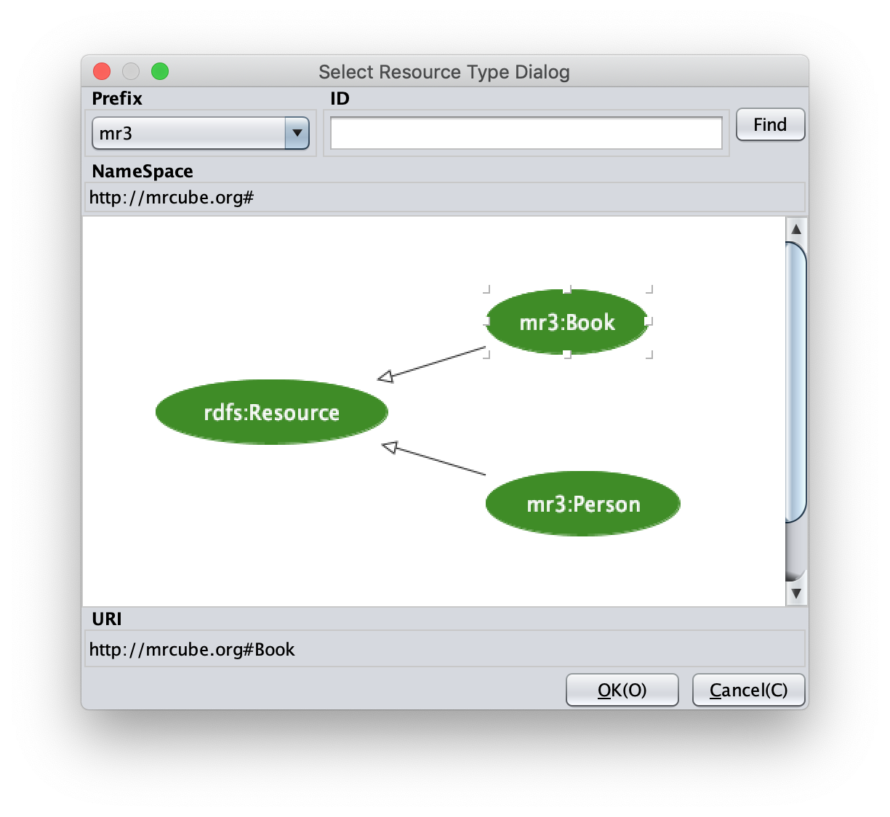

   RDF Resource Type Selection Dialog

.. _rdf-and-rdfs-management-dialog:
.. figure:: figures/rdf_and_rdfs_management_dialog.png
   :scale: 50 %
   :alt: RDF(S) contents management dialog
   :align: center

   RDF(S) contents management dialog

If the users would like to define the **rdfs:label** of an RDF resource, the users should select **[Label]** in the left side menu in the **Attribute Dialog** as shown in :numref:`attr-rdf-res-label`. After inputting language in the **[Lang]** text field and label in the **[Label]** text field, the language and the label are added in the table in the **Attribute Dialog**. If the users select a line in the table and click **Remove** button, the selected label is removed.

.. _attr-rdf-res-label:
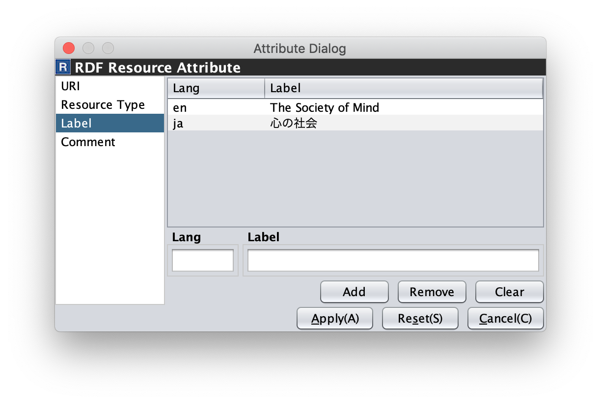

   Attribute Dialog (Label of an RDF resource)

If the users would like to define the **rdfs:comment** of an RDF resource, the users should select **[Comment]** in the left side menu in the **Attribute Dialog** as shown in :numref:`attr-rdf-res-comment`. After clicking the **[Add]** button, the **[Edit Comment Dialog]** is shown. 

First input language in the **[Lang]** text field and comment in the **[Comment]** text area. Then, click **[OK]** button. After that, the language and the label are added in the table in the **Attribute Dialog**. If the users select a line in the table and click **[Edit]** button, the users can edit the selected comment and the language. In the same way, if the user select a line in the table and click **[Remove]** button, the selected label is removed.

.. _attr-rdf-res-comment:
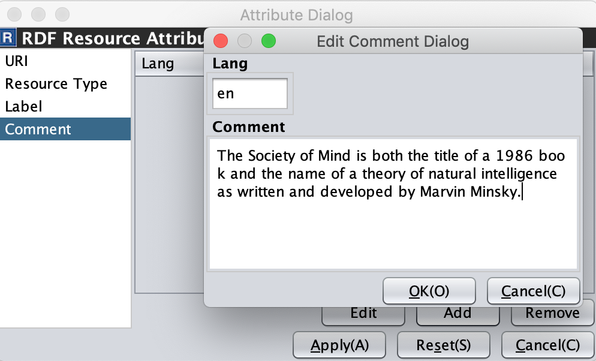

   Attribute Dialog (Comment of an RDF resource)

Editing attributes of RDF properties
~~~~~~~~~~~~~~~~~~~~~~~~~~~~~~~~~~~~~~~~~~~~~~
If the users select an RDF property in the **RDF Editor**, the attributes of the RDF property are shown in the **Attribute Dialog** (:numref:`attr-rdf-property`). The users can edit the URI of the selected RDF property. 

When the users input a URI which is not defined in the **Property Editor**, **[RDF(S) contents management]** dialog is shown as shown in :numref:`rdf-and-rdfs-management-dialog`. In the **[RDF(S) contents management]** dialog, the users can select rename the RDFS property or create an RDFS property. 

When the users select one of the prefixes in the dialog, IDs of RDFS properties that are defined in the **Property Editor** and the namespace is correspond to the selected prefix are shown in the **[Property ID]** list. 

When the users select one of the Property IDs and click **[RDFSPropertyEdit]** button, the RDFS property is selected and the attributes of the RDFS property are shown in the **Attribute Dialog**.

.. _attr-rdf-property:
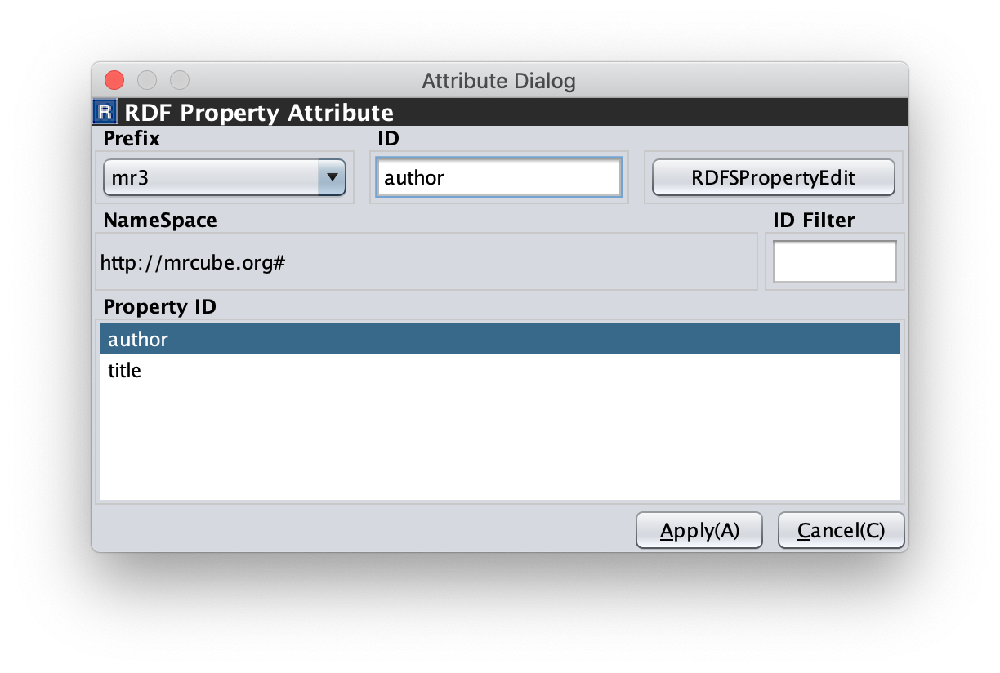

   Attribute Dialog (RDF Property)

Editing attributes of RDF literals
~~~~~~~~~~~~~~~~~~~~~~~~~~~~~~~~~~~~~~~~~~~~
When the users select an RDF literal in the **RDF Editor**, the attributes of the RDF literal are shown in the **Attribute Dialog**. (:numref:`attr-rdf-literal`) The users can edit the contents of the literal, the attribute of language (**xml:lang**), and the data type of the literal. In the **[Literal]** text are, the users can input the contents of the literal. The users can also input language in the **[Lang]** text field. If the users set the data type of the literal, the users should check **[Data type]** checkbox and select one of the types in the combobox. Language attribute and data type attribute are exclusive and the users only select one of them. 

.. _attr-rdf-literal:
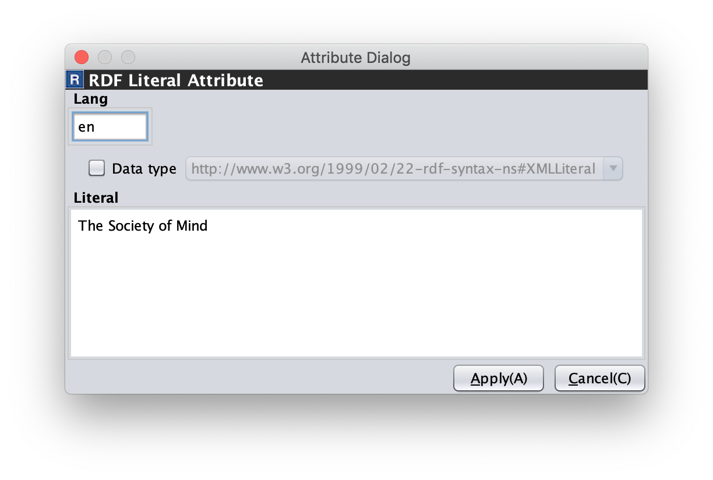

   Attribute Dialog (RDF Literal)

.. index:: Class Editor

Class Editor
--------------
The Class Editor allows the users to edit the attributes of RDFS classes and the relationships between the classes.

:numref:`class-editor` shows an screenshot of the Class Editor

.. _class-editor:
.. figure:: figures/class_editor.png
   :scale: 25 %
   :alt: An screenshot of the Class Editor
   :align: center
   
   An screenshot of the Class Editor

Toolbar in the Class Editor
~~~~~~~~~~~~~~~~~~~~~~~~~~~~~~~~
Icons in the toolbar in the Class editor and the corresponding functions are shown in the following table.

.. csv-table::
   :header: Icon, Function
   :align: center
   :widths: 3, 10 

    .. figure:: figures/toolbar/resource.png, Insert an RDFS class
    .. figure:: figures/toolbar/copy.png, Copy nodes
    .. figure:: figures/toolbar/cut.png,  Cut nodes
    .. figure:: figures/toolbar/paste.png, Paste nodes
    .. figure:: figures/toolbar/delete.png, Remove nodes
    .. figure:: figures/toolbar/undo.png, Undo
    .. figure:: figures/toolbar/redo.png, Redo
    .. figure:: figures/toolbar/export_graph_img.png, Save the class graph as an image file
    .. figure:: figures/toolbar/l_to_r_layout.png, Automatically layout the class graph (lef to right)
    .. figure:: figures/toolbar/u_to_d_layout.png, Automatically layout the class graph (up to down)         
    .. figure:: figures/toolbar/open_resource.png, Open a selected RDFS class

Popup menu in the Class Editor
~~~~~~~~~~~~~~~~~~~~~~~~~~~~~~~~~~~~
When users right click in the Class editor, a popup menu is shown. The contents of the popu menu is different when nodes are selected or not. The popup menus are shown as follows.

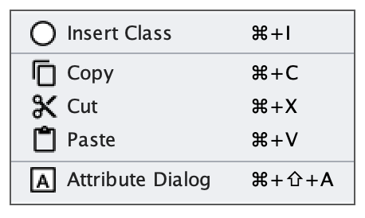
   
   Popup menu when nodes in the Class Editor are not selected.
   
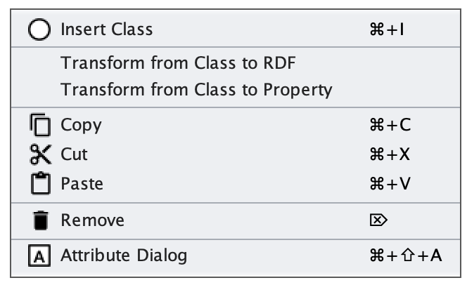
   
   Popup menu when nodes in the Class Editor are selected.

Insert Class
    Insert an RDFS class to the position that the mouse is right clicked. If one or more RDFS classes are selected, an RDFS class is inserted as the sub classes of the selected classes.
Connect Mode
   Change the mode to connect mode from move mode. When the mode is connect mode, users can connect classes by dragging and dropping.
Move Mode
    Change the mode to move mode from connect mode. When the mode is move mode, users can move nodes in the Class editor.
Transform from Class to RDF
    Transform the selected RDFS classes to RDF resources. 
Transform from Class to Property
    Transform the selected RDFS classes to RDFS properties.
Copy
    Copy selected RDFS classes and the relationships between the classes.
Cut
    Cut selected RDFS classes and the relationships between the classes.
Paste
    Paste copied RDFS classes and the relationships between the classes.
Remove
    Remove selected RDFS classes and the relationships between the classes.
Show Attribute Dialog
    Show the Attribute Dialog

Editing attributes of the Class editor
~~~~~~~~~~~~~~~~~~~~~~~~~~~~~~~~~~~~~~~~~~~~~~~~~
When the users select an RDFS class in the Class Editor, the attributes of the RDFS class are shown in the Attribute Dialog (:numref:`attr-class-basic` to :numref:`attr-class-upper-class`). The users can edit the attributes of an RDFS class by selecting Base, Label, Comment, Instances, or UpperClasses items from the left side menu in the Attribute Dialog.

When the users select the Base item, the type of an RDFS class and the URI can be edited (:numref:`attr-class-basic`).  The types can be defined class class list in the Config Dialog. When the users select the Label item, the value of rdfs:label property can be edited. When the users select the Comment item, the value of rdfs:comment property can be edited. The methods for editing rdfs:label and rdfs:comment are same as RDF resource. When the users select the Instances item, the instances of the selected RDFS class are shown in the list (:numref:`attr-class-instance`). When the users select the one of the items in the list, corresponding RDF resource is selected and the attributes of the RDF resource are shown in the Attribute Dialog. When the users select the UpperClasses item, the uppser classes of the selected RDFS class are shown in the list (:numref:`attr-class-upper-class`).

.. _attr-class-basic:
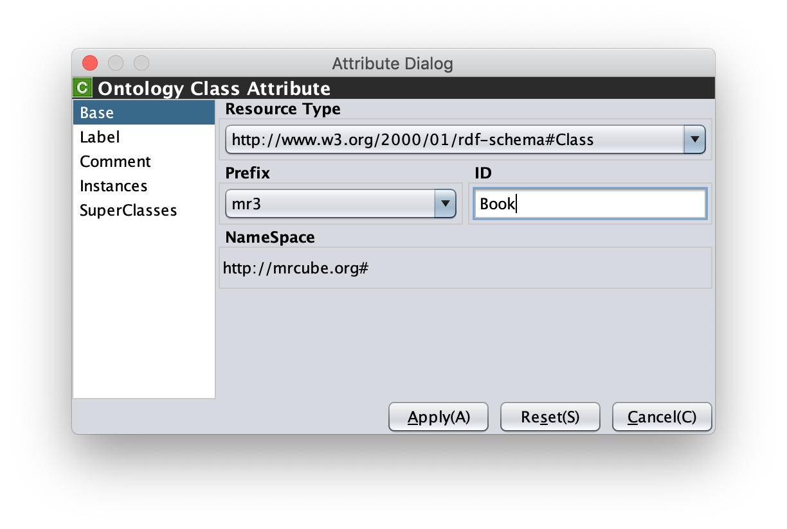
   
   Attribute Dialog (Base of RDFS class)
 
.. _attr-class-instance:
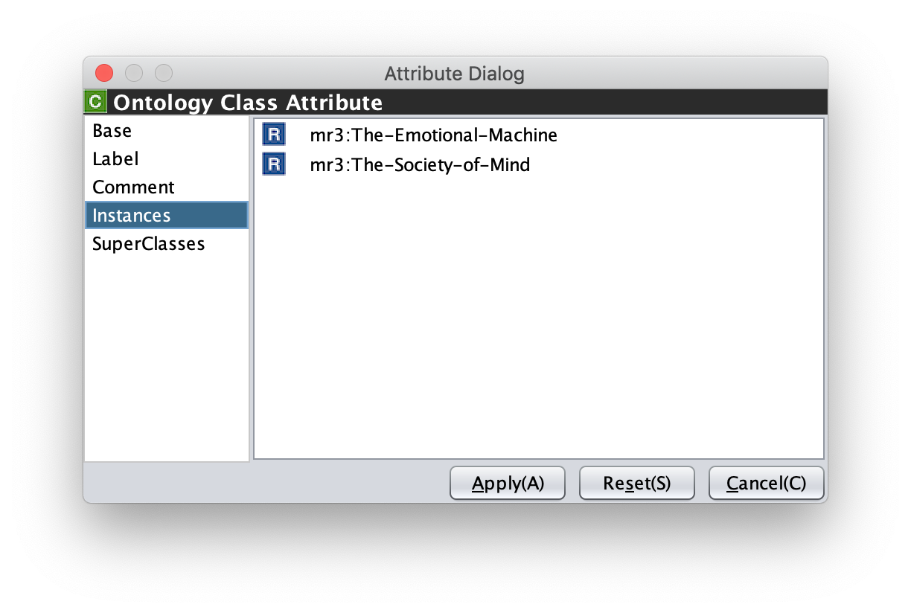

   Attribute Dialog (Instances of the RDFS class)
  
.. _attr-class-upper-class:
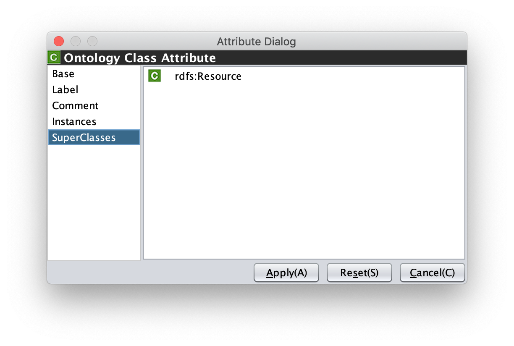

   Attribute Dialog (Upper classes of the RDFS class)

.. index:: Property Editor

Property Editor
------------------
The Property Editor allows the users to edit the attributes of RDFS properties and the relationships between the properties.

:numref:`property-editor` shows an screenshot of the Property Editor

.. _property-editor:
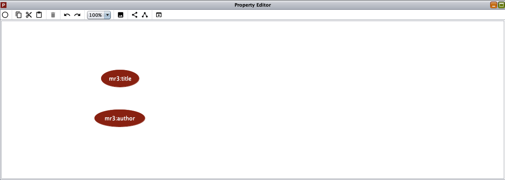
   
   An screenshot of the Property Editor

Toolbar in the Property Editor
~~~~~~~~~~~~~~~~~~~~~~~~~~~~~~~~~~~~~~~~~~~~~~
Icons in the toolbar in the Property editor and the corresponding functions are shown in the following table.

.. csv-table::
   :header: Icon, Function
   :align: center
   :widths: 3, 10 
     
   .. figure:: figures/toolbar/resource.png, Insert an RDFS property
   .. figure:: figures/toolbar/copy.png, Copy nodes
   .. figure:: figures/toolbar/cut.png, Cut nodes
   .. figure:: figures/toolbar/paste.png, Paste nodes
   .. figure:: figures/toolbar/delete.png, Remove nodes
   .. figure:: figures/toolbar/undo.png, Undo
   .. figure:: figures/toolbar/redo.png, Redo
   .. figure:: figures/toolbar/export_graph_img.png, Save the property graph as an image file
   .. figure:: figures/toolbar/l_to_r_layout.png, Automatically layout the RDFS property graph (left to right)
   .. figure:: figures/toolbar/u_to_d_layout.png, Automatically layout the RDFS property graph (up to down)
   .. figure:: figures/toolbar/open_resource.png, Open a selected RDFS property

Popup menu in the Property Editor
~~~~~~~~~~~~~~~~~~~~~~~~~~~~~~~~~~~~~~~~
When users right click in the Property editor, a popup menu is shown. The contents of the popu menu is different when nodes are selected or not. The popup menus are shown as follows.

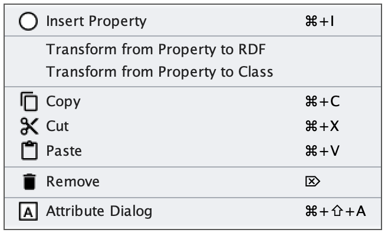
   
   Popup menu when nodes in the Property Editor are not selected.
   

   
   Popup menu when nodes in the Property Editor are selected.

Insert Property
    Insert an RDFS property to the position that the mouse is right clicked. If one or more RDFS properties are selected, an RDFS property is inserted as the sub properties of the selected properties.
Connect Mode
   Change the mode to connect mode from move mode. When the mode is connect mode, users can connect propertie by dragging and dropping.
Move Mode
    Change the mode to move mode from connect mode. When the mode is move mode, users can move nodes in the Property editor.
Transform from Property to RDF
    Transform the selected RDFS properties to RDF resources
Transform from Property to Class
    Transform the seledcted RDFS properties to RDFS classes
Copy
    Copy the selected RDFS properties and the relationships between the properties
Cut
    Cut the selected RDFS properties and the relationships between the properties
Paste
    Paste the copied RDFS properties and the relationships between the properties
Remove
    Remove the selected RDFS properties and the relationships between the properties
Show Attribute Dialog
    Show the Attribute Dialog

Editing attributes of the Property editor
~~~~~~~~~~~~~~~~~~~~~~~~~~~~~~~~~~~~~~~~~~~~~
When the users select an RDFS property in the Property Editor, the attributes of the RDFS property are shown in the Attribute Dialog (:numref:`attr-property-region`  and :numref:`attr-property-instance`).  The users can edit the attributes of an RDFS property by selecting Base, Label, Comment, Region, Instance, or SuperProperties items in the left side menu of the Attribute Dialog. Base, Label, and Comment items are same as RDFS Class. The type list in the Base item can be defined in the property class list in the Config Dialog. When the users select Region item, domains and ranges of the selected RDFS property can be edited (:numref:`attr-property-region`). When the users select Instances item, RDF resource list that have the selected RDFS property is shown in the Attribute Dialog (:numref:`attr-property-instance`). When the users select the one of the items in the list, the RDF resource is selected and the attributes of the RDF resource are shown in the Attribute Dialog. When the users select SuperProperties item, super properties of the selected RDFS property are shown in the list.

.. _attr-property-region:
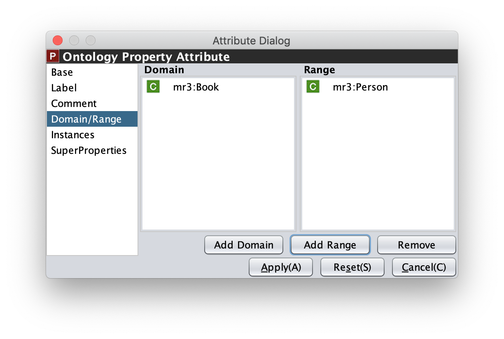
   
   Attribute Dialog (Range of RDFS property)
  
.. _attr-property-instance:
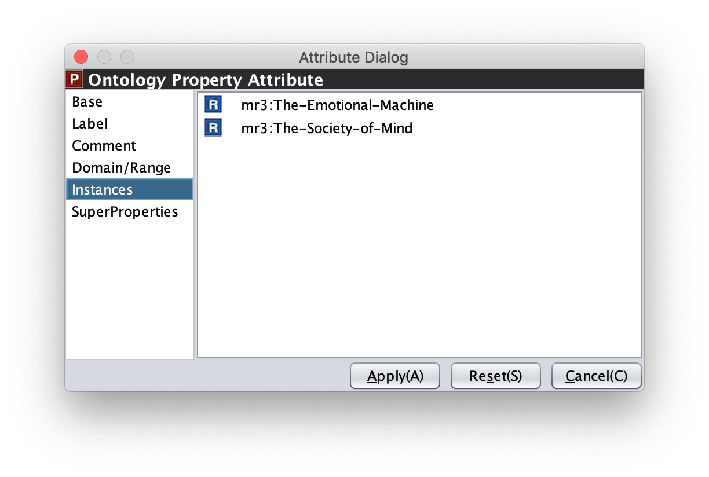
   
   Attribute Dialog (Instances of RDFS property)
  
.. index:: Resource Search Dialog

Resource Search Dialog
--------------------------
The users can find resources (RDF resources, RDF properties, RDFS classes, and RDFS properties) by using Resource Search Dialog. :numref:`resource-search-dialog` shows a screenshot of the Resource Search Dialog. The users can set search scope by checking the Graph Type (RDF, Class, or Property). When the users set a URI in the URI text field, resources that partially match the URI are shown in the Find Result list in the Resource Search Dialog. When the users select the one of the items in the list, corresponding resource is selected and the attributes of the resource are shown in the Attribute Dialog. The users can set the value of rdfs:label and rdfs:comment in the Label or Comment text field. 

 .. _resource-search-dialog:
 .. figure:: figures/resource_search_dialog.png
   :scale: 50 %
   :alt: A screenshot of the Resource search dialog
   :align: center

   A screenshot of the Resource search dialog
 
.. index:: Namespace Table

Namespace Table
-------------------
The users can register perfixes and the corresponding namespaces in the Namespace Table. :numref:`namespace-table` shows a screenshot of the Namespace Table. When the users set a prefix in the Prefix text field, set a namespace in the NameSpace text field, and click Add button, the prefix and the namespace are added in the table in the Namespace Table. If the users would like to remove the prefix and the corresponding namespace, select the line in the table and click Remove button. If the users check the available checkbox, namespaces of resources in each editor are replaced with the corresponding prefix (This function is only available when the Display->URI menu is selected.). When the users set a URI of an resource, the Namespace Table is referred and the users can select the registered prefixes in the Attribute Dialog. When the users select one of the prefixes, the corresponding namespace is shown in the Namespace label or RDF Resource text field.

.. _namespace-table:
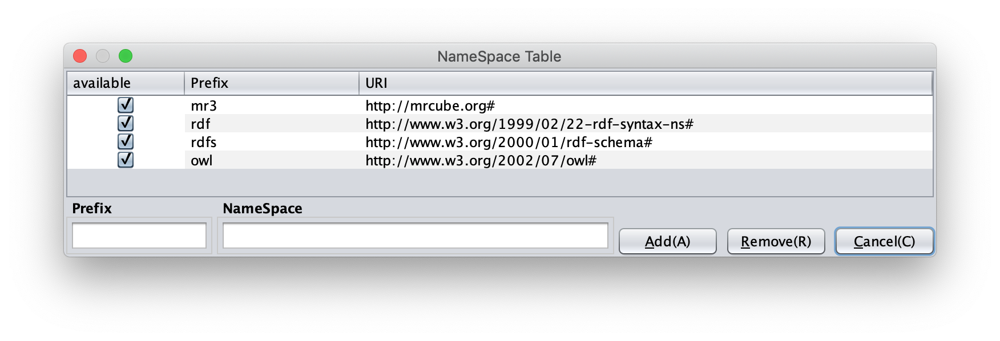

   A screenshot of the Namespace Table
 

.. index:: Remove Dialog

Remove Dialog
-----------------
If an RDFS class is referred by a type of a resource or a domain or a range of a property, it is inconsistency when the RDFS class is removed. If an RDFS property is reffered in the RDF editor, it is inconsistency when the RDFS property is removed. In these cases, when the users remove those RDFS classes or properties, the Remove Dialog as shown in :numref:`remove-dialog` is shown before removing them actually.

Removed RDFS classes or properties are shown in the upper part of :numref:`remove-dialog`. RDF resources that referred the removed RDFS classes as their type are shown in the RDF tab in the lower part of :numref:`remove-dialog`. RDF properties that referred the removed RDFS properties are also shown in the RDF tab. RDFS properties that refer removed RDFS classes as their domains or ranges are shown in the Property tab in the lower part of :numref:`remove-dialog`.

If the users check the Delete Checkboxes and click Apply button, RDF resources, RDF properties, and RDFS properties that listed in the lower part of the Remove Dialog stop referring to the removed RDFS classes or RDFS properties. Then, the RDFS classes and RDFS properties are actually removed. 

If the users select one of the RDF resources, RDF properties, or RDFS properties, attributes of the selected resource are shown in the Attribute Dialog. Then, the users can edit the attributes to maintain consistency.

.. _remove-dialog:
.. figure:: figures/remove_dialog.png
   :scale: 50 %
   :alt: Remove Dialog
   :align: center

   Remove Dialog
 

.. index:: Import Dialog

Import Dialog
--------------------
The users can import RDF(S) documents described as Turtle, JSONLD, RDF/XML, or N-Triples format to |MR3| by using Import Dialog. :numref:`import-dialog` shows a screenshot of the Import Dialog. 

 .. _import-dialog:
 .. figure:: figures/import_dialog.png
   :scale: 50 %
   :alt: A screenshot of the Import Dialog
   :align: center

   A screenshot of the Import Dialog

.. index:: Export Dialog

Export Dialog
----------------------
The users can export RDF(S) data graphs in |MR3| to an RDF(S) document as Turtle, JSONLD, RDF/XML, or N-Triples syntax. :numref:`export-dialog` shows a screenshot of the Export Dialog. 

.. _export-dialog:

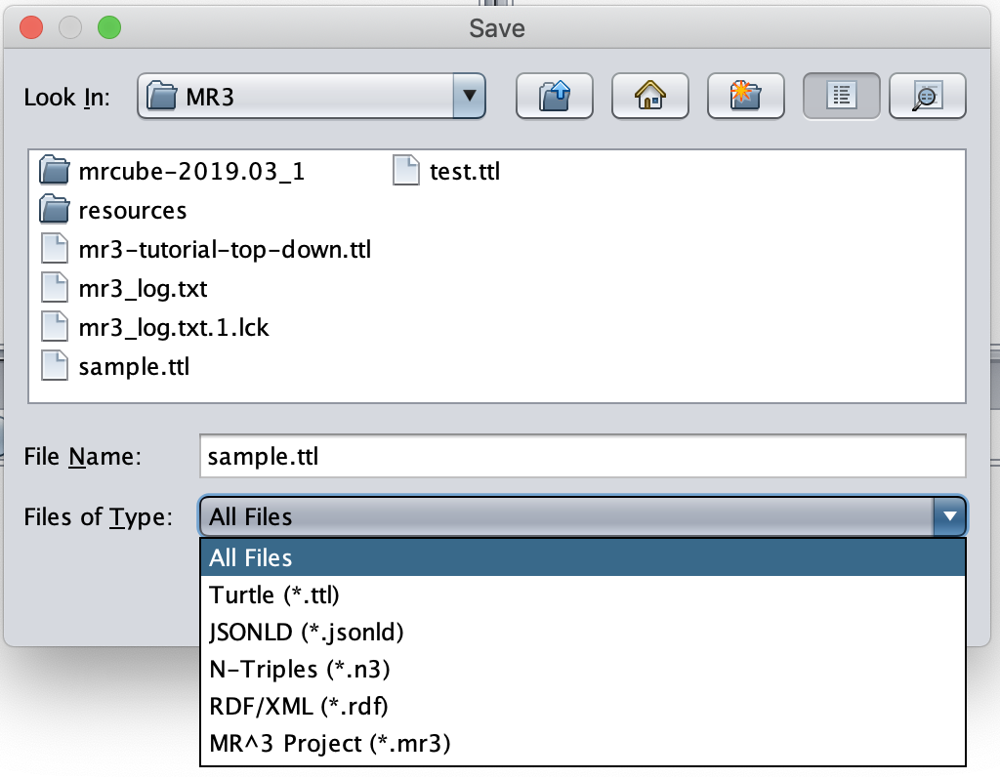

   A screenshot of the Export Dialog
    
.. index:: Config Dialog

Config Dialog
----------------
The users can set configurations about basic, directory, proxy, meta class, layout, and rendering in the Config Dialog.

Basic
~~~~~~~~~
When the users select the Basic item as shown in :numref:`config-basic`, language, UI language, output encoding, font, base URI, and log file can be set. If a resource has many multilingual labels, the users should select the prior language. The prior language of labels can be set in the Lang text field. Labels with prior language are shown in each resource when the user select display->label menu. Language of UI such as menu can be set in the UI Lang list. The users can select ja (Japanese), en (English), or zh (Chinsese) from the UI Lang list. Output encoding can be used to export an RDF(S) document. The font of resources can be set by clicking Font Setting button and selecting a font from the font selecting dialog. Default namespace is set based on the Base URI. The directory that a log file is saved can be set by clicking Browse button and selecting the directory from the directory selection dialog.

.. _config-basic:

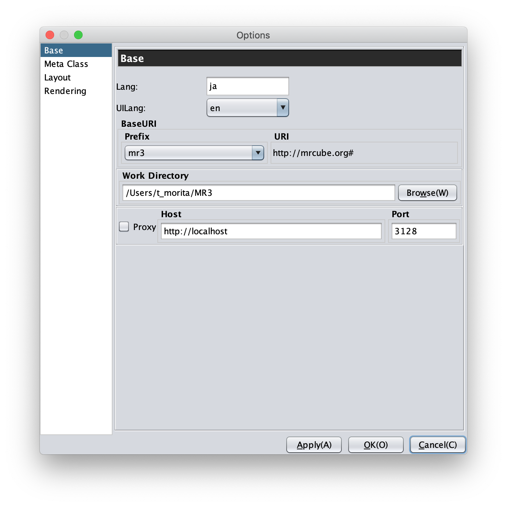

   Config Dialog: Basic

Directory
~~~~~~~~~~~~
When the users select the Directory item as shown in :numref:`config-directory`, work directory, plugins directory, and resources directory can be set. The work directory is a directory that is opened firstly when the users import an RDF(S) document. The plugins directory is a directory that plug-ins of |MR3| are saved. The resources directory is a directory that property files are saved. The property files are defined labels that displayed in |MR3| for each language.

.. _config-directory:
.. figure:: figures/config_dialog_directory.png
   :scale: 50 %
   :alt: Config Dialog: Directory
   :align: center

   Config Dialog: Directory
   
Proxy
~~~~~~~~
When the users select the Proxy item as shown in :numref:`config-proxy`, a host name and a port number of a proxy server can be set. This configuration is necessary to import an RDF(S) document from a URI when the user's environment is under a proxy server.

.. _config-proxy:
.. figure:: figures/config_dialog_proxy.png
   :scale: 50 %
   :alt: Config Dialog: Proxy
   :align: center

   Config Dialog: Proxy

Meta Class
~~~~~~~~~~~~~~
When the users select the Meta Class item as shown in :numref:`config-metaclass`, Class Class and Property Class can be set. If the users set a Class Class, |MR3| regards resources that have the Class Class as their type as classes. If the users set a Property Class, |MR3| regards resources that have the Property Class as their type as properties. These classes and properties are imported in the RDFS class editor or RDFS property editor. 

In the initial setting, rdfs:Class is defined in Class Class and rdf:Property is defined in Property Class. If the users would like to import OWL classes and properties, owl:Class must be set as Class Class, owl:ObjectProperty and owl:DatatypeProperty must be set as Property Class.

.. _config-metaclass:
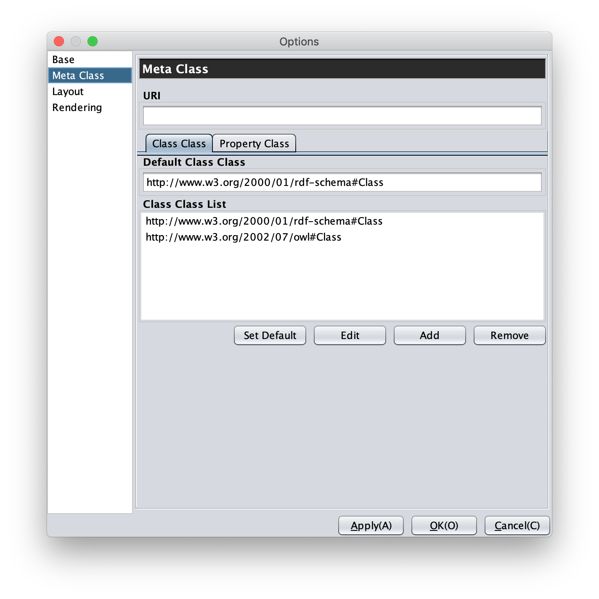

   Config Dialog: Meta Class

Layout
~~~~~~~~~~
When the users select the Layout item as shown in :numref:`config-layout`, methods for layout for each editor can be set.

.. _config-layout:
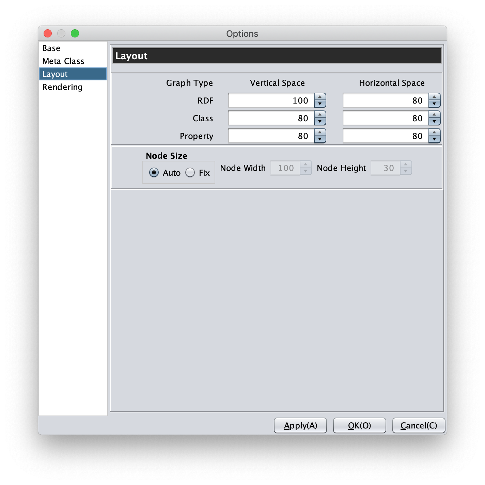

   Config Dialog: Layout

Validator
-----------
When the users select Validator sub menu in the Tool menu, the dialog as shown in :numref:`validator-dialog` is shown. |MR3| uses Apache Jena's validation API (`org.apache.jena.reasoner.ValidityReport <https://jena.apache.org/documentation/javadoc/jena/org/apache/jena/reasoner/ValidityReport.html>`_ ) and it is enabled to check if the data type of literals are defined based on a range of property.

.. _validator-dialog:
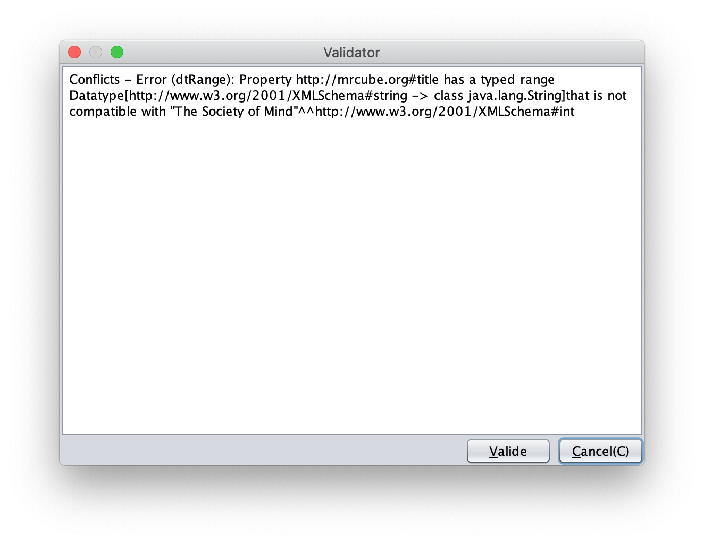

   Validator

Project Info
------------------
When the users select Project Info sub menu in the Tool menu, the dialog as shown in :numref:`project-info-dialog` is shown. The current project name, the number of RDF resources, the number of RDF literals, the number of RDF statements, the number of classes, the number of properties, the number of all resources, the number of all literals, the number of all statements are shown in the dialog.

.. _project-info-dialog:
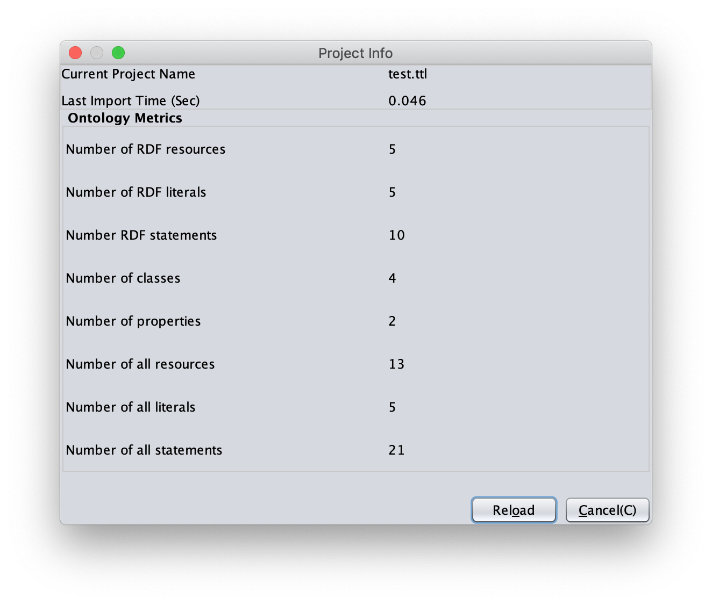

   Project Info

Log Console
-----------------
When the users select Show Log Console sub menu in the Tool menu, the dialog as shown in :numref:`log-console` is shown. The users can confirm the standard output and the standard error in the dialog. 

.. _log-console:
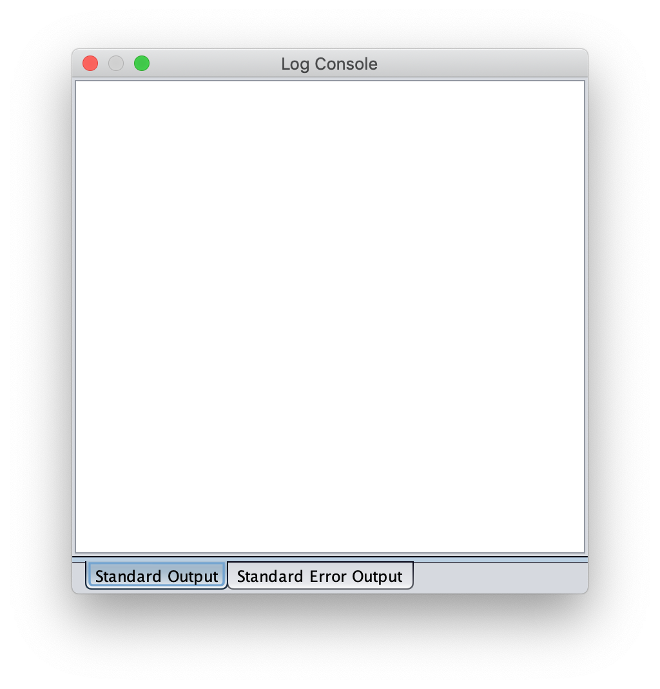

   Log Console

About MR3
-----------
When the users select About MR3 sub menu in the Help menu, the dialog as shown in :numref:`about-mr3` is shown. The developer, version, license, project web site, contact, and libraries used in |MR3| are shown in the dialog.

.. _about-mr3:
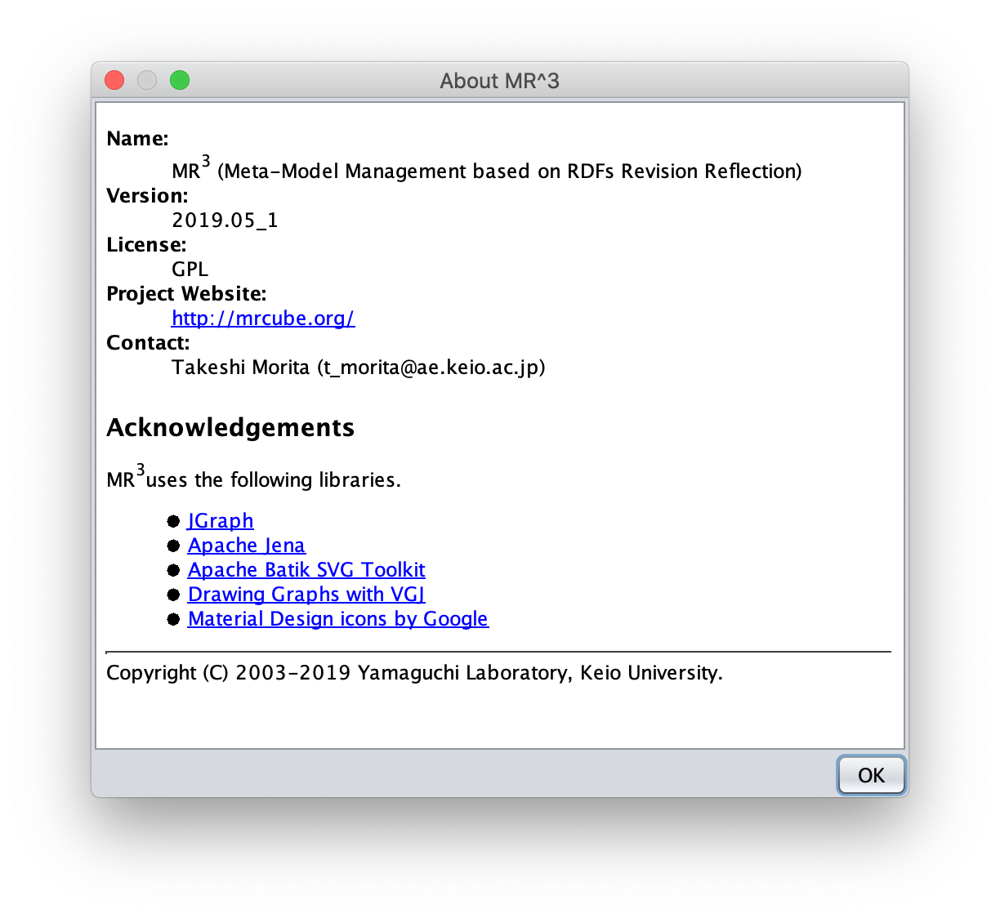

   About MR3

Menu
---------------

File
~~~~~~~~~~
New Project
    Create new |MR3| project. The users should select save the current project or delete it.
Open Project
    Open |MR3| project file
Save Project
    Save |MR3| project file
Save As Project
    Save As |MR3| project file
Quit
    Quit |MR3|

View
~~~~~~~~
URI
    URIs of resources are shown in each editor. If namespaces are defined in the Namespace Table, the corresponding prefixes are replaced with the namespaces.
ID
    IDs of resources are shown in each editor.
Label
    Values of rdfs:label properties are shown in each editor. If a resource does not have rdfs:label property, the URI of the resource is shown instead of the value of rdfs:label property.
Resource Type
    If the users check the Show Resource Type, the type of RDF resources are shown at the top right of each resource.
RDF Property Label
    If the users check the Show RDF Property Label, the label of properties are shown. If it is not checked, the label properties are not shown in the RDF editor.
ToolTips
    If the users check the Show ToolTips, tooltips are shown when the users mouse over the resources.
RDF Graph Layout (Left to Right)
    Automatically layout the RDF graph (left to right)
Class Graph Layout (Left to Right)
    Automatically layout the Class graph (left to right)
Class Graph Layout (Up to Down)
    Automatically layout the Class graph (up to down)
Property Graph Layout (Left to Right)
    Automatically layout the Property graph (left to right)
Property Graph Layout (Up to Down)
    Automatically layout the Property graph (up to down)

Window
~~~~~~~~~~
RDF Editor Overview
    The overview of the RDF editor is shown in the dialog. When the users drag a red rectangle, part of the RDF graph in the red rectangle are shown in the RDF editor. The users can change the size of the red rectangle by dragging the right down part. It is enabled to expand and reduce the editor.
Class Editor Overview
    The overview of the Class editor is shown in the dialog. The functions of the dialog is as same as RDF Editor Overview.
Property Editor Overview
    The overview of the Property editor is shown in the dialog. The functions of the dialog is as same as RDF Editor Overview.
Attribute Dialog
    Show Attribute Dialog to the front.       
Namespace Table
    Show Namespace Table to the front.
Deploy Windows (C,P,R)
    Show the RDF editor, the Property editor, and the Class editor.
Deploy Windows (C,R)
    Show the Class editor and the RDF editor.
Deploy Windows (P,R)
    Show the Property editor and the RDF editor.

Tool
~~~~~~~~~~~~~~~~~~~~~
RDF Source Code Viewer
    Show RDF Source Code Viewer.
Find
    Show Resource Find Dialog.
Validation
    Show Validation Dialog.
Project Information
    Show Project Information Dialog.
Log Console
    Show Log Console which outputs standard outputs and standard error outputs in MR\ :sup:`3` \.
Option
    Dhow Option Dialog.

Help
~~~~~~~~~
About MR\ :sup:`3` \
    The developer, version, license, project web site, contact, and libraries used in |MR3| are shown in the dialog.
MR\ :sup:`3` \ manual 
    Open MR\ :sup:`3` \ manual page in browser.

Toolbar
------------------

.. csv-table::
   :header: Icon, Function
   :align: center
   :widths: 3, 10

   .. figure:: figures/toolbar/new.png, New MR\ :sup:`3` \ project
   .. figure:: figures/toolbar/open.png, Open MR\ :sup:`3` \ project file
   .. figure:: figures/toolbar/save.png, Save MR\ :sup:`3` \ project file
   .. figure:: figures/toolbar/saveas.png, Save as MR\ :sup:`3` \ project file
   .. figure:: figures/toolbar/find.png, Show Resource Search Dialog
   .. figure:: figures/toolbar/rdf_editor.png, Show RDF Editor Overview to the front
   .. figure:: figures/toolbar/class_editor.png, Show Class Editor Overview to the fornt
   .. figure:: figures/toolbar/property_editor.png, Show Property Editor Overview to the front
   .. figure:: figures/toolbar/attribute_dialog.png, Show Attribute Dialog to the front
   .. figure:: figures/toolbar/namespace_table.png, Show Namespace Table to the front
   .. figure:: figures/toolbar/cpr.png, "Show Class, Property, and RDF editors"
   .. figure:: figures/toolbar/cr.png, "Show Class and RDF editors"
   .. figure:: figures/toolbar/pr.png, "Show Property and RDF editors"
   .. figure:: figures/toolbar/code.png, Show RDF source codes
   .. figure:: figures/toolbar/accept.png, Validate RDFs contents
   .. figure:: figures/toolbar/information.png, Show Project Information
   .. figure:: figures/toolbar/log_console.png, Show Log Console
   .. figure:: figures/toolbar/cog.png, Show Config Dialog
   .. figure:: figures/toolbar/help.png, Show about MR\ :sup:`3` \

Shortcut keys
-------------------

Shortcut keys that can be used in |MR3|
~~~~~~~~~~~~~~~~~~~~~~~~~~~~~~~~~~~~~~~~~~

.. csv-table::
   :header: Shortcut keys, Description
   :align: center
   :widths: 5, 10 

    Ctrl + N | Command + N, Create new |MR3| project. The users should select save the current project or delete it.
    Ctrl + O | Command + O, Open |MR3| project file.
    Ctrl + S | Command + S, Save |MR3| project file.
    Ctrl + Shift + S | Command + Shift + S, Save as |MR3| project file.
    Ctrl + Q | Command + Q, Quit |MR3|.
    Ctrl + Shift + A | Command + Shift + A, Show the Attribute Dialog.
    Ctrl + Shift + N | Command + Shift + N, Show the Namespace Table.
    Ctrl + 1 | Command + 1, "Show Class, Property, and RDF editors."
    Ctrl + 2 | Command + 2, "Show Class and RDF editors."
    Ctrl + 3 | Command + 3, "Show Property and RDF editors."
    Ctrl + R | Command + R, Show the RDF source code viewer.
    Ctrl + F | Command + F, Show the Find Resource Dialog.
    Ctrl + Shift + V | Command + Shift + V, Validate RDF graphs.
    Ctrl + Shift + M | Command + Shift + M, Show the Project Information dialog.
    Ctrl + Shift + L | Command + Shift + L, Show the Log console.
    Ctrl + Shift + O | Command + Shift + O, Show the Option dialog.
    F1, Show about MR\ :sup:`3` \.

Shortcut keys that can be used in editors
~~~~~~~~~~~~~~~~~~~~~~~~~~~~~~~~~~~~~~~~~~~~~~~~~~~~~

.. csv-table::
   :header: Shortcut key, Description
   :align: center
   :widths: 5, 10 

   Ctrl + I | Command + I, Insert an resource.
   Ctrl + L | Command + L, Insert a literal.
   Ctrl + A | Command + A, Select all of the nodes in a editor.
   Delete, Delete selected nodes in a editor.
   Ctrl + C | Command + C, Copy selected nodes in a editor.
   Ctrl + X | Command + X, Cut selected nodes in a editor.
   Ctrl + V | Command + V, Paste nodes that are copied or cut.
